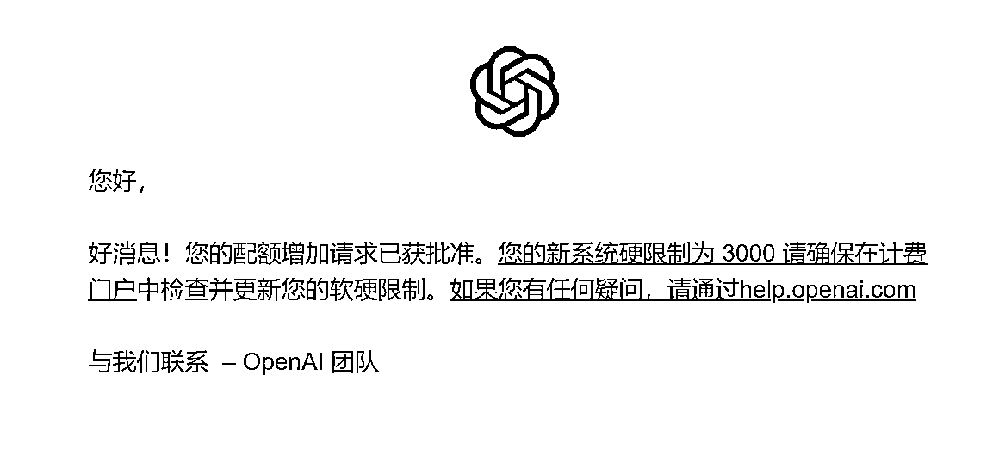

# 给 ChatGPT 账户提额到 3000 刀的方法

> 原文：[`www.yuque.com/for_lazy/xkrm14/bhrlcf3qmr6bwnd3`](https://www.yuque.com/for_lazy/xkrm14/bhrlcf3qmr6bwnd3)

<ne-p id="ud757c6dd" data-lake-id="ud757c6dd"><ne-text id="u74983b59">作者： 强子</ne-text></ne-p> <ne-p id="u51767d20" data-lake-id="u51767d20"><ne-text id="ua42947ab">日期：2023-04-10</ne-text></ne-p> <ne-p id="u9c286c00" data-lake-id="u9c286c00"><ne-text id="uddcef01d">点赞数：</ne-text><ne-text id="u0075c8af" ne-bold="true">25</ne-text></ne-p> <ne-hole id="ub68ec01a" data-lake-id="ub68ec01a"><ne-card data-card-name="hr" data-card-type="block" id="hzaC0" data-event-boundary="card"><ne-p id="ua2676372" data-lake-id="ua2676372"><ne-text id="ue04ac6cb">正文：</ne-text></ne-p> <ne-p id="u0a0b5a2d" data-lake-id="u0a0b5a2d"><ne-text id="ubb4ebf02">如何给 ChatGPT 账户提额到 3000 刀，马上去查看你账户操作起来 今天以外发现马上实测提交了申请到 3000 额度，提交后不到半小时就通过了。</ne-text> <ne-text id="u8e948cbe">是这样的，之前买了一个 120 刀额度的账号（成本小几十块），120 刀额度早已消耗完了，今天鬼使神差登录了下意外发现额度限额里面显示上限允许到 3000，马上就点了提交申请，就填写了下必填项，很快就收到了通过审核的邮件。</ne-text> <ne-text id="udd2878bc">白嫖 3000 刀能让我开心两三天了哈哈。 个人总结下最大可能的原因： 1、使用了企业邮箱注册（自定义域名邮箱注册账号）；</ne-text> <ne-text id="uec5d173a">2、短时间内消耗量比较好，比如 24h 或 48h 消耗几十上百刀这种量。（之前给网站跑文章，一个 120 的号基本也就两天消耗完）</ne-text> <ne-text id="u9c9e4670">仅供参考，能确定一点的是，只要账户后台 Usage limits ---- Approved usagelimit</ne-text> <ne-text id="ub92c90fd">这里显示超过 120 比如 3000 的，点提交基本就能过审核，然后到硬限制 Hard limit 里面去改成上限额度即可。 openai</ne-text></ne-p> <ne-p id="u7229991f" data-lake-id="u7229991f"><ne-card data-card-name="image" data-card-type="inline" id="Znb7c" data-event-boundary="card"></ne-card></ne-p> <ne-p id="u3628f017" data-lake-id="u3628f017"><ne-card data-card-name="image" data-card-type="inline" id="GwtWU" data-event-boundary="card"></ne-card></ne-p> <ne-p id="u0e0db752" data-lake-id="u0e0db752"><ne-card data-card-name="image" data-card-type="inline" id="A3fdY" data-event-boundary="card"></ne-card></ne-p> <ne-p id="u5a0ae2fa" data-lake-id="u5a0ae2fa"><ne-card data-card-name="image" data-card-type="inline" id="e9IAz" data-event-boundary="card"></ne-card></ne-p> <ne-hole id="u9fa09d46" data-lake-id="u9fa09d46"><ne-card data-card-name="hr" data-card-type="block" id="hq9Xn" data-event-boundary="card"><ne-p id="u03e55525" data-lake-id="u03e55525"><ne-text id="uebce6c24">评论区：</ne-text></ne-p> <ne-p id="u5c4b1a4f" data-lake-id="u5c4b1a4f"><ne-text id="u8acefa17">亦仁 : 中标，术值 +1。 点击最上方 #中标 专栏，可查看所有中标风向标。</ne-text></ne-p> <ne-hole id="u389744f6" data-lake-id="u389744f6"><ne-card data-card-name="hr" data-card-type="block" id="GkXj1" data-event-boundary="card"><ne-p id="uba20e15f" data-lake-id="uba20e15f"><ne-text id="u14f68870">公众号懒人找资源，懒人专属群分享</ne-text></ne-p></ne-card></ne-hole></ne-card></ne-hole></ne-card></ne-hole>