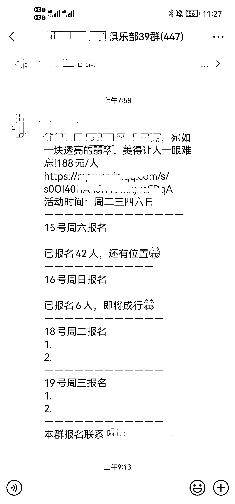
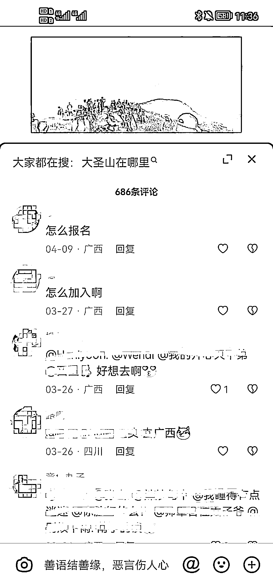

# 抖音，组队出游，精准客户非常多

> 原文：[`www.yuque.com/for_lazy/xkrm14/byy9t232gwg57rwy`](https://www.yuque.com/for_lazy/xkrm14/byy9t232gwg57rwy)

<ne-p id="ufa721b93" data-lake-id="ufa721b93"><ne-text id="u24fabd99">作者： 九歌</ne-text></ne-p> <ne-p id="u56870a8c" data-lake-id="u56870a8c"><ne-text id="u5fd3f15f">日期：2023-04-14</ne-text></ne-p> <ne-p id="u34b669d6" data-lake-id="u34b669d6"><ne-text id="u991167d6">点赞数：</ne-text><ne-text id="u95fffebf" ne-bold="true">44</ne-text></ne-p> <ne-hole id="uc849ed8a" data-lake-id="uc849ed8a"><ne-card data-card-name="hr" data-card-type="block" id="kKLeE" data-event-boundary="card"><ne-p id="ue023befa" data-lake-id="ue023befa"><ne-text id="u66454e05">正文：</ne-text></ne-p> <ne-p id="u7d603770" data-lake-id="u7d603770"><ne-text id="u077e6098">一次活动收益 3000+ 随着放开管控，又恰好春天，出行的人越来越多了。 特别是周末的周边出行，自己去没意思，社交是人的刚需。</ne-text> <ne-text id="u0eb4ab77">那么组队去郊游、爬山就是最好的选择。 这就有了组队户外爬山的需求。</ne-text> <ne-text id="ue55ea9c1">刷抖音的时候，刷到不少户外爬山的视频，剪辑手法很简单，基本上就是户外的景色、爬山的场景，再加上一个热情的 BGM，一个视频几分钟就能剪辑好。</ne-text> <ne-text id="u9a4919e6">虽然这类账号粉丝不高，但是咨询的人非常多。 添加微信之后，发现是商队组织出游。加了不少同类型的，发现人数还真多，活动也很多，各种户外活动，各种爬山活动。</ne-text> <ne-text id="u29423391">计算了下，按照平均一次成行 40 人，人均 150，一次出行 6000，只包括来回车费，保险。保守估计一次收益至少 3000。</ne-text> <ne-text id="ud7c46d53">思路拓展：可以做一个中间商，自己搞流量，与这些商队合作，分成。 财友们，看看还有什么盈利的方向？</ne-text></ne-p> <ne-p id="u78359781" data-lake-id="u78359781"><ne-card data-card-name="image" data-card-type="inline" id="JNQuc" data-event-boundary="card"></ne-card></ne-p> <ne-p id="u6d0cddf9" data-lake-id="u6d0cddf9"><ne-card data-card-name="image" data-card-type="inline" id="dCUwb" data-event-boundary="card"></ne-card></ne-p> <ne-p id="u806d9fc9" data-lake-id="u806d9fc9"><ne-card data-card-name="image" data-card-type="inline" id="egrFu" data-event-boundary="card"></ne-card></ne-p> <ne-hole id="uca707fb0" data-lake-id="uca707fb0"><ne-card data-card-name="hr" data-card-type="block" id="ILkSQ" data-event-boundary="card"><ne-p id="u29334bc8" data-lake-id="u29334bc8"><ne-text id="uf406278b">评论区：</ne-text></ne-p> <ne-p id="u95223975" data-lake-id="u95223975"><ne-text id="ud0c3359d">巫哥 : 和相亲交友社群结合起来，完美</ne-text></ne-p> <ne-p id="u83de3964" data-lake-id="u83de3964"><ne-text id="ufa575f6e">亦仁 : 中标，术值 +1。 点击最上方 #中标 专栏，可查看所有中标风向标。</ne-text></ne-p> <ne-p id="ufb96a068" data-lake-id="ufb96a068"><ne-text id="u345507a9">田新一 : 徒步、露营</ne-text></ne-p> <ne-hole id="u5fb32d17" data-lake-id="u5fb32d17"><ne-card data-card-name="hr" data-card-type="block" id="BYXb5" data-event-boundary="card"><ne-p id="u546c0669" data-lake-id="u546c0669"><ne-text id="u0df08b2d">公众号懒人找资源，懒人专属群分享</ne-text></ne-p></ne-card></ne-hole></ne-card></ne-hole></ne-card></ne-hole>