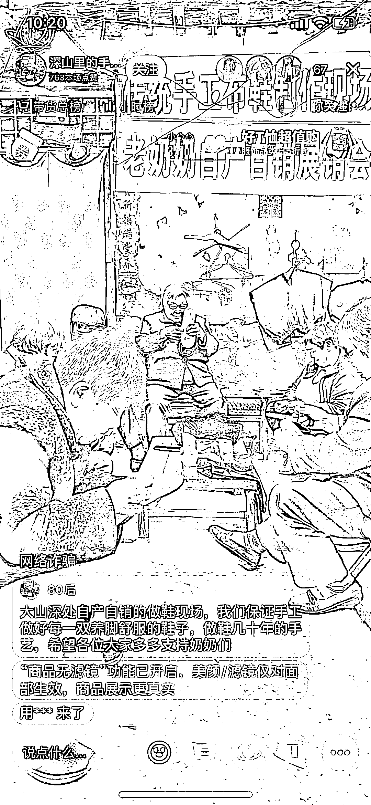

# 抖音直播卖千层底布鞋，怀旧情怀带动银发经济

> 原文：[`www.yuque.com/for_lazy/xkrm14/os4ciyh3u4fsucts`](https://www.yuque.com/for_lazy/xkrm14/os4ciyh3u4fsucts)

<ne-p id="u90daa8bf" data-lake-id="u90daa8bf"><ne-text id="u5922a311">作者： 在路上</ne-text></ne-p> <ne-p id="u1e6a56ed" data-lake-id="u1e6a56ed"><ne-text id="u6e61d127">日期：2023-04-14</ne-text></ne-p> <ne-p id="u7da23678" data-lake-id="u7da23678"><ne-text id="ub6343359">点赞数：</ne-text><ne-text id="uf2ab3e35" ne-bold="true">71</ne-text></ne-p> <ne-hole id="u5a834cbf" data-lake-id="u5a834cbf"><ne-card data-card-name="hr" data-card-type="block" id="rz2DD" data-event-boundary="card"><ne-p id="u32909ec0" data-lake-id="u32909ec0"><ne-text id="u393e5610">正文：</ne-text></ne-p> <ne-p id="ub67bdd83" data-lake-id="ub67bdd83"><ne-text id="u461b344a">抖音直播卖千层底布鞋，98 元一双价格不算低。看得我都想买了。 聚集一帮老年人做生产，带动银发经济，促进老年人就业。 卖怀旧情怀，谁小时候没穿过布鞋呢？</ne-text> <ne-text id="u38b7f3b6">引流渠道可以多种，视频号，小红书都可以考虑。</ne-text></ne-p> <ne-p id="uc086cf30" data-lake-id="uc086cf30"><ne-card data-card-name="image" data-card-type="inline" id="DJZPr" data-event-boundary="card"></ne-card></ne-p> <ne-hole id="u30071f86" data-lake-id="u30071f86"><ne-card data-card-name="hr" data-card-type="block" id="hI2an" data-event-boundary="card"><ne-p id="u91cf5ed0" data-lake-id="u91cf5ed0"><ne-text id="u1421a304">评论区：</ne-text></ne-p> <ne-p id="u01a270c1" data-lake-id="u01a270c1"><ne-text id="u110c021a">J K : 销量怎么样 很多老年人不舍得买这么贵的</ne-text></ne-p> <ne-p id="udb3734e6" data-lake-id="udb3734e6"><ne-text id="u9a5276f6">someone so* : ？？？并非是老年人买啊</ne-text></ne-p> <ne-p id="ud10d6a56" data-lake-id="ud10d6a56"><ne-text id="ue14849ff">在路上 : 年轻人买，老年人做最多一个链接 50 多销量 也不算多</ne-text></ne-p> <ne-p id="uf9ecc7f2" data-lake-id="uf9ecc7f2"><ne-text id="uc61ab30a">刺客 : 大部分是城里人或者年轻人买吧，其实我比较喜欢这种鞋，穿起来健康、舒服。</ne-text></ne-p> <ne-p id="u0b0b8384" data-lake-id="u0b0b8384"><ne-text id="u0eca951e">在路上 : 马云也穿，穿布鞋的马云</ne-text></ne-p> <ne-p id="u07454c5f" data-lake-id="u07454c5f"><ne-text id="u211ab7b1">KWOK : 这还挺有意义的</ne-text></ne-p> <ne-p id="u98d80f1b" data-lake-id="u98d80f1b"><ne-text id="ufab64ea5">在路上 : [强]</ne-text></ne-p> <ne-p id="ub4d0fc67" data-lake-id="ub4d0fc67"><ne-text id="ud2cf2f21">活在未来 : 我小时候就穿的这种鞋，我妈做的纯手工。</ne-text></ne-p> <ne-hole id="u0b6108aa" data-lake-id="u0b6108aa"><ne-card data-card-name="hr" data-card-type="block" id="x6lcp" data-event-boundary="card"><ne-p id="ufbdccee8" data-lake-id="ufbdccee8"><ne-text id="u22743c81">公众号懒人找资源，懒人专属群分享</ne-text></ne-p></ne-card></ne-hole></ne-card></ne-hole></ne-card></ne-hole>