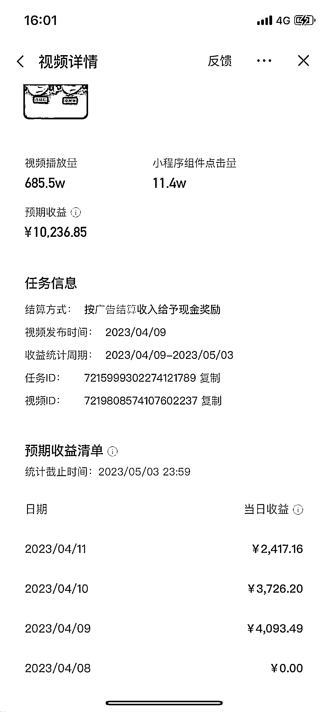
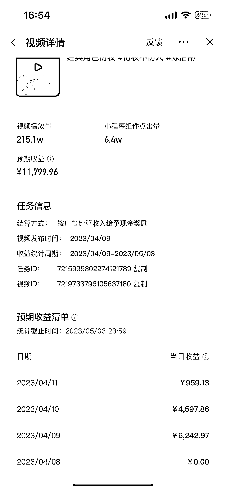

# 小程序推广当下最热的品，不仅能快速涨粉还能额外赚钱

> 原文：[`www.yuque.com/for_lazy/xkrm14/wldzsgt4vun9nyps`](https://www.yuque.com/for_lazy/xkrm14/wldzsgt4vun9nyps)

<ne-p id="u5e6eb34c" data-lake-id="u5e6eb34c"><ne-text id="u08eeb71b">作者： 孙伟悦</ne-text></ne-p> <ne-p id="ue4e57c8b" data-lake-id="ue4e57c8b"><ne-text id="u2c20df38">日期：2023-04-13</ne-text></ne-p> <ne-p id="u6e6416f7" data-lake-id="u6e6416f7"><ne-text id="u5e3c346b">点赞数：</ne-text><ne-text id="uc46fb2cf" ne-bold="true">43</ne-text></ne-p> <ne-hole id="ua365ba95" data-lake-id="ua365ba95"><ne-card data-card-name="hr" data-card-type="block" id="NMwW9" data-event-boundary="card"><ne-p id="ua4bcefc4" data-lake-id="ua4bcefc4"><ne-text id="u7cf027f8">正文：</ne-text></ne-p> <ne-p id="ub1a782c7" data-lake-id="ub1a782c7"><ne-text id="u0d53fde2">小程序推广计划 Faceplay。当下最热的品，抖音星图里面可以找到，用他拍视频不仅能够快速涨粉，别人通过你的视频用了这个小程序你就有钱拿！</ne-text></ne-p> <ne-p id="uc85c487f" data-lake-id="uc85c487f"><ne-card data-card-name="image" data-card-type="inline" id="HUBUH" data-event-boundary="card"></ne-card></ne-p> <ne-p id="u52222a1e" data-lake-id="u52222a1e"><ne-card data-card-name="image" data-card-type="inline" id="eWBRh" data-event-boundary="card"></ne-card></ne-p> <ne-p id="u16caf566" data-lake-id="u16caf566"><ne-card data-card-name="image" data-card-type="inline" id="peYmM" data-event-boundary="card"></ne-card></ne-p> <ne-hole id="ucdd74334" data-lake-id="ucdd74334"><ne-card data-card-name="hr" data-card-type="block" id="pkN0N" data-event-boundary="card"><ne-p id="u8379da01" data-lake-id="u8379da01"><ne-text id="u89398f6f">评论区：</ne-text></ne-p> <ne-p id="u9b9cd40e" data-lake-id="u9b9cd40e"><ne-text id="ucc8e9c8f">孙伟悦 : 就是一个换脸小程序</ne-text></ne-p> <ne-p id="u2d0eb820" data-lake-id="u2d0eb820"><ne-text id="uaf4a1da6">Sunwei : 这是你账号的播放等数据吗🐮</ne-text></ne-p> <ne-p id="ub01eca8d" data-lake-id="ub01eca8d"><ne-text id="u05213093">do 小鱼 : 同问</ne-text></ne-p> <ne-p id="u5b34b04e" data-lake-id="u5b34b04e"><ne-text id="u53e4a719">孙伟悦 : 我朋友的播放，视频制作只要几分钟[呲牙]</ne-text></ne-p> <ne-p id="ud552ea46" data-lake-id="ud552ea46"><ne-text id="u01027644">田小田的甜 : 要 1000 粉丝</ne-text></ne-p> <ne-p id="u716cec62" data-lake-id="u716cec62"><ne-text id="u3910e7d7">亦仁 : 中标，术值 +1。 点击最上方 #中标 专栏，可查看所有中标风向标。</ne-text></ne-p> <ne-p id="uf504b82e" data-lake-id="uf504b82e"><ne-text id="uadc6875a">孙伟悦 : [鼓掌][鼓掌][鼓掌]</ne-text></ne-p> <ne-hole id="uc6a8c07c" data-lake-id="uc6a8c07c"><ne-card data-card-name="hr" data-card-type="block" id="B1NXQ" data-event-boundary="card"><ne-p id="u86895881" data-lake-id="u86895881"><ne-text id="u296e23be">公众号懒人找资源，懒人专属群分享</ne-text></ne-p></ne-card></ne-hole></ne-card></ne-hole></ne-card></ne-hole>