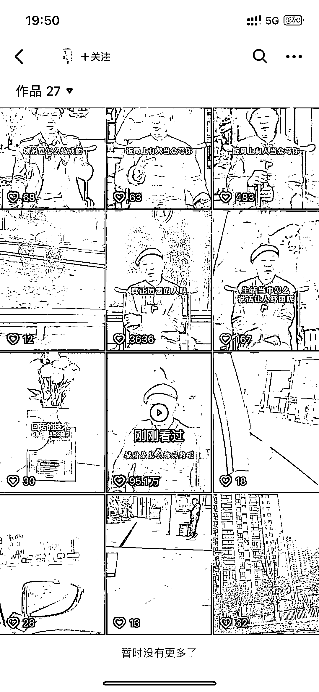
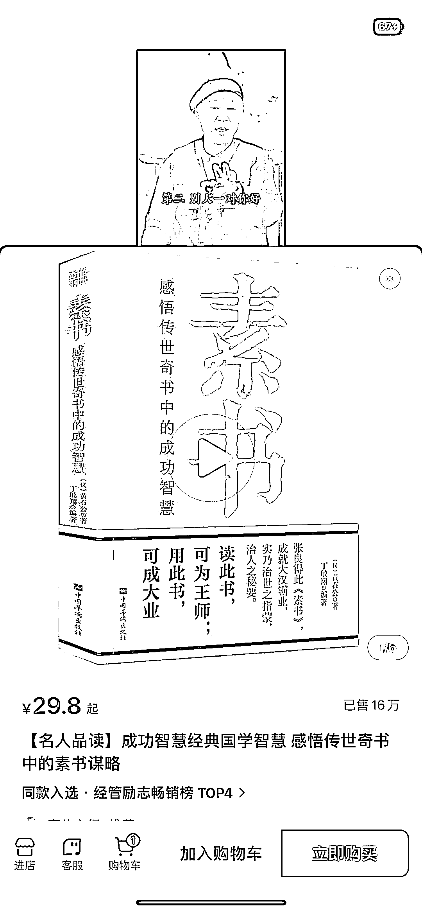

# 抖音单个书单号值得一对一对标模仿

> 原文：[`www.yuque.com/for_lazy/xkrm14/pq14iq97e3m70h1a`](https://www.yuque.com/for_lazy/xkrm14/pq14iq97e3m70h1a)

作者： LeoD

日期：2023-04-13

点赞数：71

<ne-card data-card-name="hr" data-card-type="block" id="dVzHE" data-event-boundary="card">

正文：

一个书单号，点进去主页可以显而易见看到这个视频的流量远超其他视频，这种单个爆的视频值得一对一对标模仿。

<ne-card data-card-name="image" data-card-type="inline" id="qz9Qk" data-event-boundary="card"></ne-card>

<ne-card data-card-name="image" data-card-type="inline" id="hEgP5" data-event-boundary="card"></ne-card>

<ne-card data-card-name="image" data-card-type="inline" id="Wy2iE" data-event-boundary="card"></ne-card>

<ne-card data-card-name="hr" data-card-type="block" id="jguyH" data-event-boundary="card">

评论区：

〃斜杠青年陈少 ヾ : 就这老人，有人搬到视频号带货也爆了，就这一条视频，说真的，我自己都被他的一席话种草了……[流汗]

〃斜杠青年陈少 ヾ : 刷到视频的第一眼，得找个和这老人一样的感觉，人长得就像有故事的人，经历过岁月经历的人，讲的话才会有一定的说服力……😂

LeoD : 同理 已故的曾仕强教授混剪带货各种国学产品能力极其强悍

白奇杉 : 奇怪，抖音不是查重文案吗，他这个文案，我看到过很多次了。

生命大海狂野冲浪者 : 这个视频已经删了，博主重新发了一遍了。

way : 这个老人叫什么呀

LeoD : 对的，这就是一个异常值的流量，说明这个文案在 dy 的流量很大，值得对标

LeoD : 非官方消息：这个老人叫白眉，短视频老演员了，可带货各种国学

<ne-card data-card-name="hr" data-card-type="block" id="PmVLT" data-event-boundary="card">

公众号懒人找资源，懒人专属群分享

</ne-card></ne-card></ne-card>