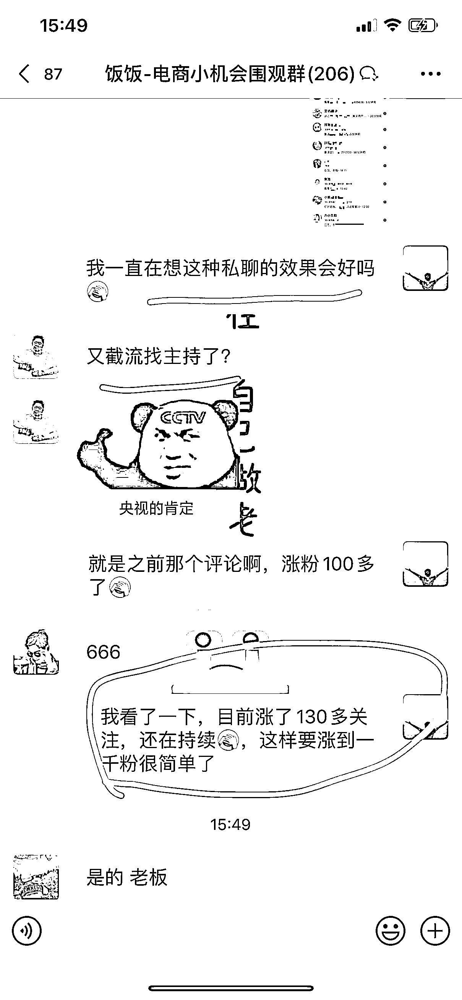

# 在抖音评论区评论截流，轻松涨粉

> 原文：[`www.yuque.com/for_lazy/xkrm14/znpc5ungctcbov9v`](https://www.yuque.com/for_lazy/xkrm14/znpc5ungctcbov9v)

作者： 饭饭

日期：2023-04-11

点赞数：85

正文：

抖音截流，轻松到千粉！ 分享一个抖音很轻松简单的涨粉方法： 已多次实践，效果可行！ 抖音评论区：评论截流 思路：在抖音评论区留言说出自己需求，然后会有很多业务员来关注你。 举个例子： 例如我是做电商的，我可以在哪些大的电商播出评论区留言我的需求： 我试了留言；来一个靠谱主持（电商 s 单的意思） 效果如图：在一个电商播出作品下面留言了，然后目前一天时间涨📈了 135 个关注，收到非常多私信（这个不用回）关注还在持续，到处留言，涨一千真人粉开直播真的不难。 延展思路： 在卖房博主评论区：最近想入手 XXX 楼盘，我发现太难选了… 在卖车博主评论区：打算最近这几天入手，不知道在哪买………… 在各行业评论区，很好玩也能涨粉然后如果你的账号发了笔记，笔记播放量还会蹭蹭蹭📈

评论区：

养牛达人福老板 : 思路清奇。。我去找找卖车险的视频，这些人都比较疯狂[捂脸]

饭饭 : 这些都是能互动的真人粉，他把你当作精准客户，还还不容易取关[胜利]

121 : 这个思路真的太清奇了！

饭饭 : 有用就好[呲牙]

阿辉 : 好方法

孙伟悦 : 牛牛牛

浩瀚 : 这方法很不错，之前试过，效果不错，但没楼主聪明，懂得这样利用，非常赞

饭饭 : 生财太多好方法了💪

公众号懒人找资源，懒人专属群分享

