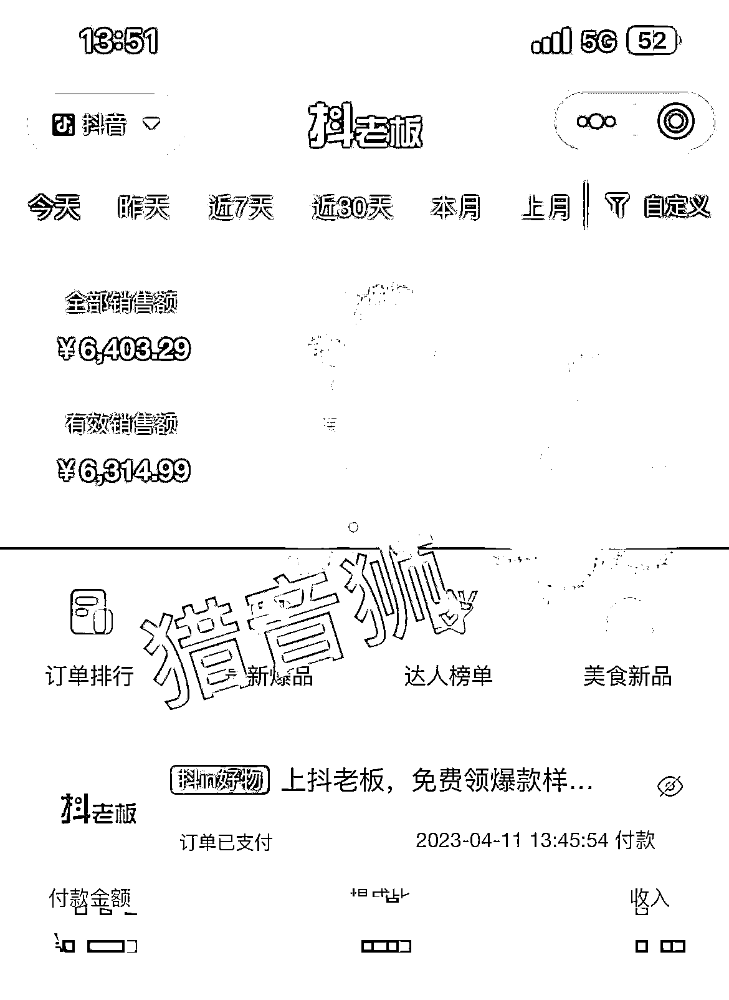
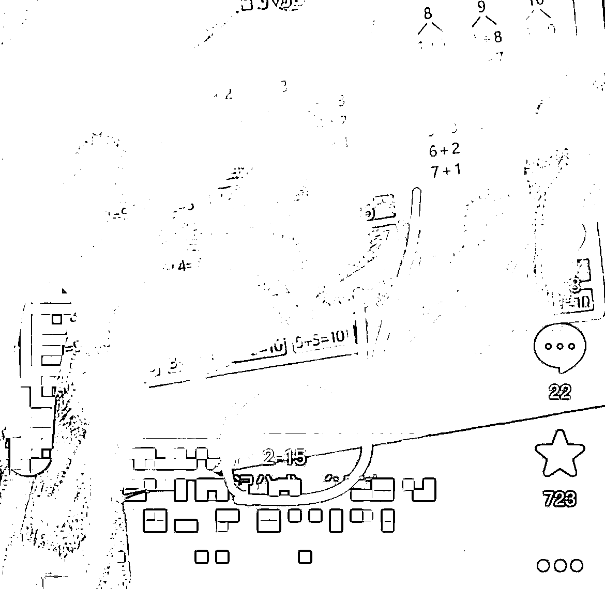

# 抖音历史爆款视频炒冷饭玩法

> 原文：[`www.yuque.com/for_lazy/xkrm14/eup304rp78m3ingg`](https://www.yuque.com/for_lazy/xkrm14/eup304rp78m3ingg)

作者： 猎音狮

日期：2023-04-11

点赞数：29

正文：

【抖音项目】【历史爆款视频炒冷饭玩法】 发了两条帖子，得到了圈友们的认可，也是满满呢鼓励与动力，那我闲暇之余，就利用每天的碎片时间分享一下图书投流带货的经验吧。 是不是有人告诉你，视频发布过了几天就没有热度了，一定要赶快投赶快撤？我用实战经验告诉你，这个理论是错的，如果你不想错过赚更多钱的机会，你一定要试试我这个方法。 什么方法？就是时不时把之前测过的转化比较好的视频拿出来，再投几笔，你一定会有惊喜。 我试过很多次，当时投放投不动了，就没投了。过了十天半个月，我又去投了几笔，发现投产非常好，我就继续加大投放了，又赚了一波。（图 1 ：测两个月前的视频，流量又起来了！） 为什么会这样呢？因为大家都喜欢跟风，正在爆的品，大家都在跟，竞争自然激烈，过段时间等他们都不跑了，你去跑不就竞争小了吗？投产不就好了吗？ 这个方法你知道就行了，我是猎音狮，点关注，不迷路，带你玩转图书带货，一起生财有术！

评论区：

琨儿 : 感谢分享

猎音狮 : [握手][握手]

刘员外 : 哈，做教辅的

猎音狮 : [机智][机智]

刘员外 : 我一个品，但凡爆了，能吃一个月以上

猎音狮 : 大佬带带弟弟

刘员外 : 你是大佬

Tommy : 日后不投流，自然流会变小吗？[捂脸] 跟吸毒一样哈哈哈

公众号懒人找资源，懒人专属群分享

