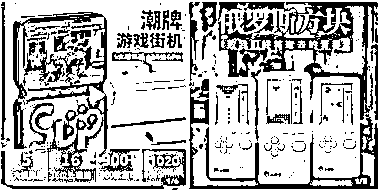
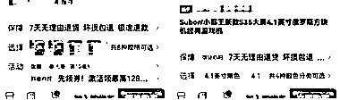
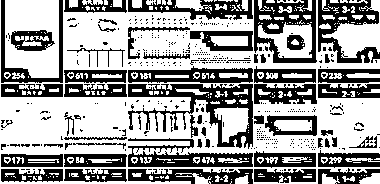

# 抖音快手复古游戏机有很大商机

> 原文：[`www.yuque.com/for_lazy/xkrm14/onhnlqen38g7zus9`](https://www.yuque.com/for_lazy/xkrm14/onhnlqen38g7zus9)

作者： 黄岛主(虚拟项目)

日期：2023-04-11

点赞数：26

正文：

最近比较怀旧，看上了这类游戏机，小时候经常玩的，发现商机无限哈 这类游戏机的佣金不高也不低，没有卖书佣金那么高，但是销量是可以的，而且项目基本没什么成本，需要买台游戏机就可以，比如俄罗斯方块，十几块钱就能买到，彩色的 sup 稍微贵一点，项目不需要用电脑，一部手机就可以完成整个流程。 基本不需要剪辑，拍好直接用剪映配一下背景音乐，或者直接用某音、某手收藏的 BGM 配一下背景音乐也是可以的，都是实拍原创，而且作品制作速度很快，每天花 40 分钟弄三、五条发就可以，项目从开始做到收益周期也不长，至少得坚持一、两个星期，无论哪个项目，只要不擦边，就不会涉及封号，顶多是流量不好，销量不好。 简单说下操作思路： 直接在某音、某手搜复古游戏机就能搜到，目前这两种销量比较好 1、账号注册，可以去找一些对标账号，模仿着他们的账号填写个人简介、头像、背景图设置，复古游戏机，超级玛丽、俄罗斯方块的游戏机比较多，还有就是 sup 掌机，头像用超级玛丽或者魂斗罗，游戏中的人物头像也可以，名字随便起就行。 2、个人简介，引导粉丝到店铺或者橱窗进行下单购买，大家可以去搜索一下，看人家怎么做的，主打某手，因为某音带货需要 1000 粉丝，某手只要实名就能带货，某音不推荐唰粉，一毛钱没挣到，就花一、两百，万一不做了就退不回来，两个平台同步发作品，不需要养号直接发就行，一天发三、五条，一、两分钟，配一下 BGM 直接发就可以。 3、制作作品，因为需要实拍，不需要剪辑配 BGM，BGM 搜索一下，找到对标账号，看人家的 BGM 是什么，把背景音乐收藏一下，发的时候就可以直接用背景音乐，到拼夕夕搜索手播支架，调整角度，下面手在玩游戏，拍一、两分钟就可以，如果不想花钱，也可以把手机放在桌子上，然后手在玩游戏机，效果跟手播支架一样，一、两分钟就行，一次性拍十几条，每天发几条就行，尽量一天发五、六条。 变现思路 带货，在某音卖游戏机，需要 1000 粉丝带货，在视频上挂上商品链接，同款游戏到下方店铺或者小店下单就行了，项目总体逻辑就是发打游戏的作品，吸引粉丝到了店铺下单，这也是一个长期的项目，需要大家去坚持，不可能发三、五天作品，就能卖一、两百单，需要坚持。 感兴趣的话可以试试

评论区：

千穹 : 老师好，我看您至少 10 节课[憨笑]

黄岛主(虚拟项目) : 哈哈，看的啥课

千穹 : 引流，小红书，淘宝等等的[偷笑]

公众号懒人找资源，懒人专属群分享

