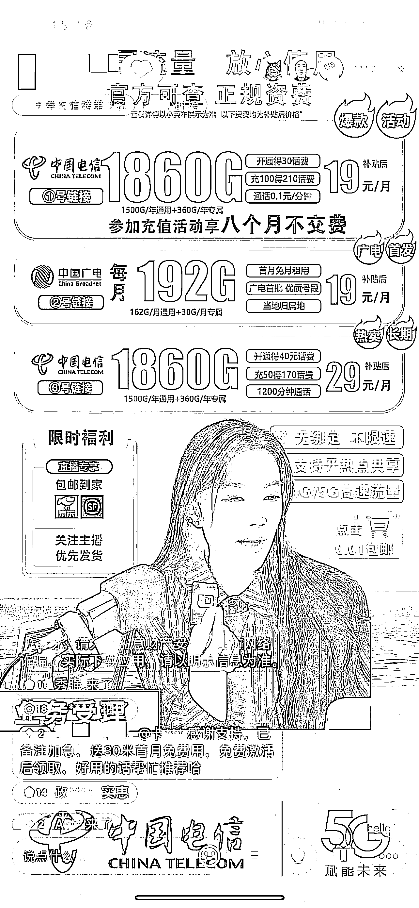
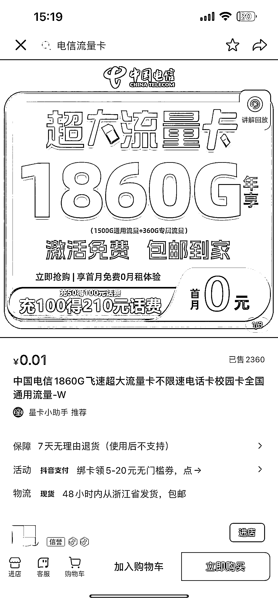

# 抖音直播配合千川投流卖流量卡，也可以做地推

> 原文：[`www.yuque.com/for_lazy/xkrm14/pffp2r9za4r0ifgk`](https://www.yuque.com/for_lazy/xkrm14/pffp2r9za4r0ifgk)

<ne-p id="u13565dd0" data-lake-id="u13565dd0"><ne-text id="ud1cbfac9">作者： 阿大</ne-text></ne-p> <ne-p id="uc52fb5f2" data-lake-id="uc52fb5f2"><ne-text id="ua60873f4">日期：2023-04-10</ne-text></ne-p> <ne-p id="u2df31cd7" data-lake-id="u2df31cd7"><ne-text id="u78264541">点赞数：</ne-text><ne-text id="u9aaf9967" ne-bold="true">23</ne-text></ne-p> <ne-hole id="u786029f6" data-lake-id="u786029f6"><ne-card data-card-name="hr" data-card-type="block" id="jnyku" data-event-boundary="card"><ne-p id="u56b819ea" data-lake-id="u56b819ea"><ne-text id="uffc6678e">正文：</ne-text></ne-p> <ne-p id="u50e247bb" data-lake-id="u50e247bb"><ne-text id="u44184d77">直播卖大流量卡，配合千川投流，10 分钟卖了 300 单，在云瞻开放平台一单利润在 80-150 左右。</ne-text> <ne-text id="u8f5ad92c">电话卡在抖音属于特邀类目，要开小店比较困难，需要的资金也比较高。但可以借助企业号跳转和星图来实现挂链接，企业号 600 块钱能搞定，星图一小时 50 块钱左右。</ne-text> <ne-text id="ud371163a">对主播要求不高，不断重复一些简单的话术即可，也可以借助数字人实现日不落直播间。</ne-text> <ne-text id="uf72ac49a">再给个思路，做地推，在网上买一件三大运营商的衣服，包装一下自己，打印一个 kt 板即可操作。</ne-text></ne-p> <ne-p id="u1cfb1ad0" data-lake-id="u1cfb1ad0"><ne-card data-card-name="image" data-card-type="inline" id="iJqra" data-event-boundary="card"></ne-card></ne-p> <ne-p id="uc84a58b5" data-lake-id="uc84a58b5"><ne-card data-card-name="image" data-card-type="inline" id="TiG02" data-event-boundary="card"></ne-card></ne-p> <ne-hole id="u6b286cf2" data-lake-id="u6b286cf2"><ne-card data-card-name="hr" data-card-type="block" id="BORqS" data-event-boundary="card"><ne-p id="u9a5a5223" data-lake-id="u9a5a5223"><ne-text id="ub531c508">评论区：</ne-text></ne-p> <ne-p id="u33c5dd12" data-lake-id="u33c5dd12"><ne-text id="u80b2b915">王多鱼 : 最考验的是投手了</ne-text></ne-p> <ne-p id="uf83544ea" data-lake-id="uf83544ea"><ne-text id="uf70e638c">阿大 : 杨秀强 回复 王多鱼: 这个卡对我们来说无成本，投 100 块钱有 1 人下单就回本，对投手要求也不高[捂脸]</ne-text></ne-p> <ne-p id="ub9238224" data-lake-id="ub9238224"><ne-text id="ua629004d">Cooper : 企业号跳转是咋做？</ne-text></ne-p> <ne-p id="u7459ea98" data-lake-id="u7459ea98"><ne-text id="u23b15b4d">阿大 : 我也不会[尴尬]可以在淘宝搜一下“企业号小风车”</ne-text></ne-p> <ne-p id="u9f5c2643" data-lake-id="u9f5c2643"><ne-text id="u733b57c4">胡鹏 : 麻烦请教下，卡的供货商从哪来呀？从哪接单呢？</ne-text></ne-p> <ne-p id="u15abc8cc" data-lake-id="u15abc8cc"><ne-text id="u2e429419">阿大 : 云瞻开放平台，在生财里搜索“流量卡、电话卡”等即可看到相关资源</ne-text></ne-p> <ne-p id="uefea6203" data-lake-id="uefea6203"><ne-text id="ue1054a3e">晚睡女王 : 大佬，结算周期是多少天的啊？</ne-text></ne-p> <ne-p id="u66bd8031" data-lake-id="u66bd8031"><ne-text id="ud9220561">阿大 : 具体我没看，应该也要客户收到货激活了之后吧</ne-text></ne-p> <ne-hole id="u576d3a69" data-lake-id="u576d3a69"><ne-card data-card-name="hr" data-card-type="block" id="GPmjg" data-event-boundary="card"><ne-p id="ufbfbdf06" data-lake-id="ufbfbdf06"><ne-text id="ub4e3802e">公众号懒人找资源，懒人专属群分享</ne-text></ne-p></ne-card></ne-hole></ne-card></ne-hole></ne-card></ne-hole>