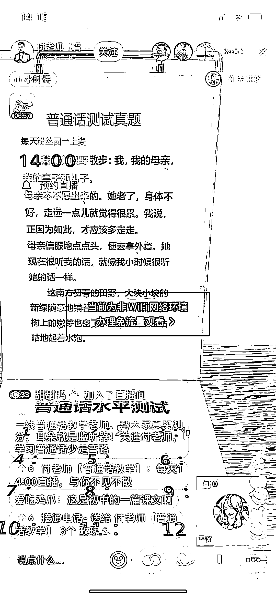
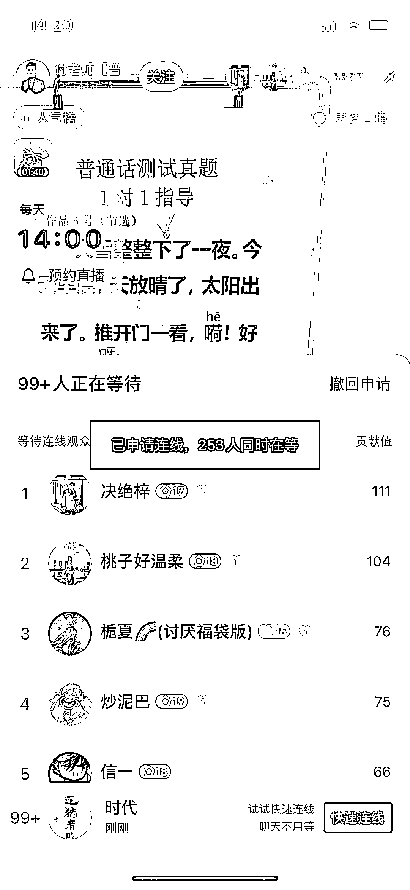

# 抖音普通话测试真题直播间，引流卖各种课

> 原文：[`www.yuque.com/for_lazy/xkrm14/zmutuws0nid0s8ab`](https://www.yuque.com/for_lazy/xkrm14/zmutuws0nid0s8ab)

<ne-p id="u42361cbc" data-lake-id="u42361cbc"><ne-text id="u6a337260">作者： 时代</ne-text></ne-p> <ne-p id="u8f51503a" data-lake-id="u8f51503a"><ne-text id="u85dda4d9">日期：2023-04-10</ne-text></ne-p> <ne-p id="u25b43085" data-lake-id="u25b43085"><ne-text id="u766d5063">点赞数：</ne-text><ne-text id="u73575739" ne-bold="true">14</ne-text></ne-p> <ne-hole id="u45986868" data-lake-id="u45986868"><ne-card data-card-name="hr" data-card-type="block" id="SvZpi" data-event-boundary="card"><ne-p id="ufb944d76" data-lake-id="ufb944d76"><ne-text id="uaac04895">正文：</ne-text></ne-p> <ne-p id="u11781a4d" data-lake-id="u11781a4d"><ne-text id="u9587dcfe">抖音直播间 普通话测试真题 直播间在线练习，评估等级 直播间在线 3000+，排队 200+ 音浪+粉丝灯牌 收入，简介处留 V 引流私域，做培训 卖课</ne-text> <ne-text id="u7bf12e28">卖资料 私教课收入 找字正腔圆的主播（主持人）合作， 普通话一乙以上，可以直播间在线点评。 不知道有没有这类智能软件可以自动评估的，可以实现批量化操作。</ne-text></ne-p> <ne-p id="ueeff295d" data-lake-id="ueeff295d"><ne-card data-card-name="image" data-card-type="inline" id="Erlac" data-event-boundary="card"></ne-card></ne-p> <ne-p id="ud583df95" data-lake-id="ud583df95"><ne-card data-card-name="image" data-card-type="inline" id="uCrjZ" data-event-boundary="card"></ne-card></ne-p> <ne-p id="uccc73b6e" data-lake-id="uccc73b6e"><ne-card data-card-name="image" data-card-type="inline" id="J3OUZ" data-event-boundary="card"></ne-card></ne-p> <ne-hole id="u291b6123" data-lake-id="u291b6123"><ne-card data-card-name="hr" data-card-type="block" id="zwYIZ" data-event-boundary="card"><ne-p id="uf8e625e7" data-lake-id="uf8e625e7"><ne-text id="ud31f8bb5">评论区：</ne-text></ne-p> <ne-p id="ud28dcfc2" data-lake-id="ud28dcfc2"><ne-text id="u99784d3b">小李老师 : 虽然我不是主持人，但是是湖南省普通话测试员</ne-text></ne-p> <ne-p id="u53123355" data-lake-id="u53123355"><ne-text id="u6ec18501">时代 : 啊哈哈哈，我只是举个例子，普通话测试员才是专业[捂脸]</ne-text></ne-p> <ne-p id="u10d4a7de" data-lake-id="u10d4a7de"><ne-text id="u8824a118">豆豆 : 对口</ne-text></ne-p> <ne-p id="u4c796949" data-lake-id="u4c796949"><ne-text id="u6135d7d7">亦仁 : 中标，术值 +1。 点击最上方 #中标 专栏，可查看所有中标风向标。</ne-text></ne-p> <ne-hole id="u1a1e916f" data-lake-id="u1a1e916f"><ne-card data-card-name="hr" data-card-type="block" id="OJZpw" data-event-boundary="card"><ne-p id="u89266fe7" data-lake-id="u89266fe7"><ne-text id="u8510d8de">公众号懒人找资源，懒人专属群分享</ne-text></ne-p></ne-card></ne-hole></ne-card></ne-hole></ne-card></ne-hole>