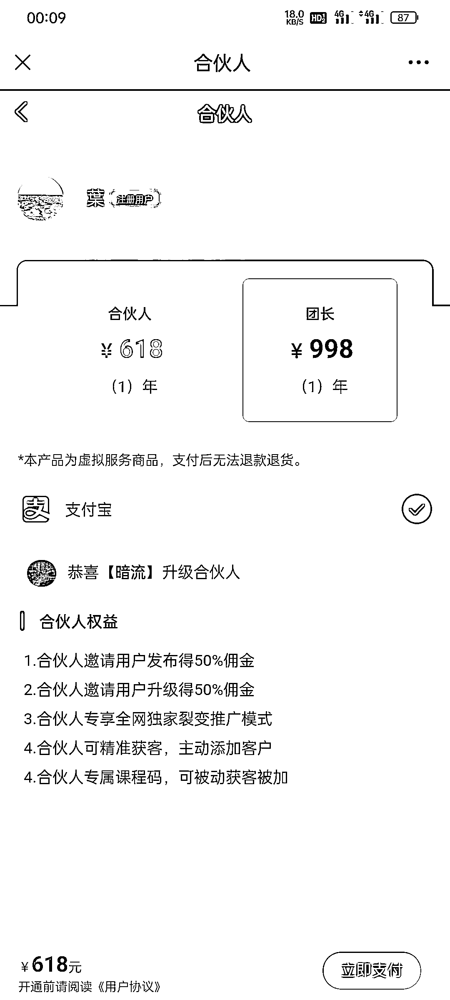

# 全网课程平台，很好的引流 + 裂变 + 变现模式

> 原文：[`www.yuque.com/for_lazy/xkrm14/mayy93r0azk1k4qb`](https://www.yuque.com/for_lazy/xkrm14/mayy93r0azk1k4qb)

作者： 星语

日期：2023-04-13

点赞数：80

<ne-hole id="u996b9282" data-lake-id="u996b9282"><ne-card data-card-name="hr" data-card-type="block" id="aAsTV" data-event-boundary="card">

正文：

分享一个非常好的引流+裂变+变现案例 1、这个平台上收集了各种互联网项目教程免费给所有注册用户学习，看图 1 2、注册用户想要免费学习课程，就必须添加平台合伙人免费领取一个课程码验证后才可以获得学习权限。（这样的话就相当给平台合伙人被动引流了） 3、注册用户分享朋友来学习课程还可以获得佣金提成。（利用兼职转发推广，合伙人获得被动流量）图 2 4、平台靠销售广告位和升级合伙人变现（因为课程其他平台都是收费，这里免费再加上兼职推广，就形成了一个流量闭环）图 3 非常好的一个引流+裂变+变现模式，大家可以研究下。 #风向标 四方集客 details?shareId=1823&isPromote=0&memberId=4058)

<ne-card data-card-name="image" data-card-type="inline" id="RDrbV" data-event-boundary="card"></ne-card>

<ne-card data-card-name="image" data-card-type="inline" id="xwpfV" data-event-boundary="card"></ne-card>

<ne-card data-card-name="image" data-card-type="inline" id="IWsdF" data-event-boundary="card"></ne-card>

<ne-hole id="u85682c89" data-lake-id="u85682c89"><ne-card data-card-name="hr" data-card-type="block" id="A1pCr" data-event-boundary="card">

评论区：

啊明 : app 叫什么名字

星语 : 网址进入～四方集客 details?shareId=2&isPromote=0&memberId=2264)

啊明 : 找不到

星语 : 点击链接就可以进去

张优勋 : 要交钱的怕不保险

文卓 : 给你点赞，这种类似的项目 3 年前看到过，当时是用免费的激活码进的，里面的内容参差不齐，大部分都是市面上放出来的割韭菜课程，不排除有高质量的，但时间筛选成本太高。营销设计不错，自动裂变分销，吸引知识付费，基本可分为 5 项收入，循序渐进，一步一步走： 1、购买会员，赚会员费 2、招代理，赚代理费 3、招分站合伙人，赚加盟费 4、卖网站系统，支持一键部署，赚软件费 5、卖源码和搭建教程，赚教程费

文卓 : PS： 基本都是盗版

<ne-hole id="u55b6be7f" data-lake-id="u55b6be7f"><ne-card data-card-name="hr" data-card-type="block" id="RPzCx" data-event-boundary="card">

公众号懒人找资源，懒人专属群分享

</ne-card></ne-hole></ne-card></ne-hole></ne-card></ne-hole>