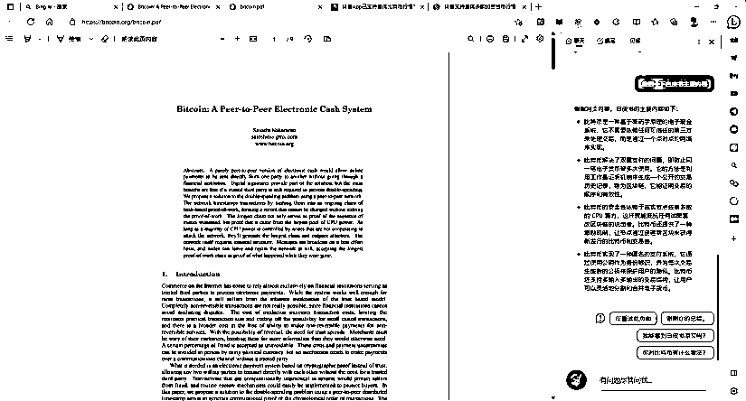

# 查询大饼价格信息的方法

> 原文：[`www.yuque.com/for_lazy/xkrm14/bsyb2qs67shtklhg`](https://www.yuque.com/for_lazy/xkrm14/bsyb2qs67shtklhg)

<ne-p id="ub7a258ce" data-lake-id="ub7a258ce"><ne-text id="u44f644c6">作者： 元峰</ne-text></ne-p> <ne-p id="u8d7953ed" data-lake-id="u8d7953ed"><ne-text id="u6ef9ec5d">日期：2023-04-11</ne-text></ne-p> <ne-p id="u4dcbe652" data-lake-id="u4dcbe652"><ne-text id="u417f6c20">点赞数：</ne-text><ne-text id="u8f2d3980" ne-bold="true">23</ne-text></ne-p> <ne-hole id="u373dd43f" data-lake-id="u373dd43f"><ne-card data-card-name="hr" data-card-type="block" id="zKScc" data-event-boundary="card"><ne-p id="uaba7f40f" data-lake-id="uaba7f40f"><ne-text id="ud72dba74">正文：</ne-text></ne-p> <ne-p id="u30e289b1" data-lake-id="u30e289b1"><ne-text id="ua454e205">今天早上，抖音上可以查询大饼价格的信息在不停地刷屏，这引起了我的兴趣。我便去 Bing 查询了一下，毕竟 Bing 集成 GPT-4</ne-text> <ne-text id="u46bdc0ea">运行，而且是微软为搜索定制的。 然后，顺便让 Bing Copilot 副驾驶读一下大饼白皮书文档，画了张图，写段朋友圈文案，公众号文章。</ne-text> <ne-text id="u14ca56bb">完整步骤移步飞书：‌⁣‬⁡⁣‌⁢‬⁢‌⁡‌⁢⁤‍⁤⁤‌‌‬⁡‌⁤‍‌⁡‬⁡‌⁡‍</ne-text>[<ne-text id="u33906032">https://esouqpttmy.feishu.cn/docx/TakNdGYnQoi5FAxC...</ne-text>](https://esouqpttmy.feishu.cn/docx/TakNdGYnQoi5FAxCqeUckLEHnle)</ne-p> <ne-p id="u353aafa1" data-lake-id="u353aafa1"><ne-card data-card-name="image" data-card-type="inline" id="gMfhw" data-event-boundary="card"></ne-card></ne-p> <ne-p id="ub175be10" data-lake-id="ub175be10"><ne-card data-card-name="image" data-card-type="inline" id="Kz2Ay" data-event-boundary="card"></ne-card></ne-p> <ne-p id="u24a678c7" data-lake-id="u24a678c7"><ne-card data-card-name="image" data-card-type="inline" id="qBHkW" data-event-boundary="card"></ne-card></ne-p> <ne-p id="u5172c400" data-lake-id="u5172c400"><ne-card data-card-name="image" data-card-type="inline" id="yNij3" data-event-boundary="card"></ne-card></ne-p> <ne-p id="u08f6c47c" data-lake-id="u08f6c47c"><ne-card data-card-name="image" data-card-type="inline" id="ClB6t" data-event-boundary="card"></ne-card></ne-p> <ne-p id="ub4db4b1b" data-lake-id="ub4db4b1b"><ne-card data-card-name="image" data-card-type="inline" id="yckcP" data-event-boundary="card"></ne-card></ne-p> <ne-hole id="u5d74cd4e" data-lake-id="u5d74cd4e"><ne-card data-card-name="hr" data-card-type="block" id="KKVIg" data-event-boundary="card"><ne-p id="udaba4a7b" data-lake-id="udaba4a7b"><ne-text id="u5ff98e03">评论区：</ne-text></ne-p> <ne-hole id="u38ce4e1c" data-lake-id="u38ce4e1c"><ne-card data-card-name="hr" data-card-type="block" id="gZuqb" data-event-boundary="card"><ne-p id="ubc2e3715" data-lake-id="ubc2e3715"><ne-text id="ufc442024">公众号懒人找资源，懒人专属群分享</ne-text></ne-p></ne-card></ne-hole></ne-card></ne-hole></ne-card></ne-hole>