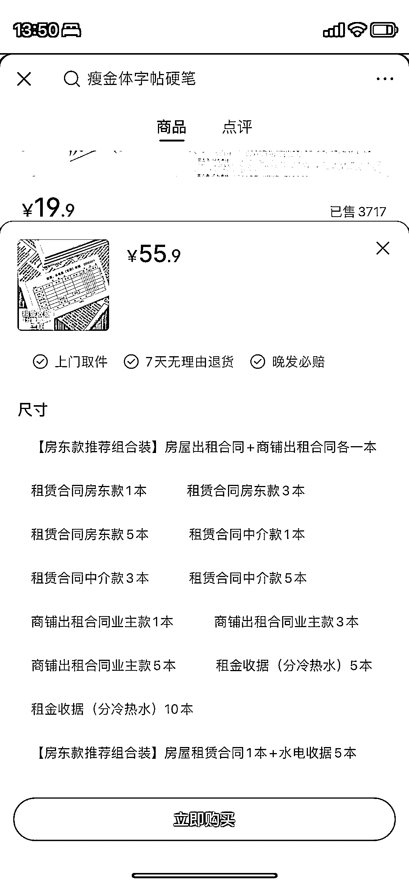

# 纸质版的房东合同模板，复购率和客单价更高

> 原文：[`www.yuque.com/for_lazy/xkrm14/mp6fg6k2tx20q2o8`](https://www.yuque.com/for_lazy/xkrm14/mp6fg6k2tx20q2o8)

作者： 不老什人

日期：2023-04-11

点赞数：14

<ne-card data-card-name="hr" data-card-type="block" id="jB7bJ" data-event-boundary="card">

正文：

房东合同模版不止可以卖电子版稳定，还能卖打印纸质本，比起直接卖电子资料提高了复购的可能，而且通过 sku 设置，客单价容易更高

<ne-card data-card-name="image" data-card-type="inline" id="uJG9r" data-event-boundary="card"></ne-card>

<ne-card data-card-name="image" data-card-type="inline" id="GNqk2" data-event-boundary="card"></ne-card>

<ne-card data-card-name="image" data-card-type="inline" id="didO7" data-event-boundary="card"></ne-card>

<ne-card data-card-name="hr" data-card-type="block" id="XSsGO" data-event-boundary="card">

评论区：

<ne-card data-card-name="hr" data-card-type="block" id="TP8ro" data-event-boundary="card">

公众号懒人找资源，懒人专属群分享

</ne-card></ne-card></ne-card>