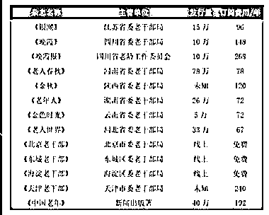
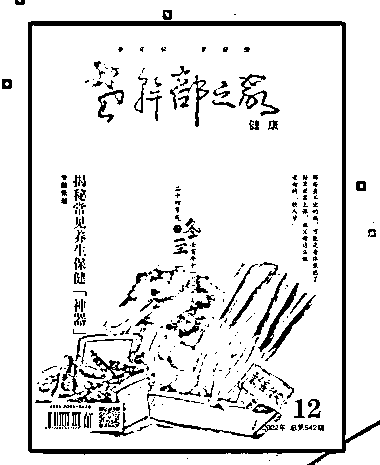

# 老年人市场内容宝藏推荐

> 原文：[`www.yuque.com/for_lazy/xkrm14/krcrf0onklkoclvn`](https://www.yuque.com/for_lazy/xkrm14/krcrf0onklkoclvn)

<ne-p id="u483ef0c7" data-lake-id="u483ef0c7"><ne-text id="u93420bf4">作者： Luke 王子</ne-text></ne-p> <ne-p id="u4c6d6eb8" data-lake-id="u4c6d6eb8"><ne-text id="u282c4052">日期：2023-04-11</ne-text></ne-p> <ne-p id="ubc8171b2" data-lake-id="ubc8171b2"><ne-text id="u9d7c380b">点赞数：</ne-text><ne-text id="uc48bbee1" ne-bold="true">41</ne-text></ne-p> <ne-hole id="uce957131" data-lake-id="uce957131"><ne-card data-card-name="hr" data-card-type="block" id="YNxE3" data-event-boundary="card"><ne-p id="ua95dac09" data-lake-id="ua95dac09"><ne-text id="ue2eac03c">正文：</ne-text></ne-p> <ne-p id="uf062c8b6" data-lake-id="uf062c8b6"><ne-text id="u64871e07">老年人市场内容宝藏推荐 众所周知当前中国中老年市场潜力巨大，怎么能深入了解他们的心里想法和真是需求？</ne-text> <ne-text id="u066a8395">这里提供一个思路：我上周逛了离退休办公楼，有大发现。离退休中心会给老人订购中老年杂志：请见附录 这里我重点说下《老干部之家》 每月上下两刊</ne-text> <ne-text id="ud0ca63c9">上刊：老人摄影，文学投稿，故事（类似意林），老年人关注的板块 下刊：养生知识（你嗅到什么了？）</ne-text> <ne-text id="uc05ef172">（多说一句：互联网严重冲击，老干部之家杂志还能保持盈利，说明深的中老年人欢心） 离退休中老年人的消费能力和学习热情高，价值大！</ne-text></ne-p> <ne-p id="u5601b8e6" data-lake-id="u5601b8e6"><ne-card data-card-name="image" data-card-type="inline" id="aVHrQ" data-event-boundary="card"></ne-card></ne-p> <ne-p id="uc0e1988a" data-lake-id="uc0e1988a"><ne-card data-card-name="image" data-card-type="inline" id="UVH2U" data-event-boundary="card"></ne-card></ne-p> <ne-hole id="u9e79bf3a" data-lake-id="u9e79bf3a"><ne-card data-card-name="hr" data-card-type="block" id="AQwYH" data-event-boundary="card"><ne-p id="u353312bb" data-lake-id="u353312bb"><ne-text id="udc2ce8de">评论区：</ne-text></ne-p> <ne-p id="u3e5e696f" data-lake-id="u3e5e696f"><ne-text id="u5391034e">招财喵 : 货源有吗</ne-text></ne-p> <ne-p id="uadc30111" data-lake-id="uadc30111"><ne-text id="ud9bf238c">侯小凌 : 很多老干部对文件性的杂志还是很感兴趣的，但是这是机关报社，好像不存在盈利吧。</ne-text></ne-p> <ne-p id="u5589962f" data-lake-id="u5589962f"><ne-text id="ub446348f">Luke 王子 : 你看到有年费价格的，都是要通过订阅才能拿到杂志的噢！</ne-text></ne-p> <ne-p id="u60269a6b" data-lake-id="u60269a6b"><ne-text id="u626bdc3d">Luke 王子 : 没有</ne-text></ne-p> <ne-p id="u5f07ccb3" data-lake-id="u5f07ccb3"><ne-text id="uc6660d57">镜泊森源 : 离退休老干部的报刊、杂志都是有订阅任务的，有考核指标的，说白了就是摊派。</ne-text></ne-p> <ne-p id="ufd827438" data-lake-id="ufd827438"><ne-text id="u41592725">镜泊森源 : zf 机关的老干部局（办），国企的老干部办（中心）。</ne-text></ne-p> <ne-p id="u3deb5c17" data-lake-id="u3deb5c17"><ne-text id="u7aa004e0">Luke 王子 : 看看老干部之家，这个挺有意思的</ne-text></ne-p> <ne-p id="u1958dd13" data-lake-id="u1958dd13"><ne-text id="u47f8d496">wangyalili : 这个有什么盈利点吗，有朋友在 hn 老干部局，杂志是它们下属二级机构在做的，每个单位都有订阅任务</ne-text></ne-p> <ne-hole id="u6a97f956" data-lake-id="u6a97f956"><ne-card data-card-name="hr" data-card-type="block" id="ZhDoM" data-event-boundary="card"><ne-p id="u9d35b13c" data-lake-id="u9d35b13c"><ne-text id="u63e3059f">公众号懒人找资源，懒人专属群分享</ne-text></ne-p></ne-card></ne-hole></ne-card></ne-hole></ne-card></ne-hole>