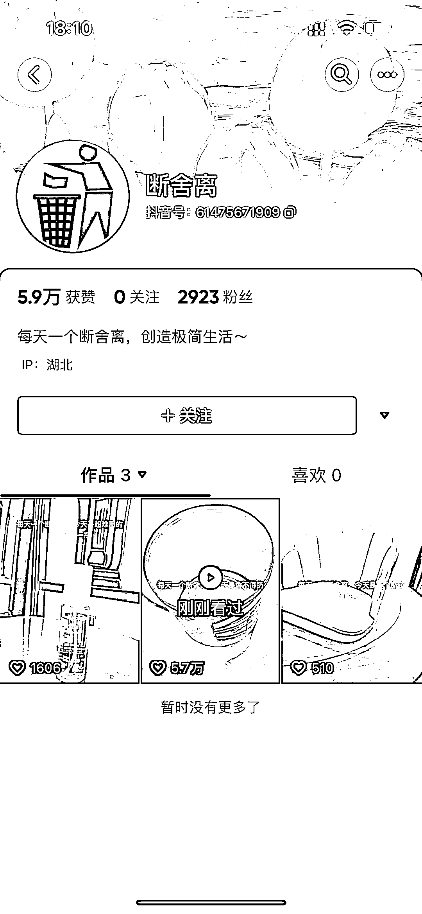

# 小红书，每天一个断舍离

> 原文：[`www.yuque.com/for_lazy/xkrm14/kggoz1flaes7b649`](https://www.yuque.com/for_lazy/xkrm14/kggoz1flaes7b649)

作者： 寻兵

日期：2023-04-14

点赞数：104

<ne-card data-card-name="hr" data-card-type="block" id="Dgeve" data-event-boundary="card">

正文：

每天一个断舍离，数据很好，可迁移性强，小红书发图文更简单

<ne-card data-card-name="image" data-card-type="inline" id="yfXMd" data-event-boundary="card"></ne-card>

<ne-card data-card-name="hr" data-card-type="block" id="kXjf5" data-event-boundary="card">

评论区：

张乐乐 : 如何变现

寻兵 : 这个变现方式太多了，比如扔一堆产品空瓶，夸一下好用，用了这么多，瓶子这么好看不舍得扔，所有产品都可以以扔的方式来变现，还可以反着来，比如，甲方看了我上一个扔他家产品的饰视频，跪求给我打钱，我赶紧下去垃圾箱捡回来[呲牙]，这只是我粗浅想法，肯定有很多变现玩法。

唠嗑的小迷弟 : 小红书搜了下，好多账号在做 每日一扔

维 妮 Winnie : 如何变现？

拾悦说 : 这个账号一天涨了 1.3 万粉应该全部是生财的粉。[偷笑]

米斯特 LIu : 想多了

欧欧 : 看起来是接广告？

<ne-card data-card-name="hr" data-card-type="block" id="B4NtQ" data-event-boundary="card">

公众号懒人找资源，懒人专属群分享

</ne-card></ne-card></ne-card>