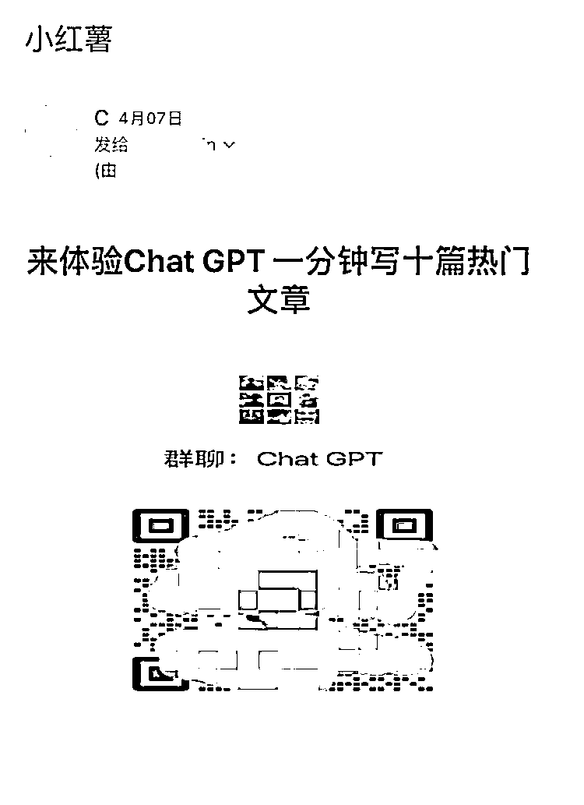

# 小红书，利用留邮箱的博主推广 Chat GPT 训练营

> 原文：[`www.yuque.com/for_lazy/xkrm14/aszzycwhnl43na8d`](https://www.yuque.com/for_lazy/xkrm14/aszzycwhnl43na8d)

作者： 田新一

日期：2023-04-14

点赞数：44

<ne-hole id="u50fcd57e" data-lake-id="u50fcd57e"><ne-card data-card-name="hr" data-card-type="block" id="cm3Mc" data-event-boundary="card">

正文：

推广 chatgpt 训练营的方式：1、批量获取小红书上，留有邮箱的信息 2、批量的发送邮件 3、在群里进行后期转化

<ne-card data-card-name="image" data-card-type="inline" id="rCjML" data-event-boundary="card"></ne-card>

<ne-hole id="u2fa0077d" data-lake-id="u2fa0077d"><ne-card data-card-name="hr" data-card-type="block" id="hERjW" data-event-boundary="card">

评论区：

大圣 : 6 打开新思路

小鲁 : 怎么加群

田新一 : 这个是我收到的广告，私我推给你

亦仁 : 中标，术值 +1。 点击最上方 #中标 专栏，可查看所有中标风向标。

jackey : 牛批

小芊 : 同求

<ne-hole id="u713c8982" data-lake-id="u713c8982"><ne-card data-card-name="hr" data-card-type="block" id="Hzz1j" data-event-boundary="card">

公众号懒人找资源，懒人专属群分享

</ne-card></ne-hole></ne-card></ne-hole></ne-card></ne-hole>