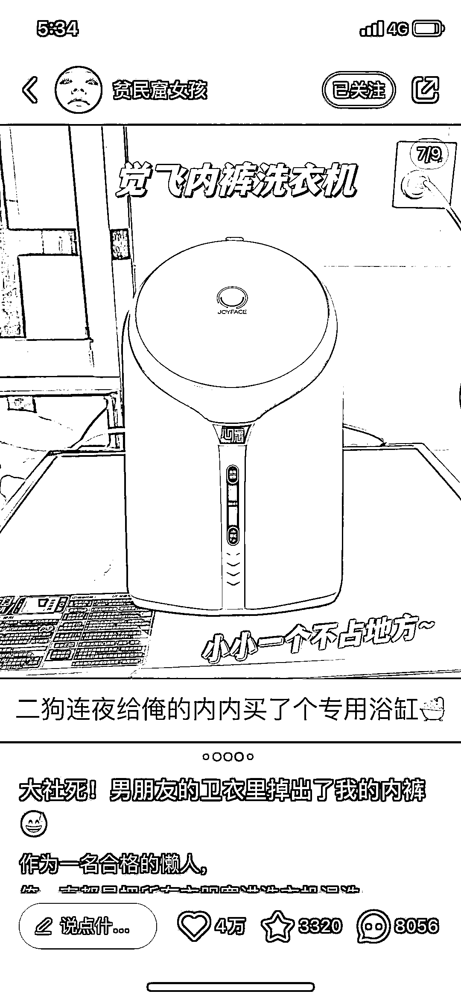
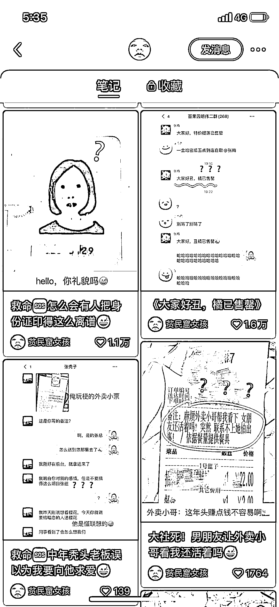

# 小红书朋友圈形式 + 尴尬事件内容爆款率非常高

> 原文：[`www.yuque.com/for_lazy/xkrm14/ztfnd13ufwbodrag`](https://www.yuque.com/for_lazy/xkrm14/ztfnd13ufwbodrag)

作者： Nafrua（赖赖）

日期：2023-04-13

点赞数：113

正文：

小红书特别的引流方式，中午发的目前是五点半已经 8k 赞，朋友圈形式+尴尬事件，最后是瑞幸的引流。。 她的主页都是这种形式，爆款率非常高，可模仿形式起号

评论区：

亦仁 : 中标，术值 +1。 点击最上方 #中标 专栏，可查看所有中标风向标。

公众号懒人找资源，懒人专属群分享

