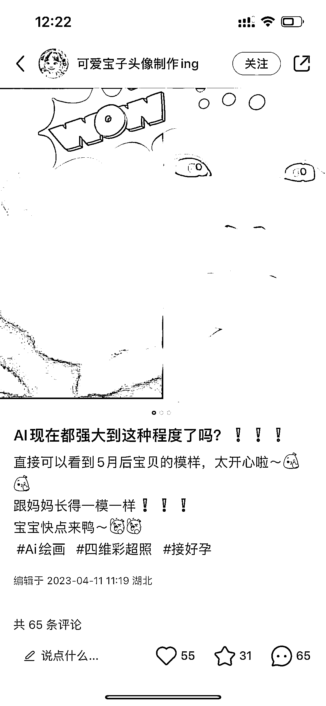
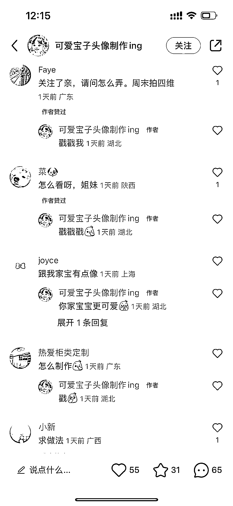

# 小红书上用 AI 画宝宝头像的可以教制作出售

> 原文：[`www.yuque.com/for_lazy/xkrm14/ao0gc3vehzy2mwle`](https://www.yuque.com/for_lazy/xkrm14/ao0gc3vehzy2mwle)

作者： 味蕾哦

日期：2023-04-13

点赞数：67

<ne-card data-card-name="hr" data-card-type="block" id="Na9p5" data-event-boundary="card">

正文：

小红书上看到根据四维照用 ai 画宝宝头像的，下方问制作的挺多。比起普通的画宝宝头像，孕妈处于好奇宝宝的样子的阶段，都愿意付这个钱。可以教制作或者直接制作出售？

<ne-card data-card-name="image" data-card-type="inline" id="AKqxo" data-event-boundary="card"></ne-card>

<ne-card data-card-name="image" data-card-type="inline" id="myWur" data-event-boundary="card"></ne-card>

<ne-card data-card-name="image" data-card-type="inline" id="ruj5Z" data-event-boundary="card"></ne-card>

<ne-card data-card-name="image" data-card-type="inline" id="bqFR5" data-event-boundary="card"></ne-card>

<ne-card data-card-name="hr" data-card-type="block" id="oEl4U" data-event-boundary="card">

评论区：

认知小窗-认哥 : 刚需 宝妈都是好多羊毛裙，相似度 60%以上，转化会出奇地高。不过，不高也无所谓，这东西没售后的[流泪]

lydia : 这玩意怎么交付？怎么做出来的？哈哈

拾悦说 : 顺藤摸瓜，戳她一下[偷笑]

阿釘。 : 生财的小伙伴太猛了，藏这么深都被你们翻到😂

张涵 : 牛

way : 原来是圈友的啊哈哈

豆豆 : 哈哈哈哈哈哈哈

味蕾哦 : 本尊？[惊讶][呲牙]

<ne-card data-card-name="hr" data-card-type="block" id="XuScE" data-event-boundary="card">

公众号懒人找资源，懒人专属群分享

</ne-card></ne-card></ne-card>