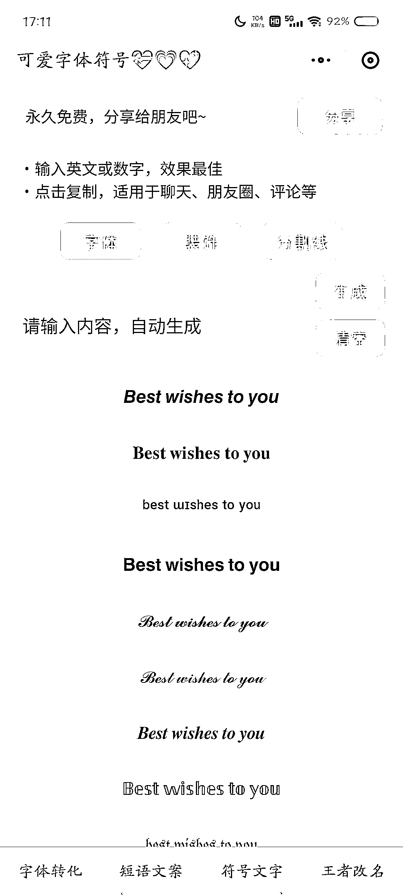

# 小红书 3 种留联系方式避免违规的方法

> 原文：[`www.yuque.com/for_lazy/xkrm14/zsvi22s2fynf5qph`](https://www.yuque.com/for_lazy/xkrm14/zsvi22s2fynf5qph)

作者： 坏脾气的小可爱

日期：2023-04-13

点赞数：116

<ne-hole id="u8a1e988f" data-lake-id="u8a1e988f"><ne-card data-card-name="hr" data-card-type="block" id="g3tyo" data-event-boundary="card">

正文：

小红书最近对引流查的很严格，很多小伙伴简介里面留邮箱号都提示违规，没办法留联系方式。 但是很多小红书号主都是靠接广告为生。有的可能是卖课，如果没有办法留联系方式，广告主就没办法联系自己。 私信发自己的微信号又容易违规，有的号，几万，十几万，甚至几十万，为了发个微信导致违规限流不划算。 我最近看到很多其他的同行是这么留的邮箱号，大家可以模仿的去留。还可以把字改成花字，更加不容易被识别出来。 第一种：直接将之前 123 这些用最后一个小程序改成花字。 第二种：设置一个邮箱是这种拼音的小字。再用文字的形式@1⃣2⃣这样的，懂得自然懂。 第三种，里面加一些 2⃣这种表情字体，不要用 qq 两个字可以，换成企鹅，或者🐧，懂得自然懂。 包括你做小说推文，评论区留小说名字的时候，也可以用这种方法。如果有更多更好用的方法，也欢迎大家补充，希望能帮到大家。

<ne-card data-card-name="image" data-card-type="inline" id="Ia2nN" data-event-boundary="card"></ne-card>

<ne-card data-card-name="image" data-card-type="inline" id="rE8gU" data-event-boundary="card"></ne-card>

<ne-card data-card-name="image" data-card-type="inline" id="kWQ9q" data-event-boundary="card"></ne-card>

<ne-card data-card-name="image" data-card-type="inline" id="N5EET" data-event-boundary="card"></ne-card>

<ne-card data-card-name="image" data-card-type="inline" id="tngmk" data-event-boundary="card"></ne-card>

<ne-hole id="u90f09ff9" data-lake-id="u90f09ff9"><ne-card data-card-name="hr" data-card-type="block" id="JSpqC" data-event-boundary="card">

评论区：

平凡不平凡 : 我说个方法：微信联系方式也可以放，QQ 也可以放，直接把联系方式转换为 base64 位，然后告诉用户转化下,输入个网址转换下就可以。让用户涨技能高大尚，而且双方互益~

坏脾气的小可爱 : 谢谢哥分享，可以请问下 base64 位是啥么？

Never Sett* : 注册一个石墨文档，然后把二维码插入这个文档，后台有人问的话直接发文档链接，提示她复制发给文件传输助手再点开，点开直接长安识别就添加成功了；

坏脾气的小可爱 : 哇，非常感谢，又贡献一个好方法。

平凡不平凡 : 就是可以把明文转化一串字符串~

坏脾气的小可爱 : 好的，谢谢哥~

vizi 敏 : 小红书发链接都会有限制吧

豆豆 : 估计用户会看蒙，路径变长，也会流失

<ne-hole id="uae399699" data-lake-id="uae399699"><ne-card data-card-name="hr" data-card-type="block" id="ng38W" data-event-boundary="card">

公众号懒人找资源，懒人专属群分享

</ne-card></ne-hole></ne-card></ne-hole></ne-card></ne-hole>