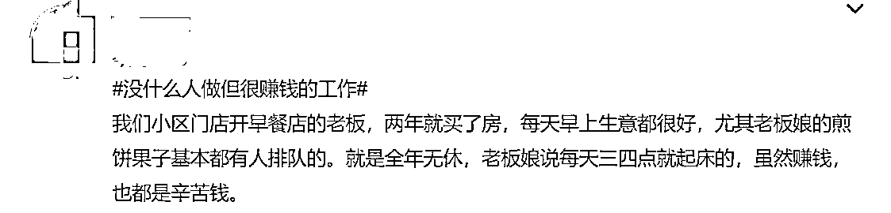
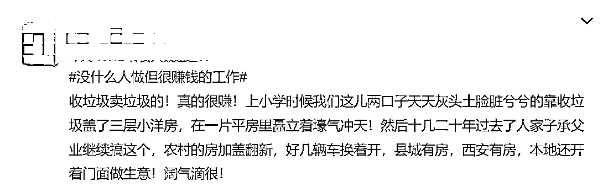

# 微博“什么人做但很赚钱的工作” Tag 里有很多小众赚钱的机会

> 原文：[`www.yuque.com/for_lazy/xkrm14/cxotpdk0uc64qilf`](https://www.yuque.com/for_lazy/xkrm14/cxotpdk0uc64qilf)

作者： 蛋蛋。

日期：2023-04-12

点赞数：95

<ne-card data-card-name="hr" data-card-type="block" id="d9TbM" data-event-boundary="card">

正文：

大家可以到微博上搜一下“#没什么人做但很赚钱的工作#”这个 tag，里边评论有很多小众又赚钱的机会，可能会有些人适合。 例如：开锁，帮人遛狗，收废品，开早餐店，村里榨油等，门槛不高，但是愿意做的人不多，可以开发下思路。

<ne-card data-card-name="image" data-card-type="inline" id="kosd1" data-event-boundary="card"></ne-card>

<ne-card data-card-name="image" data-card-type="inline" id="M8xKv" data-event-boundary="card"></ne-card>

<ne-card data-card-name="image" data-card-type="inline" id="iJynx" data-event-boundary="card"></ne-card>

<ne-card data-card-name="image" data-card-type="inline" id="Gr0VD" data-event-boundary="card"></ne-card>

<ne-card data-card-name="image" data-card-type="inline" id="XNmww" data-event-boundary="card"></ne-card>

<ne-card data-card-name="image" data-card-type="inline" id="fOdZj" data-event-boundary="card"></ne-card>

<ne-card data-card-name="image" data-card-type="inline" id="b8O9D" data-event-boundary="card"></ne-card>

<ne-card data-card-name="hr" data-card-type="block" id="g7Tzp" data-event-boundary="card">

评论区：

乾 : 比如上海的垃圾分类，旧衣回收，夜市写字，很多

<ne-card data-card-name="hr" data-card-type="block" id="TLhlj" data-event-boundary="card">

公众号懒人找资源，懒人专属群分享

</ne-card></ne-card></ne-card>