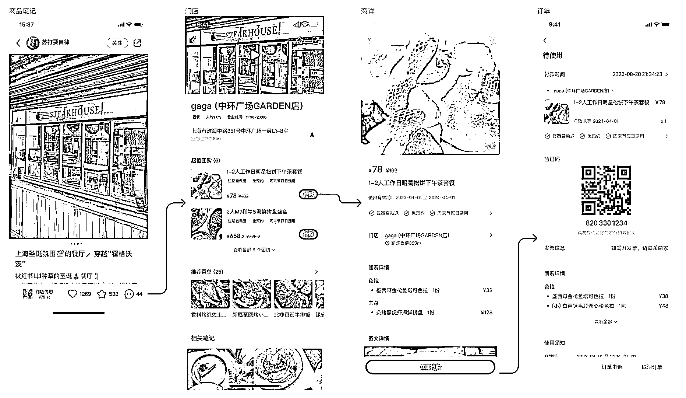

# 小红书餐饮可以上线团购了

> 原文：[`www.yuque.com/for_lazy/xkrm14/ia5kxhp6wa94fw6t`](https://www.yuque.com/for_lazy/xkrm14/ia5kxhp6wa94fw6t)

作者： 玉米

日期：2023-04-12

点赞数：59

<ne-card data-card-name="hr" data-card-type="block" id="sCsDJ" data-event-boundary="card">

正文：

小红书餐饮可以上线团购了

<ne-card data-card-name="image" data-card-type="inline" id="PY0zY" data-event-boundary="card"></ne-card>

<ne-card data-card-name="hr" data-card-type="block" id="tNHsr" data-event-boundary="card">

评论区：

晚睡女王 : 意思是餐饮店可以在小红书上团购？

晚睡女王 : 好像只有部分城市放开了

Vicent : 刚才找到这篇帖子了，但是没有发现有团购的入口啊

章芝芝 : 内测中吗

玉米 : 问了下直客，现在只有广州和上海内测，商业化在投客户可以报白

<ne-card data-card-name="hr" data-card-type="block" id="M48Bk" data-event-boundary="card">

公众号懒人找资源，懒人专属群分享

</ne-card></ne-card></ne-card>