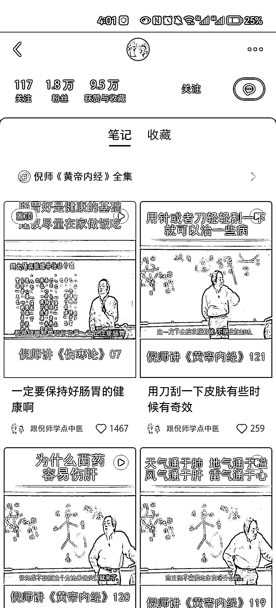
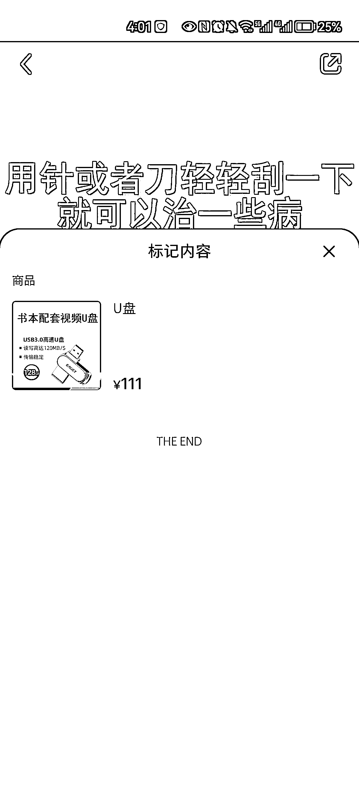
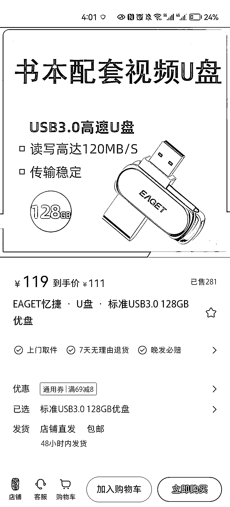
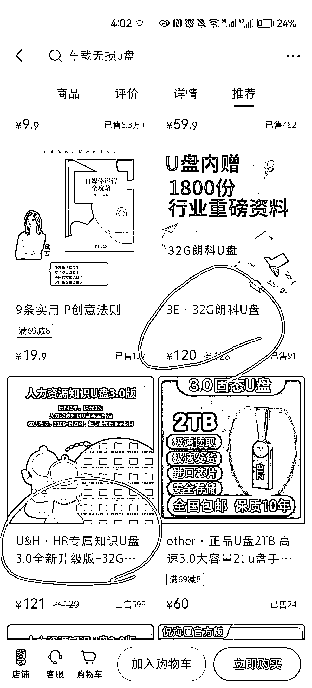

# 小红书音乐 u 盘销量不低，可以延伸其他类型的 u 盘

> 原文：[`www.yuque.com/for_lazy/xkrm14/kfzm0m480wf5dz58`](https://www.yuque.com/for_lazy/xkrm14/kfzm0m480wf5dz58)

<ne-p id="u9dd6aef3" data-lake-id="u9dd6aef3"><ne-text id="u2a36e20e">作者： 佐伊酱🔆</ne-text></ne-p> <ne-p id="u8af1bd06" data-lake-id="u8af1bd06"><ne-text id="u0cf3f719">日期：2023-04-12</ne-text></ne-p> <ne-p id="u3c4739ef" data-lake-id="u3c4739ef"><ne-text id="uf6514b13">点赞数：</ne-text><ne-text id="ud15d741a" ne-bold="true">84</ne-text></ne-p> <ne-hole id="u65403551" data-lake-id="u65403551"><ne-card data-card-name="hr" data-card-type="block" id="DRISC" data-event-boundary="card"><ne-p id="u41ff024b" data-lake-id="u41ff024b"><ne-text id="u6209f38f">正文：</ne-text></ne-p> <ne-p id="u3aade084" data-lake-id="u3aade084"><ne-text id="ud9a55f20">大多数人都低估小红书了。 作为一个小红书中度使用者，平时看到的大多数是精致，种草，这种类型的标签。今天看圈友分享，好奇的搜了下倪海厦，不得了。</ne-text> <ne-text id="uaf2ddc9d">音乐 u 盘销量竟然也不低。 还有 hr 工具 u 盘，各种知识 u 盘，发挥想象力，可以发 u 盘的品可以跑起来了。</ne-text> <ne-text id="uf33f1ddf">另外，是不是要规避一些风险，倪海厦光盘这个账号没有挂车，用的是标记，可以仔细去研究。</ne-text></ne-p> <ne-p id="u5befbc4a" data-lake-id="u5befbc4a"><ne-card data-card-name="image" data-card-type="inline" id="VIrkY" data-event-boundary="card"></ne-card></ne-p> <ne-p id="uc1a9e45f" data-lake-id="uc1a9e45f"><ne-card data-card-name="image" data-card-type="inline" id="VKJxZ" data-event-boundary="card"></ne-card></ne-p> <ne-p id="u47e6eced" data-lake-id="u47e6eced"><ne-card data-card-name="image" data-card-type="inline" id="akaUy" data-event-boundary="card"></ne-card></ne-p> <ne-p id="u084ed422" data-lake-id="u084ed422"><ne-card data-card-name="image" data-card-type="inline" id="roRqW" data-event-boundary="card"></ne-card></ne-p> <ne-p id="ua44f762a" data-lake-id="ua44f762a"><ne-card data-card-name="image" data-card-type="inline" id="bc3Qw" data-event-boundary="card"></ne-card></ne-p> <ne-p id="uc59d28c5" data-lake-id="uc59d28c5"><ne-card data-card-name="image" data-card-type="inline" id="AAkyd" data-event-boundary="card"></ne-card></ne-p> <ne-p id="ud7b37bd8" data-lake-id="ud7b37bd8"><ne-card data-card-name="image" data-card-type="inline" id="HZ2Zt" data-event-boundary="card"></ne-card></ne-p> <ne-hole id="u9fcf336a" data-lake-id="u9fcf336a"><ne-card data-card-name="hr" data-card-type="block" id="Pc13n" data-event-boundary="card"><ne-p id="ua03fc03f" data-lake-id="ua03fc03f"><ne-text id="u4fd57a4c">评论区：</ne-text></ne-p> <ne-p id="ub69a207c" data-lake-id="ub69a207c"><ne-text id="u4cb090b8">喇叭渔 : 这是个小红书虚拟项目风向标，通过课程加实体提升价值感，从而在转化率和客单价上做到提高，之前有电子书打印成书本当赠品的。</ne-text> <ne-text id="u1ed42632">通过 u 盘结合各大热门虚拟课程来增加销售额，也可以自身课程结果硬件 u 盘赠品书本等提升体验感和客单价</ne-text></ne-p> <ne-p id="u3bee41bb" data-lake-id="u3bee41bb"><ne-text id="uf54a8c98">东东.Michael : 会不会退货率很高。。。</ne-text></ne-p> <ne-p id="u537d87ba" data-lake-id="u537d87ba"><ne-text id="u80a197af">佐伊酱🔆 : 哈哈哈，没有实操过，没有发言权</ne-text></ne-p> <ne-hole id="u53614df2" data-lake-id="u53614df2"><ne-card data-card-name="hr" data-card-type="block" id="fV8j6" data-event-boundary="card"><ne-p id="ub5771a10" data-lake-id="ub5771a10"><ne-text id="ucf84a951">公众号懒人找资源，懒人专属群分享</ne-text></ne-p></ne-card></ne-hole></ne-card></ne-hole></ne-card></ne-hole>