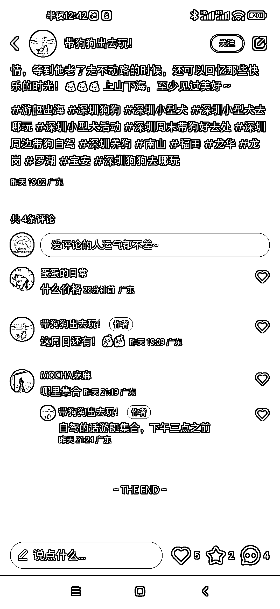
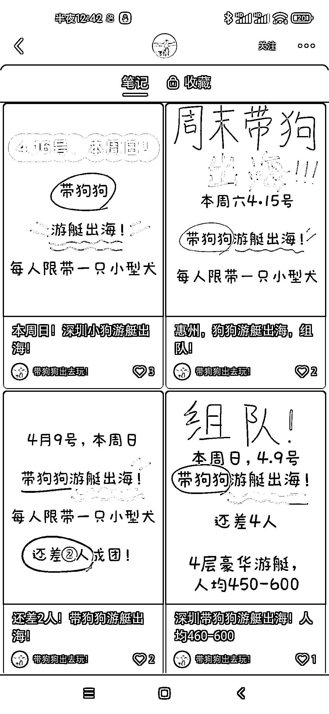

# 小红书推携宠出游，流量精准意向高，可以矩阵放大

> 原文：[`www.yuque.com/for_lazy/xkrm14/ykxz2hdlm5qq40ug`](https://www.yuque.com/for_lazy/xkrm14/ykxz2hdlm5qq40ug)

<ne-p id="u8b0c87fa" data-lake-id="u8b0c87fa"><ne-text id="u52d9c2df">作者： 老孙说经济</ne-text></ne-p> <ne-p id="u10cd7a8b" data-lake-id="u10cd7a8b"><ne-text id="uab327afa">日期：2023-04-12</ne-text></ne-p> <ne-p id="u429eef61" data-lake-id="u429eef61"><ne-text id="uf85822e5">点赞数：</ne-text><ne-text id="uf58cb16e" ne-bold="true">48</ne-text></ne-p> <ne-hole id="u193f9cf5" data-lake-id="u193f9cf5"><ne-card data-card-name="hr" data-card-type="block" id="CVvLX" data-event-boundary="card"><ne-p id="u6a449673" data-lake-id="u6a449673"><ne-text id="u61d8fa81">正文：</ne-text></ne-p> <ne-p id="u282da766" data-lake-id="u282da766"><ne-text id="u73a78677">小红书平台 利用狗狗在城市玩不开，爱狗的心态，推携宠出游，流量精准且意向高 携宠周边游，游艇游客单价一人一宠 500 左右</ne-text> <ne-text id="ue38e6a66">养宠人花在宠物上的钱不是钱，对宠物花费不敏感， 图文内容创作要点 1.出行时间 2.优惠信息 3.具体活动 4.划重点</ne-text> <ne-text id="u5034b5a9">可以矩阵放大！以及推出携宠的高客单包机出游</ne-text></ne-p> <ne-p id="ud966f413" data-lake-id="ud966f413"><ne-card data-card-name="image" data-card-type="inline" id="YcnCb" data-event-boundary="card"></ne-card></ne-p> <ne-p id="u67d42f0c" data-lake-id="u67d42f0c"><ne-card data-card-name="image" data-card-type="inline" id="a80sL" data-event-boundary="card"></ne-card></ne-p> <ne-hole id="u03017d58" data-lake-id="u03017d58"><ne-card data-card-name="hr" data-card-type="block" id="Q1taX" data-event-boundary="card"><ne-p id="u6ecf2743" data-lake-id="u6ecf2743"><ne-text id="u4e2d94a2">评论区：</ne-text></ne-p> <ne-p id="u5a6efc8d" data-lake-id="u5a6efc8d"><ne-text id="uc0eff4a7">盛小七 : 这个主题好，以狗会友[偷笑]</ne-text></ne-p> <ne-p id="u1ee824fc" data-lake-id="u1ee824fc"><ne-text id="u9f1df043">小鲁 : 好</ne-text></ne-p> <ne-p id="udcad8163" data-lake-id="udcad8163"><ne-text id="uf749f181">喇叭渔 : 这是个小红书平台的宠物周边游项目，五一是出游节点，宠物旅游这个是个亚文化，目前竞争不激烈，不过市场有待开发。没养过宠物，之前身边有朋友做过宠物生意的，专门生产阿拉斯加的，去厂房看到一堆狗子也是好玩哦</ne-text> <ne-text id="u026519e7">首先要找到当地提供游艇服务的商家，谈好介绍佣金，然后引流这边小红书测试一轮，要做大需要去相关社群人群中进行针对性引流</ne-text> <ne-text id="u8c12bfea">产品游艇游，飞机游，还可以在平台上换到抖音视频号，直播游玩过程当素材</ne-text></ne-p> <ne-p id="u951cc109" data-lake-id="u951cc109"><ne-text id="uc995d311">君顾 : 好有意思哈哈哈</ne-text></ne-p> <ne-p id="ub2fb63cb" data-lake-id="ub2fb63cb"><ne-text id="u8a067443">听雷 : 当初花爷那边讲宠物时候我还搜过，刚好那时候有个做这个的公司暴雷了，服务没跟上，租了个破渔船就带着人去岛屿，又遇上暴雨，小红书一堆吐槽的</ne-text></ne-p> <ne-hole id="ud22c9a27" data-lake-id="ud22c9a27"><ne-card data-card-name="hr" data-card-type="block" id="PZ3VV" data-event-boundary="card"><ne-p id="u8da2ec84" data-lake-id="u8da2ec84"><ne-text id="uadf6a7b8">公众号懒人找资源，懒人专属群分享</ne-text></ne-p></ne-card></ne-hole></ne-card></ne-hole></ne-card></ne-hole>