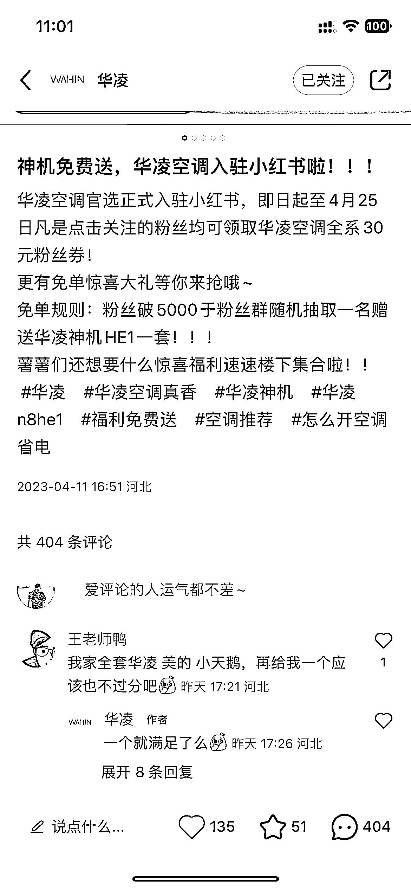
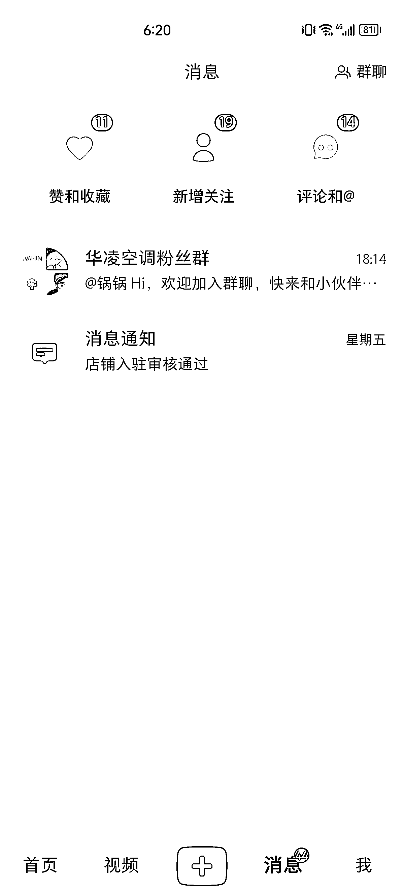

# 小红书电商红利大，竞争小

> 原文：[`www.yuque.com/for_lazy/xkrm14/rs7i9s45o5flb9lp`](https://www.yuque.com/for_lazy/xkrm14/rs7i9s45o5flb9lp)

作者： Knight

日期：2023-04-11

点赞数：68

正文：

听人劝，吃饱饭。各位大佬都说小红书店铺今年机会大好，于是我找品牌方拿了授权开通了品牌旗舰店。从开始酝酿这个项目，到落地，一共一周不到。本周一刚审核通过，昨天下午发了第一条内容，现在已经涨粉 600+，评论 400+，流水几万块了…小红书电商真是红利大，竞争小，大大的蓝海市场。

评论区：

有期 : 牛🐮

Knight : 主要还是吃了品牌和平台红利

西沙 : 大佬可以讲一下怎么获取品牌方授权吗

Knight : 以家电知名品牌为例，一般要求是： 1.公司注册时间一年以上 2.有成熟的运营团队 3.有其他平台的运营经验和案例 放宽条件到大众消费品品牌的话，一般就是要找到品牌方的业务负责人，找他们拿在大力招商的渠道授权（比如小红书、抖音、快手等），京东天猫一般都做烂了不缺客户（拿授权太费劲）。

半方糖 : 大佬 方便留个联系方式吗

Knight : 点开我头像，里面有我的 vx 哈~

万青 : 小红书企业号需要 2w 押金吧？

Knight : 是的，有保证金

公众号懒人找资源，懒人专属群分享

