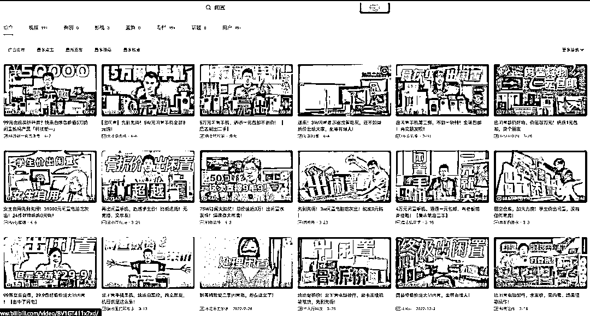
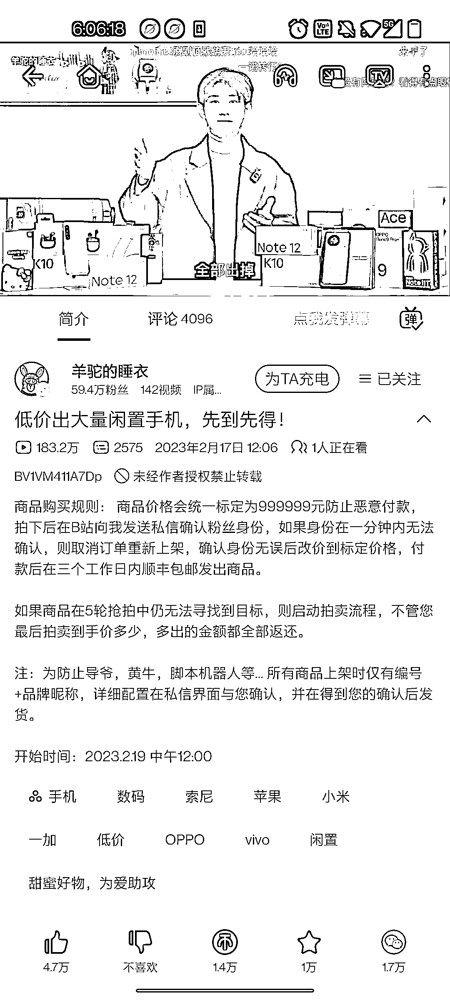
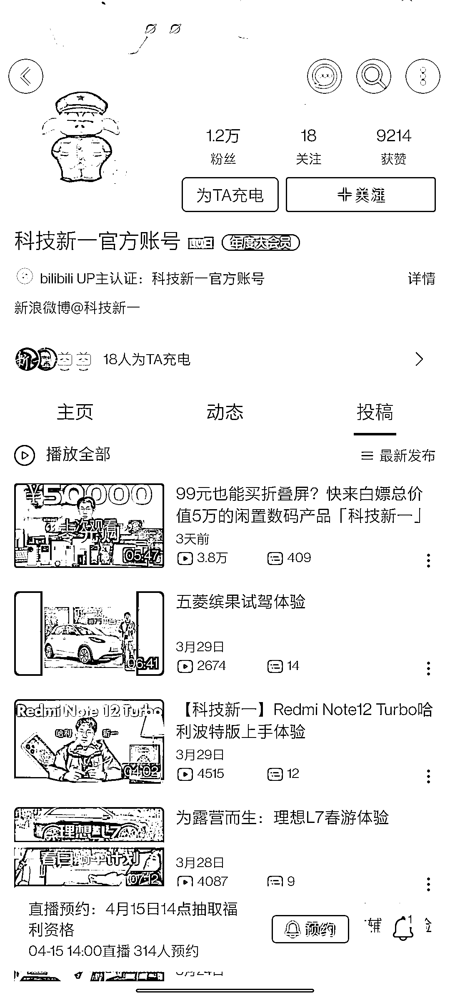
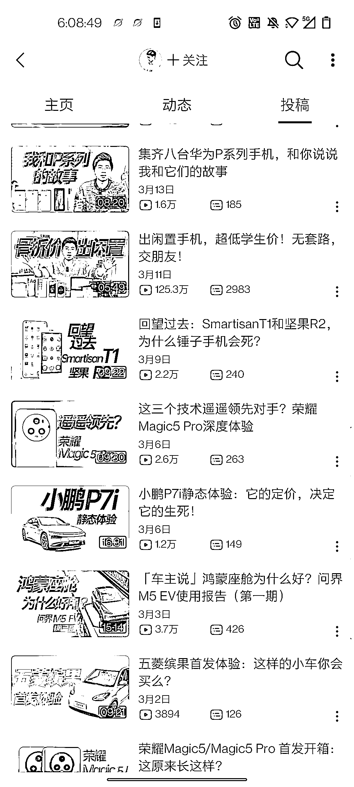

# B 站数码区的流量密码运用到其他领域，涨粉和引流都不错

> 原文：[`www.yuque.com/for_lazy/xkrm14/lvehupu5ovn1lksk`](https://www.yuque.com/for_lazy/xkrm14/lvehupu5ovn1lksk)

<ne-p id="u2a04ad8a" data-lake-id="u2a04ad8a"><ne-text id="u595d705a">作者： 万青</ne-text></ne-p> <ne-p id="ue46f8b75" data-lake-id="ue46f8b75"><ne-text id="u4f1542a0">日期：2023-04-11</ne-text></ne-p> <ne-p id="u4a0fe1fc" data-lake-id="u4a0fe1fc"><ne-text id="ufe21ac8f">点赞数：</ne-text><ne-text id="u5aa26777" ne-bold="true">19</ne-text></ne-p> <ne-hole id="ufb5fa10c" data-lake-id="ufb5fa10c"><ne-card data-card-name="hr" data-card-type="block" id="eKSID" data-event-boundary="card"><ne-p id="u60489788" data-lake-id="u60489788"><ne-text id="uc8e0625c">正文：</ne-text></ne-p> <ne-p id="uc967357c" data-lake-id="uc967357c"><ne-text id="ubf728e8b">近一个月 b 站数码区的流量密码与涨粉秘籍 “出闲置” “闲置手机”等标题 p1 追溯闲置选题来源应是 lks p2 数码区最早该爆款选题数据非常好来自 p3</ne-text> <ne-text id="u34c8a914">部分数码区 up 用该选题数据情况 p4-p7 评论区还能看见做截流和引流动作的 p8 偷懒没用工具查询各大博主涨粉数据 以其中一个博主举例</ne-text> <ne-text id="u4035771d">1、活动奖品原总价值￥49809，统一按 6 折清仓处理￥29885，预计回收价格￥10164——真情实意感恩回馈￥-19721；</ne-text> <ne-text id="u41b7bb9f">2、粉丝行情价 0.5￥/个，计划增粉 39442 个方可回收成本； 3、转化方式①关注 B+播放量，②微信扫码问卷系统，③中奖后@B；④闲鱼曝光（若有）</ne-text> <ne-text id="uba41ea7b">可以得出这就是当下 b 站数码区的流量密码 迁移：运用到其他领域，什么母婴闲置都能达到一个不错涨粉和引流效果</ne-text></ne-p> <ne-p id="u75125b41" data-lake-id="u75125b41"><ne-card data-card-name="image" data-card-type="inline" id="dOfRL" data-event-boundary="card"></ne-card></ne-p> <ne-p id="u92f5d866" data-lake-id="u92f5d866"><ne-card data-card-name="image" data-card-type="inline" id="RlP1n" data-event-boundary="card"></ne-card></ne-p> <ne-p id="uf038fd7d" data-lake-id="uf038fd7d"><ne-card data-card-name="image" data-card-type="inline" id="rtdB7" data-event-boundary="card"></ne-card></ne-p> <ne-p id="u7079c58c" data-lake-id="u7079c58c"><ne-card data-card-name="image" data-card-type="inline" id="dNKt0" data-event-boundary="card"></ne-card></ne-p> <ne-p id="ud79f3422" data-lake-id="ud79f3422"><ne-card data-card-name="image" data-card-type="inline" id="OHyiz" data-event-boundary="card"></ne-card></ne-p> <ne-p id="u47f78bf5" data-lake-id="u47f78bf5"><ne-card data-card-name="image" data-card-type="inline" id="FFUxm" data-event-boundary="card"></ne-card></ne-p> <ne-p id="u00649be6" data-lake-id="u00649be6"><ne-card data-card-name="image" data-card-type="inline" id="fsaFE" data-event-boundary="card"></ne-card></ne-p> <ne-p id="u9475d546" data-lake-id="u9475d546"><ne-card data-card-name="image" data-card-type="inline" id="vTuk0" data-event-boundary="card"></ne-card></ne-p> <ne-hole id="u7fda4274" data-lake-id="u7fda4274"><ne-card data-card-name="hr" data-card-type="block" id="Z2pm5" data-event-boundary="card"><ne-p id="u86ef108c" data-lake-id="u86ef108c"><ne-text id="uee211058">评论区：</ne-text></ne-p> <ne-hole id="u0e5f7063" data-lake-id="u0e5f7063"><ne-card data-card-name="hr" data-card-type="block" id="JEian" data-event-boundary="card"><ne-p id="ua4eb64b9" data-lake-id="ua4eb64b9"><ne-text id="ubc9d566b">公众号懒人找资源，懒人专属群分享</ne-text></ne-p></ne-card></ne-hole></ne-card></ne-hole></ne-card></ne-hole>