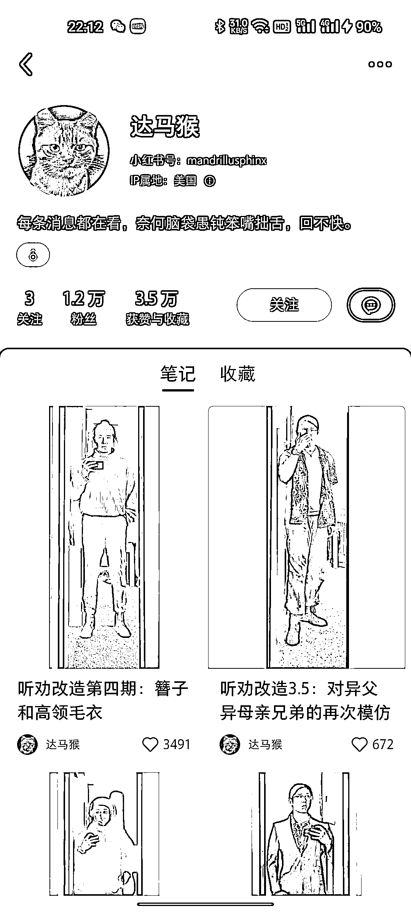

# 小红书“听取粉丝的建议改造自己”，互动效果很好

> 原文：[`www.yuque.com/for_lazy/xkrm14/wvi9hl4qb8kykuyv`](https://www.yuque.com/for_lazy/xkrm14/wvi9hl4qb8kykuyv)

作者： 孟里啥都有

日期：2023-04-10

点赞数：36

<ne-hole id="u63e1eac4" data-lake-id="u63e1eac4"><ne-card data-card-name="hr" data-card-type="block" id="NdZSy" data-event-boundary="card">

正文：

听取粉丝的建议改造自己，展示改造过程，ip 立得住，互动很好

<ne-card data-card-name="image" data-card-type="inline" id="fMzXI" data-event-boundary="card"></ne-card>

<ne-hole id="ubc2f0733" data-lake-id="ubc2f0733"><ne-card data-card-name="hr" data-card-type="block" id="TBLo4" data-event-boundary="card">

评论区：

温暖 : 这种超级多

<ne-hole id="ud21b106c" data-lake-id="ud21b106c"><ne-card data-card-name="hr" data-card-type="block" id="rDFhV" data-event-boundary="card">

公众号懒人找资源，懒人专属群分享

</ne-card></ne-hole></ne-card></ne-hole></ne-card></ne-hole>