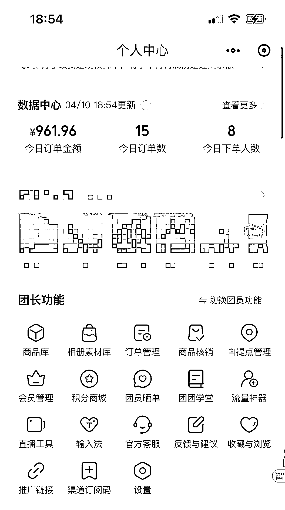

# 做快团团可以尝试对接小型的 B 端

> 原文：[`www.yuque.com/for_lazy/xkrm14/acpw9sq93vd38gzp`](https://www.yuque.com/for_lazy/xkrm14/acpw9sq93vd38gzp)

<ne-p id="u6bb7cdad" data-lake-id="u6bb7cdad"><ne-text id="u49dc5b02">作者： 韩丹</ne-text></ne-p> <ne-p id="u96b04757" data-lake-id="u96b04757"><ne-text id="u595a4824">日期：2023-04-10</ne-text></ne-p> <ne-p id="ub8e54280" data-lake-id="ub8e54280"><ne-text id="ufd465800">点赞数：</ne-text><ne-text id="u77a6f794" ne-bold="true">30</ne-text></ne-p> <ne-hole id="u2db35f9e" data-lake-id="u2db35f9e"><ne-card data-card-name="hr" data-card-type="block" id="M7avL" data-event-boundary="card"><ne-p id="uadec0a97" data-lake-id="uadec0a97"><ne-text id="u5557462b">正文：</ne-text></ne-p> <ne-p id="u7e0edc2b" data-lake-id="u7e0edc2b"><ne-text id="uf374d403">今天一个 100 人的群，通过快团团卖了快 1000，是因为有个艺术机构采购的买了个大单。200 个袋子³.5 的客单，虽然赚的不多。</ne-text> <ne-text id="u53656916">但有个思路:做快团团可以尝试对接小型的 B 端，如果我们的供应链比较垂直或者还可以的话。</ne-text></ne-p> <ne-p id="u2d8bf85d" data-lake-id="u2d8bf85d"><ne-card data-card-name="image" data-card-type="inline" id="UIOot" data-event-boundary="card"></ne-card></ne-p> <ne-p id="ucb503441" data-lake-id="ucb503441"><ne-card data-card-name="image" data-card-type="inline" id="viutu" data-event-boundary="card"></ne-card></ne-p> <ne-hole id="ua003d128" data-lake-id="ua003d128"><ne-card data-card-name="hr" data-card-type="block" id="TiHX3" data-event-boundary="card"><ne-p id="ua7ee5203" data-lake-id="ua7ee5203"><ne-text id="u0a628f9a">评论区：</ne-text></ne-p> <ne-p id="udd491d6c" data-lake-id="udd491d6c"><ne-text id="uabd3b346">十八 : 100 人的群每天销售额多少钱</ne-text></ne-p> <ne-p id="ucbd25ac6" data-lake-id="ucbd25ac6"><ne-text id="uf7b81924">韩丹 : 我目前主要卖的日用品 大概 300-500 之间</ne-text></ne-p> <ne-p id="u817a3823" data-lake-id="u817a3823"><ne-text id="ub6085b0e">十八 : 那也就是说一天利润在 50 左右</ne-text></ne-p> <ne-p id="ue0c35516" data-lake-id="ue0c35516"><ne-text id="u801a6e51">韩丹 : 差不多，一个群一月的利润在 2000 左右</ne-text></ne-p> <ne-p id="u21dab563" data-lake-id="u21dab563"><ne-text id="u67add880">十八 : 那产值不错呀，这些粉的来源是哪里呢，粘性怎么样才能达到这个产值呢</ne-text></ne-p> <ne-p id="u58cf6991" data-lake-id="u58cf6991"><ne-text id="ud5ad9879">韩丹 : 我们目前是测试群，大多是人都是我们以前做儿童兴趣课培训的家长。</ne-text></ne-p> <ne-p id="u35a7aa6d" data-lake-id="u35a7aa6d"><ne-text id="u1c662866">十八 : 那你可以考虑放大人群看看，搞 10 个群呢</ne-text></ne-p> <ne-p id="u46873a5e" data-lake-id="u46873a5e"><ne-text id="ua133da8d">韩丹 : 嗯嗯，现在就在做这个事。也挺难，加油💪</ne-text></ne-p> <ne-hole id="ub8d68a23" data-lake-id="ub8d68a23"><ne-card data-card-name="hr" data-card-type="block" id="Bxa68" data-event-boundary="card"><ne-p id="uf920049c" data-lake-id="uf920049c"><ne-text id="u841a17bc">公众号懒人找资源，懒人专属群分享</ne-text></ne-p></ne-card></ne-hole></ne-card></ne-hole></ne-card></ne-hole>