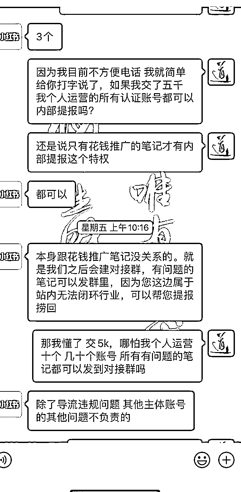

# 小红书聚光灯平台交 5k，即可正常私信导流到微信

> 原文：[`www.yuque.com/for_lazy/xkrm14/tutvox0pm46fa0qx`](https://www.yuque.com/for_lazy/xkrm14/tutvox0pm46fa0qx)

作者： 浪人

日期：2023-04-10

点赞数：26

<ne-card data-card-name="hr" data-card-type="block" id="NE2Ie" data-event-boundary="card">

正文：

小红书最近可能缺钱了，聚光灯平台交 5k，即可正常私信导流到微信，并且只要是你运营的账号，他们内部都可以提报解除违规，这么说的话交上 5k 开几十个矩阵号 也是挺划算的[旺柴]

<ne-card data-card-name="image" data-card-type="inline" id="mxdl4" data-event-boundary="card"></ne-card>

<ne-card data-card-name="hr" data-card-type="block" id="bkEJM" data-event-boundary="card">

评论区：

浪人 : 上面说的 3 个是单执照可认证的账号数量 并非保护数量

糯米糕 : 还可以这样啊

浪人 : 形象一点就是交钱你就是大爷 不交钱看你不顺眼就给你封[旺柴]

糯米糕 : 看来真的是 99%的事都能用[红包]搞定

Tommy : 交保护费

浪人 : 对的

情感指导（同城相亲） : 可以挂靠账号到你下边吗？可以付费

Chopotter : 请问你这个是联系的小红书的什么人呀

<ne-card data-card-name="hr" data-card-type="block" id="dd3CK" data-event-boundary="card">

公众号懒人找资源，懒人专属群分享

</ne-card></ne-card></ne-card>