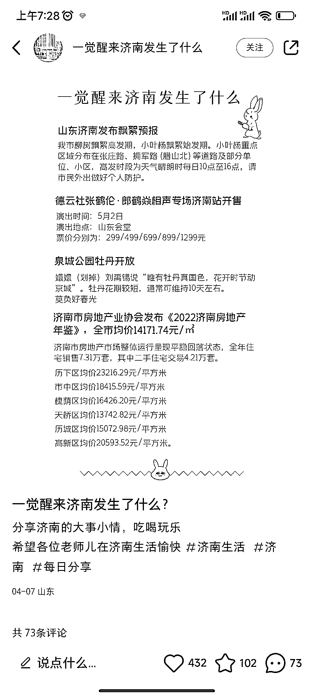

# 小红书账号按地域思路，三条笔记涨粉 4 千多

> 原文：[`www.yuque.com/for_lazy/xkrm14/pn9g21vt88m9ngzb`](https://www.yuque.com/for_lazy/xkrm14/pn9g21vt88m9ngzb)

<ne-p id="ud06790df" data-lake-id="ud06790df"><ne-text id="u4d1bdd28">作者： Mr.Zhang</ne-text></ne-p> <ne-p id="ueaf08126" data-lake-id="ueaf08126"><ne-text id="u4168d49a">日期：2023-04-10</ne-text></ne-p> <ne-p id="uee021edb" data-lake-id="uee021edb"><ne-text id="u07d25d32">点赞数：</ne-text><ne-text id="ua141122f" ne-bold="true">39</ne-text></ne-p> <ne-hole id="u42649238" data-lake-id="u42649238"><ne-card data-card-name="hr" data-card-type="block" id="XmINR" data-event-boundary="card"><ne-p id="u6ffcfa85" data-lake-id="u6ffcfa85"><ne-text id="u7eb48e6a">正文：</ne-text></ne-p> <ne-p id="u28f67854" data-lake-id="u28f67854"><ne-text id="u1358f420">小红书账号 一觉醒来济南发生了什么 发布了三条笔记收获 4 千多粉丝</ne-text></ne-p> <ne-p id="u62c04dd6" data-lake-id="u62c04dd6"><ne-card data-card-name="image" data-card-type="inline" id="KWijV" data-event-boundary="card">  <ne-p id="u0daf3d26" data-lake-id="u0daf3d26"><ne-card data-card-name="image" data-card-type="inline" id="NhvbD" data-event-boundary="card">  <ne-hole id="ud9ab29d5" data-lake-id="ud9ab29d5"><ne-card data-card-name="hr" data-card-type="block" id="ys9II" data-event-boundary="card"><ne-p id="ub959cc91" data-lake-id="ub959cc91"><ne-text id="u9d242c40">评论区：</ne-text></ne-p> <ne-p id="uc070b366" data-lake-id="uc070b366"><ne-text id="ua1f93d14">lydia : 这个按地域的思路可以哦</ne-text></ne-p> <ne-p id="u9d51be48" data-lake-id="u9d51be48"><ne-text id="u7a3c4a99">lydia : 就是不知道咋变现</ne-text></ne-p> <ne-p id="ua7c164c5" data-lake-id="ua7c164c5"><ne-text id="ud4ae3962">Vily 小维 : 同问</ne-text></ne-p> <ne-p id="u2b35cc89" data-lake-id="u2b35cc89"><ne-text id="ufb855d50">某人周 : 粉丝大多是本地人了，小红书建群后可以导流到微信私域。后续可以成交本地生活类产品，如果自己没有产品可以从吃喝玩乐等方面入手找能承接的本地商家。</ne-text></ne-p> <ne-p id="u1f63f149" data-lake-id="u1f63f149"><ne-text id="u0c396096">费曼同学 : 想问一下这种信息整理，主要是看对标还是看自己的定位内容输出方向？</ne-text></ne-p> <ne-p id="u6a7ff1a3" data-lake-id="u6a7ff1a3"><ne-text id="u846ed707">仗剑走天涯 : 信息源怎么找?</ne-text></ne-p> <ne-p id="ud7f4f6e6" data-lake-id="ud7f4f6e6"><ne-text id="ufa6e34ad">Fish 大鱼 : 我也想问</ne-text></ne-p> <ne-p id="u3951fee5" data-lake-id="u3951fee5"><ne-text id="u0500b94a">亦仁 : 中标，术值 +1。 点击最上方 #中标 专栏，可查看所有中标风向标。</ne-text></ne-p> <ne-hole id="u2bbc81bc" data-lake-id="u2bbc81bc"><ne-card data-card-name="hr" data-card-type="block" id="NrmtM" data-event-boundary="card"><ne-p id="u60fd0e36" data-lake-id="u60fd0e36"><ne-text id="u2a890c03">公众号懒人找资源，懒人专属群分享</ne-text></ne-p></ne-card></ne-hole></ne-card></ne-hole></ne-card></ne-p></ne-card></ne-p></ne-card></ne-hole>