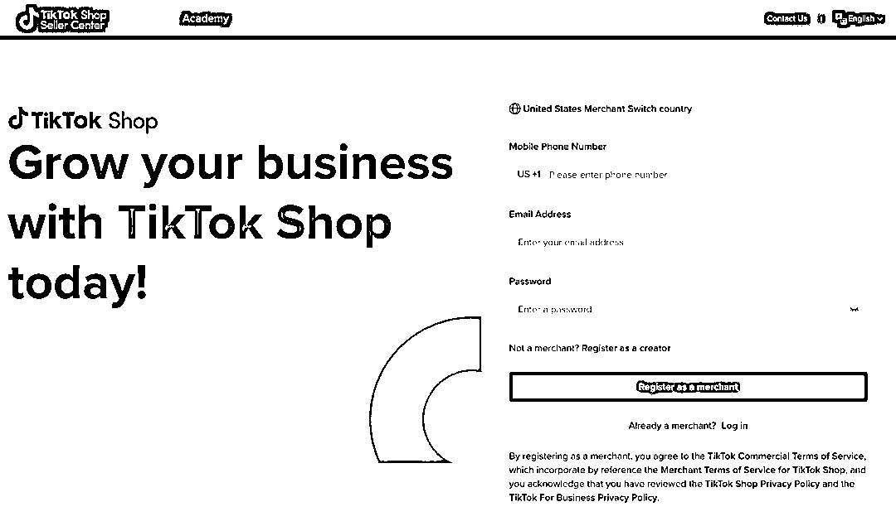

# TikTok 美国本土店开放自注册

> 原文：[`www.yuque.com/for_lazy/xkrm14/aioulnw3gpnyfc8h`](https://www.yuque.com/for_lazy/xkrm14/aioulnw3gpnyfc8h)

作者： Mr.Z

日期：2023-04-10

点赞数：23

<ne-card data-card-name="hr" data-card-type="block" id="NulJ6" data-event-boundary="card">

正文：

TikTok 美国本土店开放自注册。之前需要邀请码才能注册，邀请码炒到上万元。 现在不用花钱就能自行注册了。 打开下面链接就能注册 [[https://seller-us-accounts.tiktok.com/account/regi](https://seller-us-accounts.tiktok.com/account/regi)... ](https://seller-us- accounts.tiktok.com/account/register)

<ne-card data-card-name="image" data-card-type="inline" id="JI2dy" data-event-boundary="card"></ne-card>

<ne-card data-card-name="hr" data-card-type="block" id="iNeFf" data-event-boundary="card">

评论区：

... : 链接打不开呢，是有什么限制吗

Mr.Z : 试试魔法

... : 哦哦，谢谢，我还以为可以直接注册😂

Luke 王子 : 这个是美国本地店铺了

兵长 : 我注册了好几个，基本活不过三天，建议🈶️本土资源的朋友可以玩。ps(有小黄车得美国账号确实香）

亦仁 : 中标，术值 +1。 点击最上方 #中标 专栏，可查看所有中标风向标。

<ne-card data-card-name="hr" data-card-type="block" id="YW5wp" data-event-boundary="card">

公众号懒人找资源，懒人专属群分享

</ne-card></ne-card></ne-card>