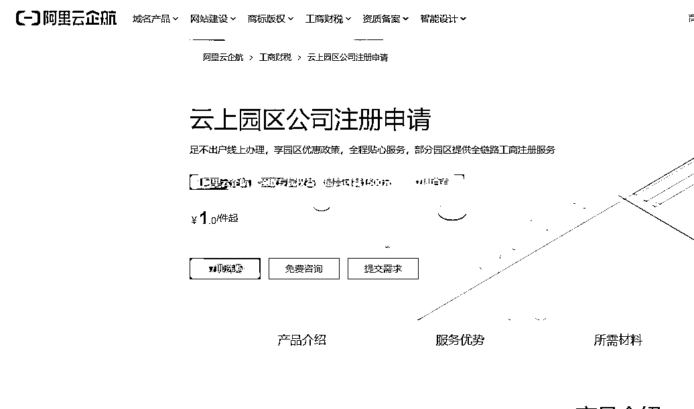

# 创业者可以考虑阿里的云上公司注册申请，突破个人数量的限制也能开公户

> 原文：[`www.yuque.com/for_lazy/xkrm14/mg9mob30lwo5bb4g`](https://www.yuque.com/for_lazy/xkrm14/mg9mob30lwo5bb4g)

<ne-p id="u43febf12" data-lake-id="u43febf12"><ne-text id="u92c3c167">作者： 幻中说焕</ne-text></ne-p> <ne-p id="uaec98175" data-lake-id="uaec98175"><ne-text id="u7f67ebc3">日期：2023-04-10</ne-text></ne-p> <ne-p id="u917a3a64" data-lake-id="u917a3a64"><ne-text id="u10baab6d">点赞数：</ne-text><ne-text id="u6bd2bd79" ne-bold="true">81</ne-text></ne-p> <ne-hole id="u3c7bc2b6" data-lake-id="u3c7bc2b6"><ne-card data-card-name="hr" data-card-type="block" id="Gj3lS" data-event-boundary="card"><ne-p id="u605df1c8" data-lake-id="u605df1c8"><ne-text id="u50c41c0e">正文：</ne-text></ne-p> <ne-p id="ue424d73d" data-lake-id="ue424d73d"><ne-text id="u9d694f6d">很多创业者，想注册营业执照但没有经营地方，又不想多花冤枉钱，这个时候可以考虑阿里的云上公司注册申请 _</ne-text> <ne-text id="u7828bc41">注册公司营业执照可以做很多事情，突破个人数量的限制，以及可以开公户 企业注册</ne-text><ne-text id="uffe27b27" ne-italic="true">园区注册公司</ne-text><ne-text id="u0f09e778">工商财税-阿里云 (aliyun.com)</ne-text> <ne-text id="u5480a062">所有平台的电商经营者都可以入驻云上园区，没有平台的限制，线下实体企业也可以入驻</ne-text> <ne-text id="ub1d77bf4">云上园区可为商家免费提供虚拟注册地址，一般来说，虚拟注册地址是真实存在的，可以用来注册公司使用但是不能实际办公。虚拟注册地址一般是经过工商、税务等部门备案过，可放心使用，并配合工商部门的信息核查。虚拟注册地址是国家为了扶持中小企业发展而批准的，便于企业在前期能够顺利开展经营，节省成本。</ne-text> <ne-text id="ua07c7147">云上公司注册流程: 起名核名-提交资料-专家资料加工补充及智能推荐注册信息-材料确认-提交工商注册-工商局线上-认证签名-取营业执照及刻章</ne-text> <ne-text id="u01ca2073">操作方法也很简单所需资料： 1.提供需设立公司名称 法人身份证正反面照片、电话、邮箱</ne-text> <ne-text id="u4e77720d">股东身份证正反面照片，执行董事、经理、监事、企业联系人、财务负责人身份证正反面照片、电话、邮箱 、公司经营范围 2.个体工商户 经营者身份证正反面照片</ne-text> <ne-text id="u3f8b1fe7">经营者邮箱、电话 经营者支付宝实名认证</ne-text></ne-p> <ne-p id="u20209c19" data-lake-id="u20209c19"><ne-card data-card-name="image" data-card-type="inline" id="dOuNe" data-event-boundary="card"></ne-card></ne-p> <ne-hole id="u0722dd68" data-lake-id="u0722dd68"><ne-card data-card-name="hr" data-card-type="block" id="jCQzR" data-event-boundary="card"><ne-p id="u181e6045" data-lake-id="u181e6045"><ne-text id="uf6fea9bb">评论区：</ne-text></ne-p> <ne-p id="ue049be67" data-lake-id="ue049be67"><ne-text id="uf2c68fb2">Andy : 注册地一般在哪</ne-text></ne-p> <ne-p id="u975a2dfb" data-lake-id="u975a2dfb"><ne-text id="ub7be3616">幻中说焕 : 目前有多个园区的，其中包括上海</ne-text></ne-p> <ne-p id="u2388c407" data-lake-id="u2388c407"><ne-text id="u06993406">大赚顺 : [呲牙]可以办对公账户吗</ne-text></ne-p> <ne-p id="u40859c80" data-lake-id="u40859c80"><ne-text id="u49927845">幻中说焕 : 可以办的，营业执照下来后 3 个工作日就可以办</ne-text></ne-p> <ne-p id="u555d3714" data-lake-id="u555d3714"><ne-text id="uc2a2b8bd">一颗杏仁 : 那这个注册出来就是和普通营业执照一样的嘛？最近看小红书店铺还想着说要不要去申请注册</ne-text></ne-p> <ne-p id="u3bf90267" data-lake-id="u3bf90267"><ne-text id="ue83cc6f1">一颗杏仁 : 注册一个费用是多少呀[握手]</ne-text></ne-p> <ne-p id="u90f5d9d7" data-lake-id="u90f5d9d7"><ne-text id="u3cc4738f">幻中说焕 : 一样的</ne-text></ne-p> <ne-p id="uaee5c36b" data-lake-id="uaee5c36b"><ne-text id="u17681fef">谦羽 : 我之前注册公司的时候就是花钱请别人帮忙办理的😂</ne-text></ne-p> <ne-hole id="u3f310f4f" data-lake-id="u3f310f4f"><ne-card data-card-name="hr" data-card-type="block" id="i7Nbi" data-event-boundary="card"><ne-p id="u40486b3c" data-lake-id="u40486b3c"><ne-text id="u721585c2">公众号懒人找资源，懒人专属群分享</ne-text></ne-p></ne-card></ne-hole></ne-card></ne-hole></ne-card></ne-hole>