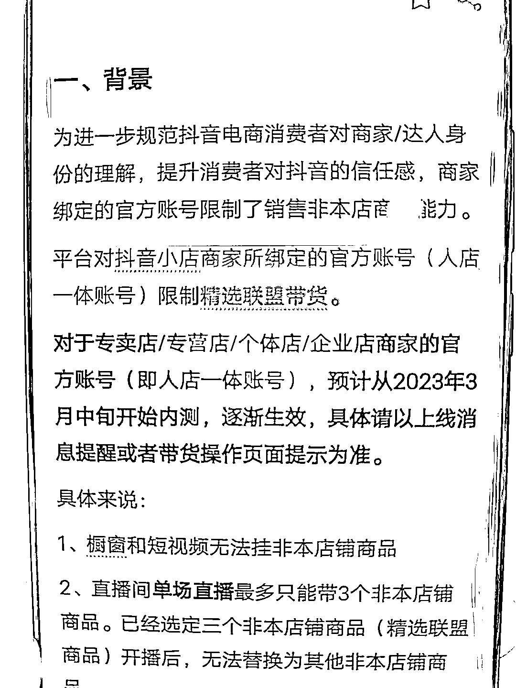

# 今年电商板块都指向“鼓励玩家开店，平台打造商城”

> 原文：[`www.yuque.com/for_lazy/xkrm14/is8iqm6e4c7nnb9b`](https://www.yuque.com/for_lazy/xkrm14/is8iqm6e4c7nnb9b)

<ne-p id="ucb2f1396" data-lake-id="ucb2f1396"><ne-text id="u223f9876">作者： 金坐</ne-text></ne-p> <ne-p id="ua40ad26a" data-lake-id="ua40ad26a"><ne-text id="uf9eff39d">日期：2023-04-10</ne-text></ne-p> <ne-p id="u793a68dd" data-lake-id="u793a68dd"><ne-text id="uf28257ef">点赞数：</ne-text><ne-text id="u78765aaa" ne-bold="true">15</ne-text></ne-p> <ne-hole id="u276540db" data-lake-id="u276540db"><ne-card data-card-name="hr" data-card-type="block" id="Aausk" data-event-boundary="card"><ne-p id="u58eccb63" data-lake-id="u58eccb63"><ne-text id="uccf898d3">正文：</ne-text></ne-p> <ne-p id="u97c29eb8" data-lake-id="u97c29eb8"><ne-text id="ua9ad55c0">今年今年电商板块动作挺多的 1\. 开放个人店铺 2\. 店铺管理员账号只能挂本店商品 3.管理员账号的口碑分被店铺体验分取代 有点像小红书的号店一体了</ne-text> <ne-text id="u94bf9612">4\. 商品卡免佣+超级商品卡 5\. 千川的图文投放变推商品 所有举动的目的其实都指向一个 鼓励玩家开店，平台要打造商城</ne-text> <ne-text id="ue0f953e1">今年在抖音怎么找增量，先跟着平台政策走准没错</ne-text></ne-p> <ne-p id="u90a99d79" data-lake-id="u90a99d79"><ne-card data-card-name="image" data-card-type="inline" id="IDxT2" data-event-boundary="card"></ne-card></ne-p> <ne-hole id="u0cf6c0c7" data-lake-id="u0cf6c0c7"><ne-card data-card-name="hr" data-card-type="block" id="wchoj" data-event-boundary="card"><ne-p id="uf085413b" data-lake-id="uf085413b"><ne-text id="u61205182">评论区：</ne-text></ne-p> <ne-p id="ufb204106" data-lake-id="ufb204106"><ne-text id="u6f2a975d">亦仁 : 中标，术值 +1。 点击最上方 #中标 专栏，可查看所有中标风向标。</ne-text></ne-p> <ne-hole id="uf2e93b79" data-lake-id="uf2e93b79"><ne-card data-card-name="hr" data-card-type="block" id="GNUau" data-event-boundary="card"><ne-p id="u4683f30f" data-lake-id="u4683f30f"><ne-text id="u689894be">公众号懒人找资源，懒人专属群分享</ne-text></ne-p></ne-card></ne-hole></ne-card></ne-hole></ne-card></ne-hole>