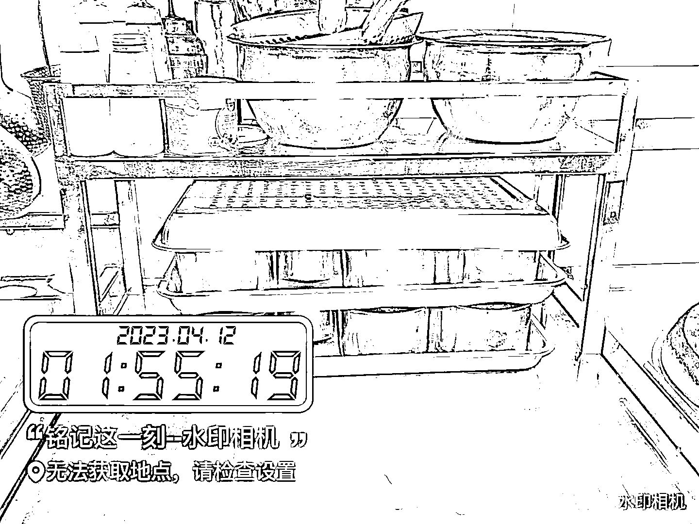
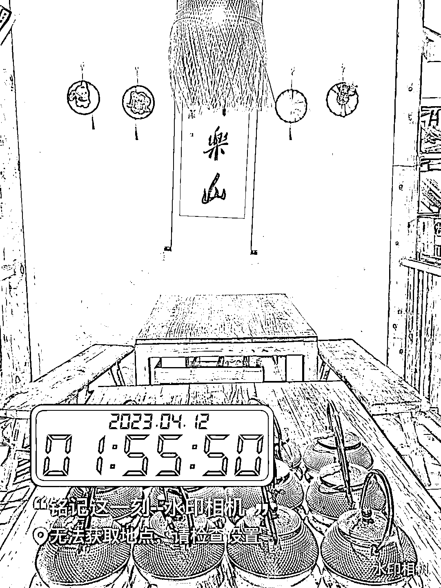

# 一个非常棒的做餐饮私域的方法，发当天的清洁打卡

> 原文：[`www.yuque.com/for_lazy/xkrm14/mt2cb8ei9bgkcod4`](https://www.yuque.com/for_lazy/xkrm14/mt2cb8ei9bgkcod4)

<ne-p id="u594206c5" data-lake-id="u594206c5"><ne-text id="uc6f1db56">作者： 念念无住</ne-text></ne-p> <ne-p id="ufaf72611" data-lake-id="ufaf72611"><ne-text id="u6b9e7c0d">日期：2023-04-14</ne-text></ne-p> <ne-p id="u2687f754" data-lake-id="u2687f754"><ne-text id="uc746bb2c">点赞数：</ne-text><ne-text id="uef6f192b" ne-bold="true">125</ne-text></ne-p> <ne-hole id="ua215770b" data-lake-id="ua215770b"><ne-card data-card-name="hr" data-card-type="block" id="as2y1" data-event-boundary="card"><ne-p id="u544d5698" data-lake-id="u544d5698"><ne-text id="u01673f3d">正文：</ne-text></ne-p> <ne-p id="u8ad4d101" data-lake-id="u8ad4d101"><ne-text id="ucab06ce1">分享一个非常棒的做餐饮私域的方法。</ne-text> <ne-text id="ud1443fdf">大前年，2019，公司附近开了一家专门吃辣卤花甲的店，加了店家的私域微信。之后这个号又换了几家店，但看得出来，都是同一个老板。</ne-text> <ne-text id="u94fe29df">因为这个微信号有一个非常明显的特点，朋友圈除了菜品推荐、活动引流，每天凌晨闭店的时候，他们会发当天的清洁打卡（如图）。非常特别。</ne-text> <ne-text id="u9b79b642">用大师兄的话来说，就是你跟别人不一样，你就赢了。 餐饮店，干净卫生是本分，但是把本分亮出来，每天坚持打卡，这就非常厉害了。</ne-text> <ne-text id="u3c718d21">这个微信号大前年在成都开店，关店以后老板就去了乐山开店。图片中已经是老板在乐山开的第三家店了。据说有成都的游客去乐山旅游，非要领队带他们去这家店光顾生意。我猜也是加了微信，被种草的。</ne-text> <ne-text id="u9fb7d858">认真做事，让人看到，就不会饿死。</ne-text></ne-p> <ne-p id="u92d40b4b" data-lake-id="u92d40b4b"><ne-card data-card-name="image" data-card-type="inline" id="nx01w" data-event-boundary="card"></ne-card></ne-p> <ne-p id="u4ca43019" data-lake-id="u4ca43019"><ne-card data-card-name="image" data-card-type="inline" id="puhtc" data-event-boundary="card"></ne-card></ne-p> <ne-p id="ue431067c" data-lake-id="ue431067c"><ne-card data-card-name="image" data-card-type="inline" id="X8BAV" data-event-boundary="card"></ne-card></ne-p> <ne-p id="ua2271682" data-lake-id="ua2271682"><ne-card data-card-name="image" data-card-type="inline" id="w9XaR" data-event-boundary="card"></ne-card></ne-p> <ne-p id="ue0512257" data-lake-id="ue0512257"><ne-card data-card-name="image" data-card-type="inline" id="sXj48" data-event-boundary="card"></ne-card></ne-p> <ne-hole id="u080a00cc" data-lake-id="u080a00cc"><ne-card data-card-name="hr" data-card-type="block" id="vBfJ6" data-event-boundary="card"><ne-p id="ufacf8619" data-lake-id="ufacf8619"><ne-text id="ub9746eb7">评论区：</ne-text></ne-p> <ne-p id="u92921b1e" data-lake-id="u92921b1e"><ne-text id="ubc6dd5f4">糯米糕 : 钱大妈也是，每天闭店时，会发店内整量后的图片到群里和朋友圈</ne-text></ne-p> <ne-p id="ue6559d61" data-lake-id="ue6559d61"><ne-text id="u596ddb9e">念念无住 : 看来有可能是学的钱大妈</ne-text></ne-p> <ne-p id="ub6b1746d" data-lake-id="ub6b1746d"><ne-text id="u08edd5b1">念念无住 : 我记得大师兄之前讲案例的时候，举的是外卖餐盒的例子。一个有质感的餐盒，成本增加几毛钱，会帮你拉高很大一截印象分。对复购和转介绍影响也很大。</ne-text></ne-p> <ne-p id="u2f1a0f92" data-lake-id="u2f1a0f92"><ne-text id="ud230115a">大辉 : 确实是一个思路</ne-text></ne-p> <ne-p id="u2dcdac11" data-lake-id="u2dcdac11"><ne-text id="u82ebe3c7">阿翔君 : 这个让我想起了，广东的《包道》，每天下班他们都会大张旗鼓的各种打扫，冲水，每个路过的人都可以看到他们很认真的清洗，让人产生这家店很爱干净的感觉，现在想想也是一种营销方式啊。</ne-text></ne-p> <ne-p id="u29e35d30" data-lake-id="u29e35d30"><ne-text id="u62bf9ae1">念念无住 : 有仪式感的做清洁，肯定会加印象分。我猜他们主要做回头客生意😄</ne-text></ne-p> <ne-p id="u5de2faa5" data-lake-id="u5de2faa5"><ne-text id="ubc080477">阿翔君 : 是的~做回头客生意</ne-text></ne-p> <ne-p id="u89da5579" data-lake-id="u89da5579"><ne-text id="ue392a301">💪🏻吉吉积极向上 : 其他卖吃的店是不是可以放一组产品数量对比图，早晨货架上摆满晚上卖空</ne-text></ne-p> <ne-hole id="u85017e7f" data-lake-id="u85017e7f"><ne-card data-card-name="hr" data-card-type="block" id="gtdyr" data-event-boundary="card"><ne-p id="u8a6bc546" data-lake-id="u8a6bc546"><ne-text id="u7c23c8cf">公众号懒人找资源，懒人专属群分享</ne-text></ne-p></ne-card></ne-hole></ne-card></ne-hole></ne-card></ne-hole>