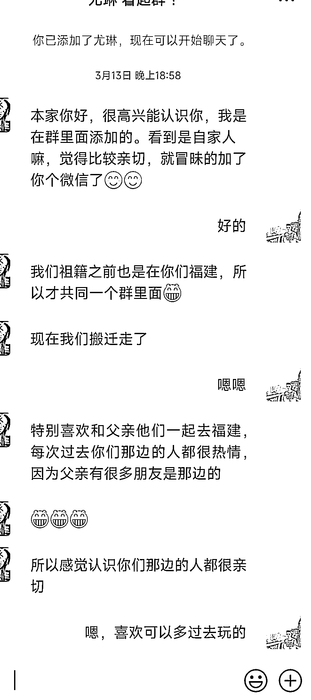
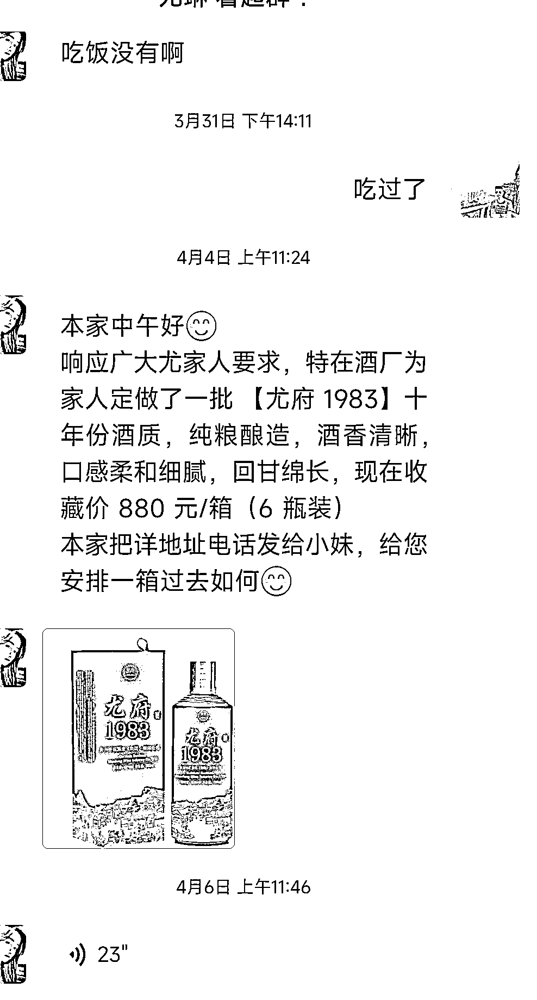

# 微信，加姓氏群引流卖定制姓氏白酒

> 原文：[`www.yuque.com/for_lazy/xkrm14/ez0n35nfh6n29tqe`](https://www.yuque.com/for_lazy/xkrm14/ez0n35nfh6n29tqe)

<ne-p id="ubff7fe0f" data-lake-id="ubff7fe0f"><ne-text id="u92f2333e">作者： 发达</ne-text></ne-p> <ne-p id="ube08416e" data-lake-id="ube08416e"><ne-text id="ub294257c">日期：2023-04-14</ne-text></ne-p> <ne-p id="ub37d8434" data-lake-id="ub37d8434"><ne-text id="ucf4086c0">点赞数：</ne-text><ne-text id="u43fafb82" ne-bold="true">64</ne-text></ne-p> <ne-hole id="u700f4096" data-lake-id="u700f4096"><ne-card data-card-name="hr" data-card-type="block" id="C2vP3" data-event-boundary="card"><ne-p id="udc08395c" data-lake-id="udc08395c"><ne-text id="u85075056">正文：</ne-text></ne-p> <ne-p id="u51547b66" data-lake-id="u51547b66"><ne-text id="ue1893cea">加姓氏群引流卖定制姓氏白酒</ne-text> <ne-text id="u5a6337b3">最近有一个美女从本家姓氏群加到我微信，开始以为是有什么事找我，热情寒暄后好像没事啊。看了下她朋友圈，怎么感觉一股专业卖酒的人设号。朋友圈就是日常生活+卖酒的日常。(图 1-2）</ne-text> <ne-text id="u34f4f450">隔 2 天除了寒暄还突然问我还有其他本家微信群，我就感觉这肯定不是本家老乡，后来就开始向我推销本家(尤氏)定制贵州白酒。(图 3）</ne-text> <ne-text id="u9965319c">可能是看我没买酒打算，心想是不是感觉酒价格贵了，就换了个思路变相降价来成交我，我还是不买，最后又加磅说买酒送一件定制姓氏 T 家族纪念服。(图 4）</ne-text> <ne-text id="u4fff15a7">事实上我个人不太喜欢这种以本家群，绕来绕去的销售方式，但是可能很多中老年面对这样的场景，应该还是会买单的。 启发和思路拆解: 1.引流:</ne-text> <ne-text id="u7f1f0070">打着祖籍是本家的方法，去进各种本家群，然后把群里男的本家人都加微信闲聊增强信任，再问聊的好的邀请进其他本家群。 2.卖货:</ne-text> <ne-text id="ud1d8a974">根据本家姓特点，改下包装，推出定制姓氏白酒(让你体验被重视、亲切感觉)，我不喝白酒，发我姓氏酒图片时候，多少有点亲切的感觉的。 3.转化:</ne-text> <ne-text id="u3850c246">有了美女形象+本家群人设+姓氏定制酒，爱喝酒一部分中老年可能就下单了，对钉子客户，进一步变相降价和赠送附加值，来增加成交的机会。 思路发散:</ne-text> <ne-text id="u99a7e502">用祖籍是本家的思路，可以换成李、王、刘、张等形式再来一遍引流。 1.白酒同行可以试下模仿她这个模式，毕竟白酒用户引流成本一个高达几百元。</ne-text> <ne-text id="u4c8640f3">2.其他有白酒客户相同的客户群体，比如中高客单价的古董、文玩，玉石等产品。</ne-text></ne-p> <ne-p id="u31a906dd" data-lake-id="u31a906dd"><ne-card data-card-name="image" data-card-type="inline" id="XFi6r" data-event-boundary="card"></ne-card></ne-p> <ne-p id="u26c5abda" data-lake-id="u26c5abda"><ne-card data-card-name="image" data-card-type="inline" id="BTDPK" data-event-boundary="card"></ne-card></ne-p> <ne-p id="u4cbbe05f" data-lake-id="u4cbbe05f"><ne-card data-card-name="image" data-card-type="inline" id="KSPox" data-event-boundary="card"></ne-card></ne-p> <ne-p id="ud1c6eb0d" data-lake-id="ud1c6eb0d"><ne-card data-card-name="image" data-card-type="inline" id="B6EtR" data-event-boundary="card"></ne-card></ne-p> <ne-hole id="ue9402619" data-lake-id="ue9402619"><ne-card data-card-name="hr" data-card-type="block" id="AfbgU" data-event-boundary="card"><ne-p id="u4c68e715" data-lake-id="u4c68e715"><ne-text id="u96784874">评论区：</ne-text></ne-p> <ne-p id="u3f1c04bb" data-lake-id="u3f1c04bb"><ne-text id="u668090c3">抽根烟 : 😃，其实就是散装酒装入定制酒瓶，别问我怎么知道。</ne-text></ne-p> <ne-p id="u7f6a7627" data-lake-id="u7f6a7627"><ne-text id="ua8f7359b">Luke 王子 : 确实可行，我爸已经买了酒</ne-text></ne-p> <ne-p id="u016b2643" data-lake-id="u016b2643"><ne-text id="ue837f6a2">Kilo : 一件含泪赚 400[呲牙]</ne-text></ne-p> <ne-p id="ue1e52af6" data-lake-id="ue1e52af6"><ne-text id="u0a7a8a6d">登登 : 我爸也买了，还很自豪😂</ne-text></ne-p> <ne-p id="ubed730be" data-lake-id="ubed730be"><ne-text id="u65c2d2a3">怡宝 : 我爸也买了 也很自豪[捂脸]</ne-text></ne-p> <ne-p id="u54d98487" data-lake-id="u54d98487"><ne-text id="u7f30e0d8">发达 : 看来买的很多啊😂</ne-text></ne-p> <ne-p id="uf4a93359" data-lake-id="uf4a93359"><ne-text id="u3f8df729">思蒙 : 😄😄</ne-text></ne-p> <ne-p id="ud5a8ac17" data-lake-id="ud5a8ac17"><ne-text id="u7748adc7">巫哥 : 看评论区突然觉得这个方法可能效果很好</ne-text></ne-p> <ne-hole id="uecf8f4ec" data-lake-id="uecf8f4ec"><ne-card data-card-name="hr" data-card-type="block" id="R1T6P" data-event-boundary="card"><ne-p id="u0272701f" data-lake-id="u0272701f"><ne-text id="ue2756df1">公众号懒人找资源，懒人专属群分享</ne-text></ne-p></ne-card></ne-hole></ne-card></ne-hole></ne-card></ne-hole>