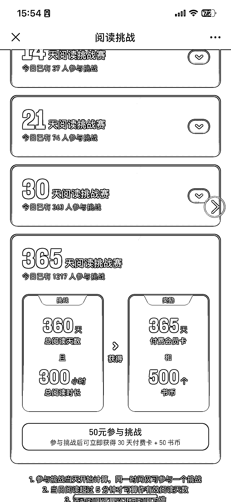

# 微信读书开启 365 阅读挑战赛，可以借鉴其裂变的思路

> 原文：[`www.yuque.com/for_lazy/xkrm14/vcqforqa8nvvxsyx`](https://www.yuque.com/for_lazy/xkrm14/vcqforqa8nvvxsyx)

作者： 认知小窗-认哥

日期：2023-04-12

点赞数：92

<ne-card data-card-name="hr" data-card-type="block" id="Pxj3u" data-event-boundary="card">

正文：

跟微信学运营 微信读书，开放了 365 阅读挑战赛，报名费 50，付费就返 30 书币， 全年阅读 360 天，总时长超过 300 小时，即算打卡成功， 获得一年会员卡和 500 个书币， 活动同时面对免费和付费用户。 不得不说，中国互联网，没有人比腾讯更懂用户， 这比爱奇艺二次收费，高明多了，用户是给自己的阅读成就付费，花钱的心甘情愿，收钱的心安理得。 对于我这种微读中度用户来说(去年看了 130 本)，参与难度不大，顺手报了。 延伸的话，适合英语打卡、自律营、早起、跑步这种高频且效果看得见的付费营， 另外，结合昨天看的付费直播，学到的裂变三要素： 1\. 信息差(我持续打卡所以我在这方面比别人牛逼)， 2\. 动力(我持续打卡能获得会员/优惠券/返现)， 3. 场景(都是积极向上的活动，打卡随便配合朋友圈，就是转化场景)参加活动的朋友， 上面几个习惯养成类训练营，都符合。 圈友们，可以搞起来啦！

<ne-card data-card-name="image" data-card-type="inline" id="vEezG" data-event-boundary="card"></ne-card>

<ne-card data-card-name="image" data-card-type="inline" id="pcvkC" data-event-boundary="card"></ne-card>

<ne-card data-card-name="image" data-card-type="inline" id="dlm8N" data-event-boundary="card"></ne-card>

<ne-card data-card-name="hr" data-card-type="block" id="I65yu" data-event-boundary="card">

评论区：

周彦充 : 这个感觉不错

认知小窗-认哥 : 适合客单价百元、长周期的训练营变现参考，缺点就是运营交付重一点

林中灰兔 : 这哈活动好像只有小部分人才有

认知小窗-认哥 : 更新一下版本 我也是更新后 才看到入口的

北柱 : 更新版本也没找到报名入口[捂脸]

认知小窗-认哥 : sad. 有个身边朋友也是这样，她苹果，你也是吧

北柱 : 我的是安卓手机

认知小窗-认哥 : 等一等吧，安卓一般比苹果会慢一点更新

<ne-card data-card-name="hr" data-card-type="block" id="w03KH" data-event-boundary="card">

公众号懒人找资源，懒人专属群分享

</ne-card></ne-card></ne-card>