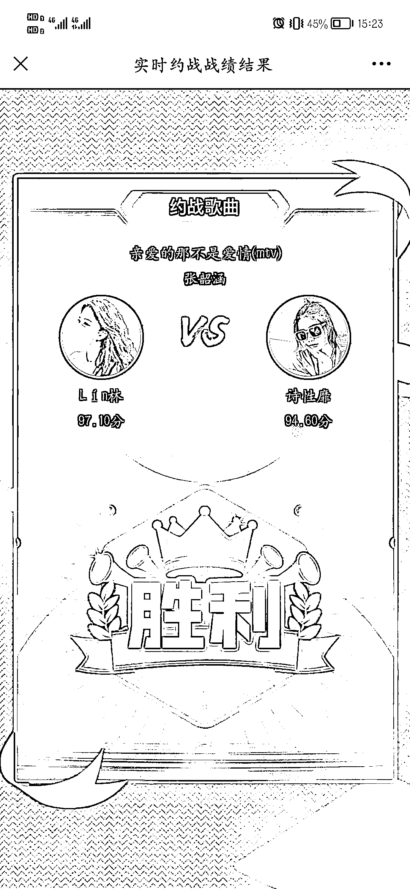

# KTV 联网交 2.33 元的“入场券”挑战，赢的一方可以获得奖金

> 原文：[`www.yuque.com/for_lazy/xkrm14/ooywrw28s1iqigmi`](https://www.yuque.com/for_lazy/xkrm14/ooywrw28s1iqigmi)

<ne-p id="u85cda7a6" data-lake-id="u85cda7a6">作者： 明月几时有</ne-p> <ne-p id="ucc726d3c" data-lake-id="ucc726d3c">日期：2023-04-11</ne-p> <ne-p id="ueee3b594" data-lake-id="ueee3b594">点赞数：48</ne-p> <ne-hole id="u078aa1d5" data-lake-id="u078aa1d5"><ne-card data-card-name="hr" data-card-type="block" id="r8PW4" data-event-boundary="card"><ne-p id="ubb2dcd21" data-lake-id="ubb2dcd21">正文：</ne-p> <ne-p id="ue492fb4c" data-lake-id="ue492fb4c">KTV 联网，去唱歌的人可以发起挑战，每挑战一首歌需要交 2.33 元的“入场券”，赢了的一方可以获得大于 2.33 元的现金红包，最高可获得 99 元（概率很小，但是可以吸引人，一般都是给小于 3 块的红包）。 每次挑战都必须有两个人才能开启，也就是说，一次挑战系统可以收 4.66 元的入场券，赢的一方系统返还 3 元左右。不管哪方赢，系统都能赚一块多。</ne-p> <ne-p id="u19fffb81" data-lake-id="u19fffb81"><ne-card data-card-name="image" data-card-type="inline" id="rdxNe" data-event-boundary="card">  <ne-p id="u6a8407e3" data-lake-id="u6a8407e3"><ne-card data-card-name="image" data-card-type="inline" id="k1aSV" data-event-boundary="card">  <ne-p id="u505bff06" data-lake-id="u505bff06"><ne-card data-card-name="image" data-card-type="inline" id="ep3ow" data-event-boundary="card">  <ne-hole id="u77314ae6" data-lake-id="u77314ae6"><ne-card data-card-name="hr" data-card-type="block" id="Gvmyv" data-event-boundary="card"><ne-p id="u8315778e" data-lake-id="u8315778e">评论区：</ne-p> <ne-p id="uf515597b" data-lake-id="uf515597b">一个人看夕阳 : 这个怎么操作</ne-p> <ne-p id="ub4d203ef" data-lake-id="ub4d203ef">明月几时有 : 我是消费者</ne-p> <ne-p id="u2ee9c3f7" data-lake-id="u2ee9c3f7">Luke 王子 : 赌场套路学到家了 庄家必赢</ne-p> <ne-hole id="u98f3b13d" data-lake-id="u98f3b13d"><ne-card data-card-name="hr" data-card-type="block" id="JuvyG" data-event-boundary="card"><ne-p id="ucf62f6a2" data-lake-id="ucf62f6a2">公众号懒人找资源，懒人专属群分享</ne-p></ne-card></ne-hole></ne-card></ne-hole></ne-card></ne-p></ne-card></ne-p></ne-card></ne-p></ne-card></ne-hole>