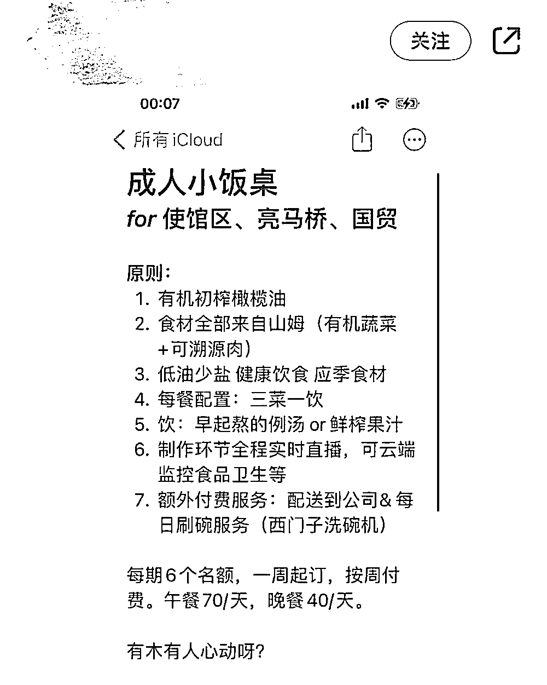
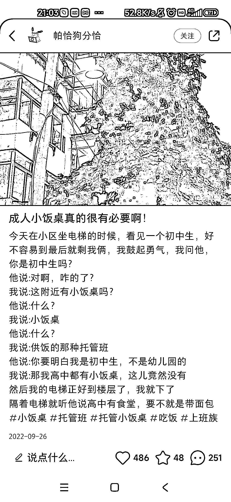

# 线下实体可以针对一二线城市部分青年做成人小饭桌

> 原文：[`www.yuque.com/for_lazy/xkrm14/xgbu3gu627fg036w`](https://www.yuque.com/for_lazy/xkrm14/xgbu3gu627fg036w)

作者： mazhongyu

日期：2023-04-10

点赞数：34

正文：

成人小饭桌 一二线城市部分青年 觉得外卖不健康 自己做饭又太麻烦 想到了去和学生晚托班搭伙 付一定的钱来解决自己的日常饮食需求

评论区：

later : 就是感觉价格有点高~

mazhongyu : 这是打算主动以此为副业的人的价格；如果是本身就有成型的服务提供，那么就只是多几张嘴的问题，对应费用不会那么高。

聪聪 8.0@益生菌 : 学习了，最近看到也有上门做饭，收费 80 元一顿起步

公众号懒人找资源，懒人专属群分享

