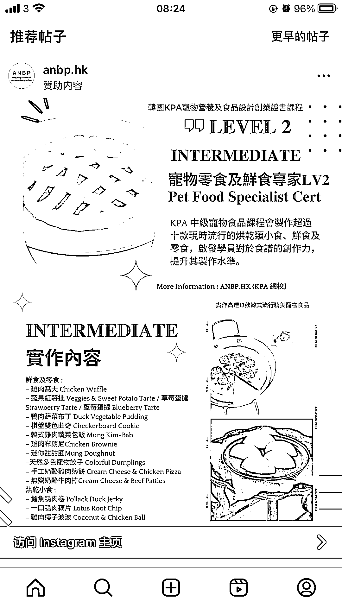

# 宠物市场前景不错，尤其是宠物零食等小而美的类型

> 原文：[`www.yuque.com/for_lazy/xkrm14/cutb7emy0ktsgawn`](https://www.yuque.com/for_lazy/xkrm14/cutb7emy0ktsgawn)

作者： 超级玛丽

日期：2023-04-10

点赞数：30

<ne-card data-card-name="hr" data-card-type="block" id="ieDk4" data-event-boundary="card">

正文：

我记得之前星球发过一个国外案例就是一位女士做宠物饼干，并且在自己的网站上卖配方，制作流程等等，非常赚。 刷 ins 又看到广告推送，某韩的宠物零食制作证书 宠物市场不错啊，尤其是小而美的那种社区类型的

<ne-card data-card-name="image" data-card-type="inline" id="PKgLr" data-event-boundary="card"></ne-card>

<ne-card data-card-name="hr" data-card-type="block" id="HRQjA" data-event-boundary="card">

评论区：

君顾 : 在外国的网站上卖中国食谱也可以，食谱就直接上淘宝买翻译成英文就好了[耶]

超级玛丽 : 牛！又学到了！

亦仁 : 中标，术值 +1。 点击最上方 #中标 专栏，可查看所有中标风向标。

<ne-card data-card-name="hr" data-card-type="block" id="bEWgJ" data-event-boundary="card">

公众号懒人找资源，懒人专属群分享

</ne-card></ne-card></ne-card>