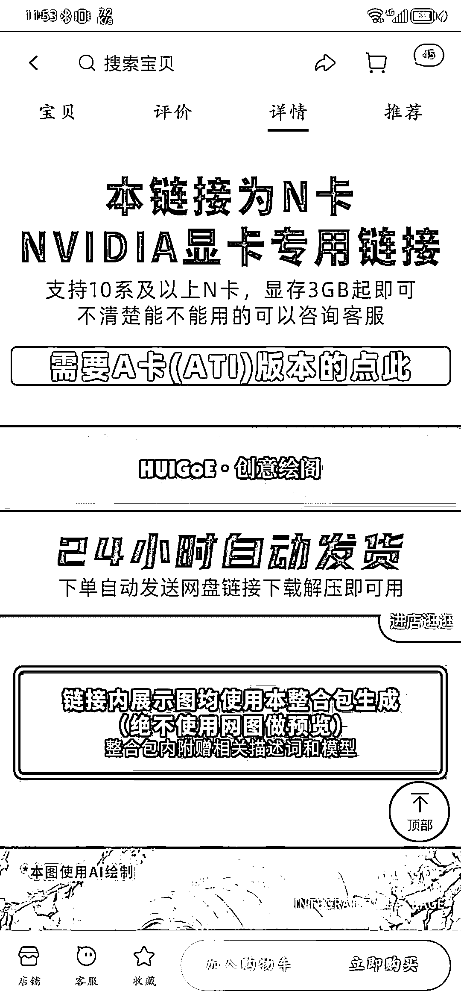
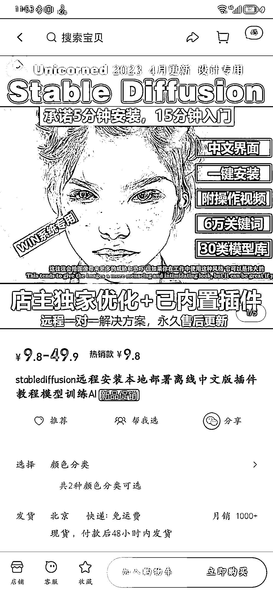
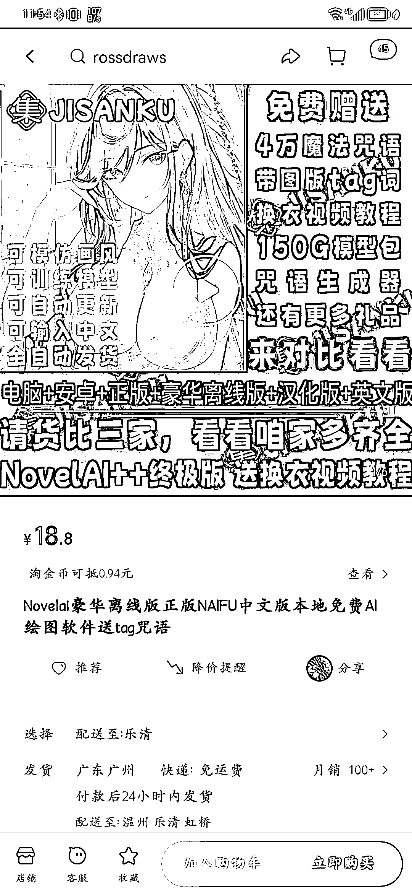
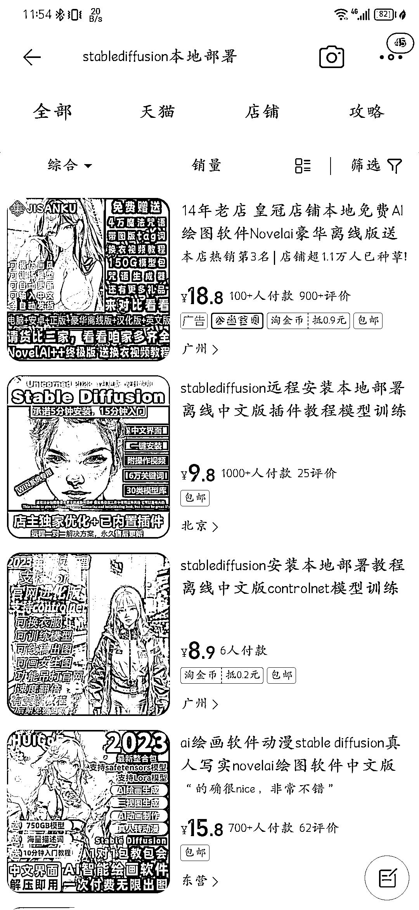

# 淘宝有卖 stable diffusion 本地部署安装包

> 原文：[`www.yuque.com/for_lazy/xkrm14/xdmk7ruti5f8wyt0`](https://www.yuque.com/for_lazy/xkrm14/xdmk7ruti5f8wyt0)

作者： zmk

日期：2023-04-07

点赞数：33

<ne-hole id="uf8675eac" data-lake-id="uf8675eac"><ne-card data-card-name="hr" data-card-type="block" id="zkJVD" data-event-boundary="card">

正文：

今天刷小红书的时候，看到有人说淘宝有卖 stable diffusion 本地部署安装包的，就去搜了一下。 店铺不是特别多，但是销量还不错。 基本配置就是整合常用插件的安装包+安装视频卖 9.8 或者 8.8，价格高一点的就是带远程安装+出图指南的卖 15.8-49.9 不等。 甚至看到有店铺顺带卖显卡的，N 卡 A 卡都卖。 还有卖 Noval ai 本地部署的店铺。 这个完全可以从外网扒现成安装包卖，或者有技术的伙伴整合下安装包去卖。感觉需求还是不小的。

<ne-card data-card-name="image" data-card-type="inline" id="F6RwJ" data-event-boundary="card"></ne-card>

<ne-card data-card-name="image" data-card-type="inline" id="CIt18" data-event-boundary="card"></ne-card>

<ne-card data-card-name="image" data-card-type="inline" id="IyszX" data-event-boundary="card"></ne-card>

<ne-card data-card-name="image" data-card-type="inline" id="N1GPx" data-event-boundary="card"></ne-card>

<ne-card data-card-name="image" data-card-type="inline" id="yxhRi" data-event-boundary="card"></ne-card>

<ne-hole id="u6708e183" data-lake-id="u6708e183"><ne-card data-card-name="hr" data-card-type="block" id="H4hhb" data-event-boundary="card">

评论区：

丑八怪 : 真是万物皆可售

<ne-hole id="ucf6b844d" data-lake-id="ucf6b844d"><ne-card data-card-name="hr" data-card-type="block" id="UUQF0" data-event-boundary="card">

公众号懒人找资源，懒人专属群分享

</ne-card></ne-hole></ne-card></ne-hole></ne-card></ne-hole>