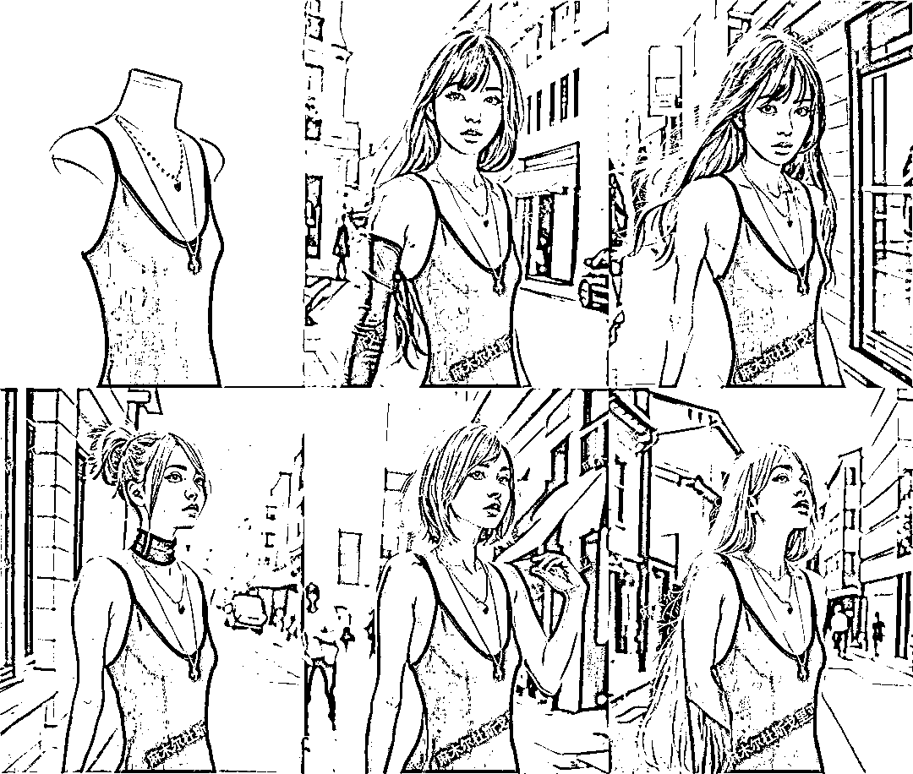

# AI 模特图的工作流已经成熟，可做成个人工作室

> 原文：[`www.yuque.com/for_lazy/xkrm14/tg0nlgn5tcd2qsno`](https://www.yuque.com/for_lazy/xkrm14/tg0nlgn5tcd2qsno)

作者： 麻木尔杜斯戈里亚

日期：2023-04-07

点赞数：50

<ne-card data-card-name="hr" data-card-type="block" id="Ld3SN" data-event-boundary="card">

正文：

起码在技术层面，AI 模特图的工作流已经成熟了，如今是 AI 绘画这个大领域内“离钱很近”的细分赛道之一（需求大且清晰）。 附图是今早在圈友码哥牵线下对接的一个 AI 模特图客户，从看到需求到交付成图，正好一小时，刨除早起迷糊等因素，实际的交付成本应该比一小时更低些。 这个事情，往小可以做成个人工作室，稍微往大做，可以组兼职团队接企业订单。

<ne-card data-card-name="image" data-card-type="inline" id="ijKbn" data-event-boundary="card">  <ne-card data-card-name="hr" data-card-type="block" id="ts0Om" data-event-boundary="card"><ne-p id="ufb7868ef" data-lake-id="ufb7868ef">评论区：

乾 : 对，就是我咨询的

MT : 圈友这是怎么做的，可以加 v 吗

啊啊啊 : 这种怎么收费

博学的金鱼 : 请问怎么对接商店

麻木尔杜斯戈里亚 : windinmyeye

麻木尔杜斯戈里亚 : 自己定价，客户可接受就行

麻木尔杜斯戈里亚 : 私域聊，公域吸引

<ne-card data-card-name="hr" data-card-type="block" id="GVDfn" data-event-boundary="card">

公众号懒人找资源，懒人专属群分享

</ne-card></ne-card></ne-card></ne-p></ne-card>