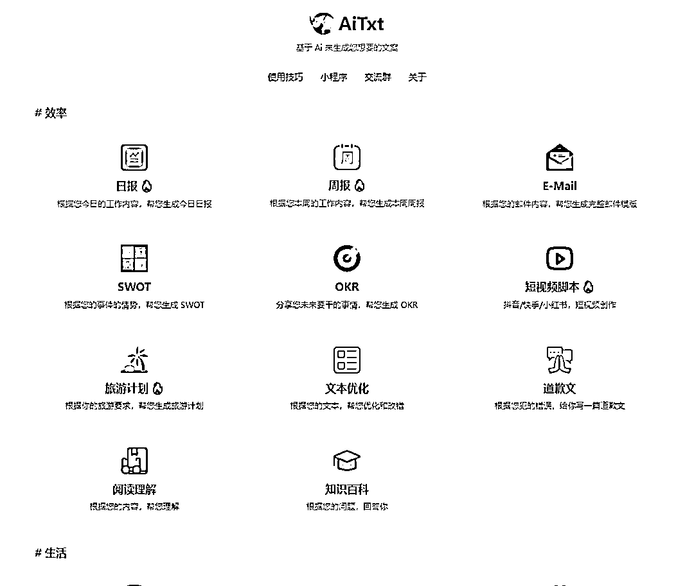

# AiTxt 在线 AI 文案生成工具

> 原文：[`www.yuque.com/for_lazy/xkrm14/fyzlctfrzsz8gzmo`](https://www.yuque.com/for_lazy/xkrm14/fyzlctfrzsz8gzmo)

<ne-p id="ua8b0fe1c" data-lake-id="ua8b0fe1c">作者： 📌小攀师兄</ne-p> <ne-p id="u157e3567" data-lake-id="u157e3567">日期：2023-04-06</ne-p> <ne-p id="uc2398262" data-lake-id="uc2398262">点赞数：79</ne-p> <ne-hole id="ue938fcd5" data-lake-id="ue938fcd5"><ne-card data-card-name="hr" data-card-type="block" id="iFOap" data-event-boundary="card"><ne-p id="u97834f46" data-lake-id="u97834f46">正文：</ne-p> <ne-p id="udd065905" data-lake-id="udd065905">刚刚试用了，很多戳中人群痛点的文案生成器 文案一键生成，究竟有多方便？ AiTxt - 在线 AI 文案生成工具 链接： 📄 多种文案场景 🤖 自动生成日报 💻 运营小编必备 💡 短视频脚本 🎉 小红书文案 如果你的工作需要快速撰写文案，那么这个 AI 工具别错过！ [AiTxt+智能助手+-+小红书、日报、周报、OKR、邮件、餐厅点评、节日祝福、甩锅等+Ai+文案助...](https://aitxt.io/)</ne-p> <ne-p id="uda8a8a5a" data-lake-id="uda8a8a5a"><ne-card data-card-name="image" data-card-type="inline" id="xvJWJ" data-event-boundary="card"></ne-card></ne-p> <ne-hole id="u47af31bb" data-lake-id="u47af31bb"><ne-card data-card-name="hr" data-card-type="block" id="DnnCl" data-event-boundary="card"><ne-p id="u8763af70" data-lake-id="u8763af70">评论区：</ne-p> <ne-p id="u760671b8" data-lake-id="u760671b8">momo : 试了一下，快捷好用[呲牙]感谢分享</ne-p> <ne-p id="ue8c0269e" data-lake-id="ue8c0269e">Mr. Lucky : 这个好玩[强]</ne-p> <ne-hole id="u0960b2c2" data-lake-id="u0960b2c2"><ne-card data-card-name="hr" data-card-type="block" id="gnRNZ" data-event-boundary="card"><ne-p id="u7319e33b" data-lake-id="u7319e33b">公众号懒人找资源，懒人专属群分享</ne-p></ne-card></ne-hole></ne-card></ne-hole></ne-card></ne-hole>