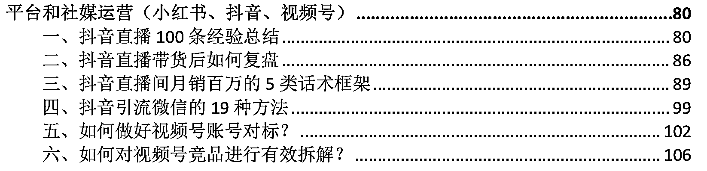

# AI 可以批量产出资料合集爆粉

> 原文：[`www.yuque.com/for_lazy/xkrm14/suvfhktba50gv147`](https://www.yuque.com/for_lazy/xkrm14/suvfhktba50gv147)

作者： 纪钟

日期：2023-04-05

点赞数：56

正文：

【AI 批量产出资料合集爆粉】过去常见引流玩法为资料引流，基本都是一些大量的低价值文档、视频课等，由于原创度低而且以量取胜，文件又大又冗杂只能走网盘，导致传播度比较差（根据种子群质量裂变 3-7 层级基本终止，但文档传播非常便捷，一份垂直领域价值很高的文档裂变层级可以达到 5-20）。 本次新研发的链路优势： 图一&图二：基于 AI 结合 SEO 进行内容生产，效率爆表，实测半天 5W 字内容很轻松，后续仅做去重及微调即可，且由于 SEO 主导内容生成所以都是绝大部分人最关心的问题。 图三&图四：小而美取胜，一本垂直领域深却干的内容，基于上面的主题词不断深挖，不需要四处搜集资料，一个领域主题就能开干，稍微在标题上做一些人工修改就可以生成看起来非常干的标题，具体的内容可以填充 AI 生成的水文（其实也不水，对非领域专家认知冲击还是比较大，虽然只是把类似百度搜索的答案整合，但你要知道 95%的人连百度搜索都不会用）。 图五&图六：文档及 PDF 埋点方便，可以追踪裂变浏览数据反向调整内容，同时利用短链替换活码可以持续引流并选择导流私域或公众号，同时追踪文档转化私域效果，非常灵活。 以文档或 PDF 为主，传播便捷，如果有种子人群定向投放冷启动会更快。 操作思路： 1.找到你所做的行业，进行 1-5 个词的扩展：如职业规划可扩展：职场人、范文、大学生、三年、模版等 SEO 词汇。 2.选定一个方向将扩展词汇喂给 AI 进行内容扩展：如大学生/职场人/三年工作经验如何进行职业规划，职业规划模版。 3.让 AI 生成对应的问题和答案：问题作为目录，稍作修改成吸人眼球的内容，答案作为正文简单内容填充即可。 4.合并到 PDF 或文档中并进行引流钩子埋点：建议文章封面和每页底部放活码和公众号码（需配置），背景浅色水印，文章分割线上栏放微信号/公众号。 5.选定垂直种子人群冷启动：比如职场就发职场群，赚钱就发副业群，越活跃越精准越好，别说是自己整理的，挂个大佬名头，还要告诉大家尽量别外传（你越这么说大家越愿意分享给自己关系好的人，前端裂变链路质量越高）。 6.承接链路设计：加到你的话术，转化链路，自成交设计，是否后续裂变。 如果有上述工具使用上的问题可以加我咨询，工具用法你自己搜也能搜得到，时间宝贵不白嫖，懒得搜就用钱换时间！谈钱不伤感情

评论区：

养牛达人福老板 : 这个厉害。。。

纪钟 : 其实看似很复杂，但就是玩法的串联

Yuti : 纪大大，这一步怎么做呀？：文档及 PDF 埋点方便，可以追踪裂变浏览数据反向调整内容，同时利用短链替换活码可以持续引流并选择导流私域或公众号，同时追踪文档转化私域效果，非常灵活。

纪钟 : 文档用飞书或者语雀石墨都可以看到有多少人浏览，如果想要跟踪数据可以自己每天做个表格记录一下不同文档阅读量的增长速度，文档里面的二维码用短链平台生成可以追踪数据的二维码，对应到不同表格的浏览数据就可以看到一天多少人阅读后扫码到你的私域或公众号，就知道现在市场上对哪些内容感兴趣，后续可以投入精力整理得更全，传播和引流效果就会越来越好

Fan : 这个超级有用。[强]

时代一粒沙 : 资料好弄，如何引流呢?

纪钟 : 你想象一下你拿到一个自己觉得超级全的资料你会怎么做？肯定分享给自己身边的人啊，资料里有二维码和微信号，其他人看到觉得有用就会加，如果想把钩子再明显些，可以标注添加后可以领其他 xxx 文档

纪钟 : 纪钟 回复 Ben App 开发 澳洲: 之前有一份裂变特别猛的字节研发白皮书，根本就不是字节出的，那一份资料在市面上流传两年多了，前两天我还看见有人拿同样的资料在小红书引流，说明效果一直很好

公众号懒人找资源，懒人专属群分享

