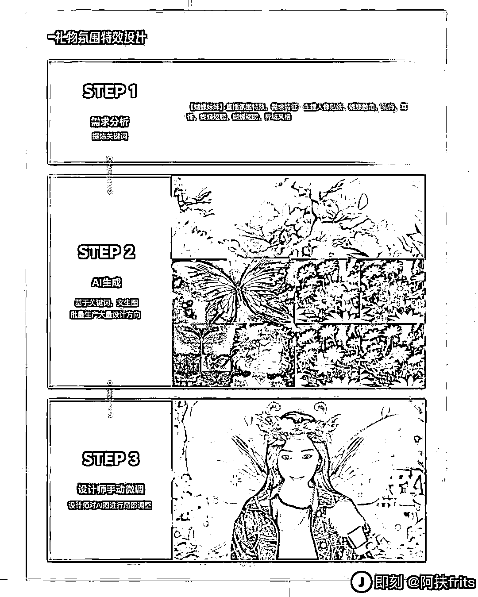
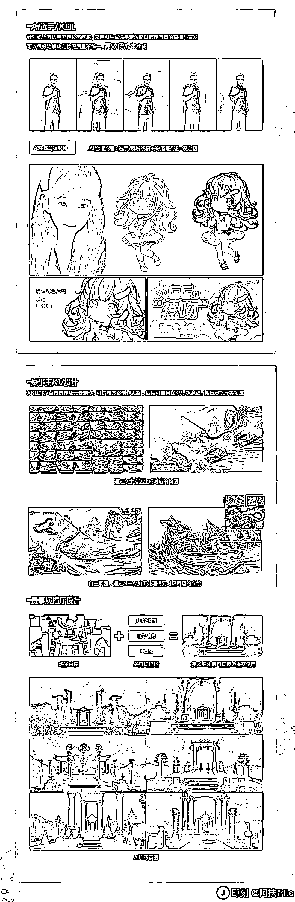
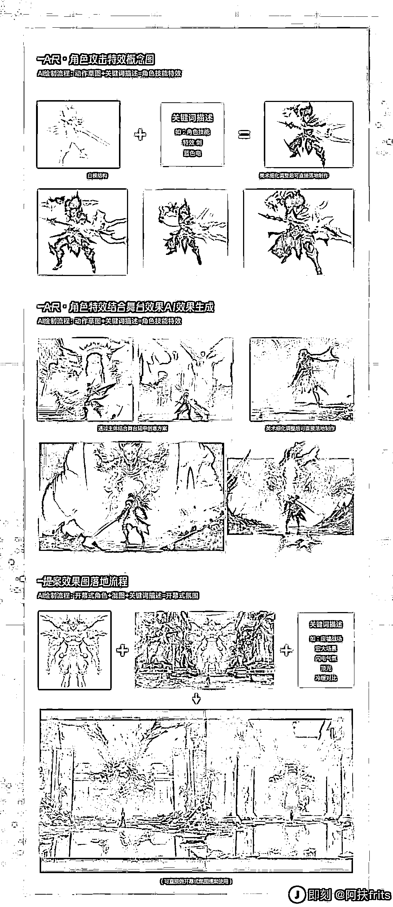
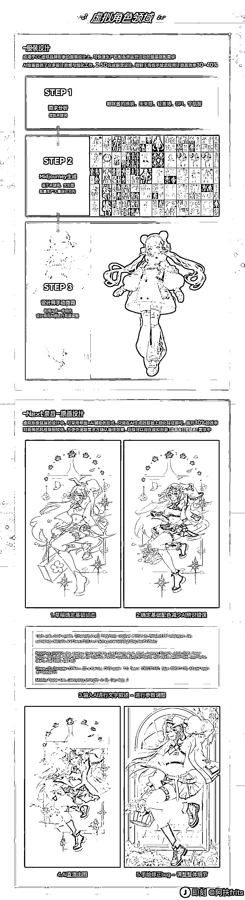
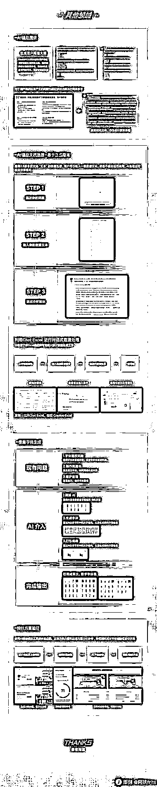

# 网易直接把 AI 设计工作流全部给捋出来了做成长图

> 原文：[`www.yuque.com/for_lazy/xkrm14/as95ias1k3fe1ri3`](https://www.yuque.com/for_lazy/xkrm14/as95ias1k3fe1ri3)

<ne-p id="uc2444aa9" data-lake-id="uc2444aa9">作者： 不期而遇</ne-p> <ne-p id="ub3db16d3" data-lake-id="ub3db16d3">日期：2023-04-05</ne-p> <ne-p id="u034aba4e" data-lake-id="u034aba4e">点赞数：37</ne-p> <ne-hole id="ub0daeb95" data-lake-id="ub0daeb95"><ne-card data-card-name="hr" data-card-type="block" id="LqlNg" data-event-boundary="card"><ne-p id="u72307e41" data-lake-id="u72307e41">正文：</ne-p> <ne-p id="u5428e7ad" data-lake-id="u5428e7ad">网易直接把 AI 设计工作流全部给捋出来了做成长图了（出品@网易 CFun 设计中心），是路人行家看了都能一目了然的程度，真的牛👏🏻 感觉大厂们在 AIGC 这块的探索还蛮积极的，下面还有两个相关文档，一并送给有需要的邻居_ 🐧腾讯 ISUX ：《运用 AIGC 人工智能生产内容》 🐷网易严选创新设计中心：《AIGC|探索 AIGC 在网易严选中的应用》 [运用 AIGC 人工智能生产内容](https://mp.weixin.qq.com/s/b10sqhA9-IvUT44U9-5dLA) [AIGC|探索 AIGC 在网易严选中的应用](https://mp.weixin.qq.com/s/GargWzAGH7QyRanIgZxiCQ)</ne-p> <ne-p id="u289d301f" data-lake-id="u289d301f"><ne-card data-card-name="image" data-card-type="inline" id="Vj2aK" data-event-boundary="card"></ne-card></ne-p> <ne-p id="ud8897611" data-lake-id="ud8897611"><ne-card data-card-name="image" data-card-type="inline" id="DZE5l" data-event-boundary="card"></ne-card></ne-p> <ne-p id="u5af9a59c" data-lake-id="u5af9a59c"><ne-card data-card-name="image" data-card-type="inline" id="xUbmj" data-event-boundary="card"></ne-card></ne-p> <ne-p id="u8369dd6a" data-lake-id="u8369dd6a"><ne-card data-card-name="image" data-card-type="inline" id="lAcf0" data-event-boundary="card"></ne-card></ne-p> <ne-p id="u6018a57b" data-lake-id="u6018a57b"><ne-card data-card-name="image" data-card-type="inline" id="Nw6Y3" data-event-boundary="card"></ne-card></ne-p> <ne-p id="ua55b3e30" data-lake-id="ua55b3e30"><ne-card data-card-name="image" data-card-type="inline" id="i4jrc" data-event-boundary="card"></ne-card></ne-p> <ne-p id="u81975a2e" data-lake-id="u81975a2e"><ne-card data-card-name="image" data-card-type="inline" id="fe4bi" data-event-boundary="card"></ne-card></ne-p> <ne-p id="u8a2b4019" data-lake-id="u8a2b4019"><ne-card data-card-name="image" data-card-type="inline" id="s3zKk" data-event-boundary="card"></ne-card></ne-p> <ne-p id="uc6173cc4" data-lake-id="uc6173cc4"><ne-card data-card-name="image" data-card-type="inline" id="wzdju" data-event-boundary="card"></ne-card></ne-p> <ne-hole id="u43dc32e3" data-lake-id="u43dc32e3"><ne-card data-card-name="hr" data-card-type="block" id="rqegt" data-event-boundary="card"><ne-p id="uab4f365e" data-lake-id="uab4f365e">评论区：</ne-p> <ne-p id="ueb004f79" data-lake-id="ueb004f79">暂无评论</ne-p> <ne-hole id="u3e8f6946" data-lake-id="u3e8f6946"><ne-card data-card-name="hr" data-card-type="block" id="eJy5v" data-event-boundary="card"><ne-p id="uda6efd63" data-lake-id="uda6efd63">公众号懒人找资源，懒人专属群分享</ne-p></ne-card></ne-hole></ne-card></ne-hole></ne-card></ne-hole>