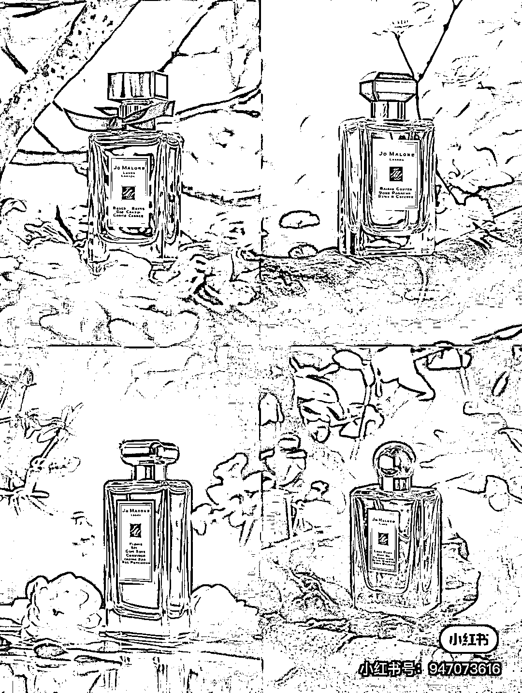
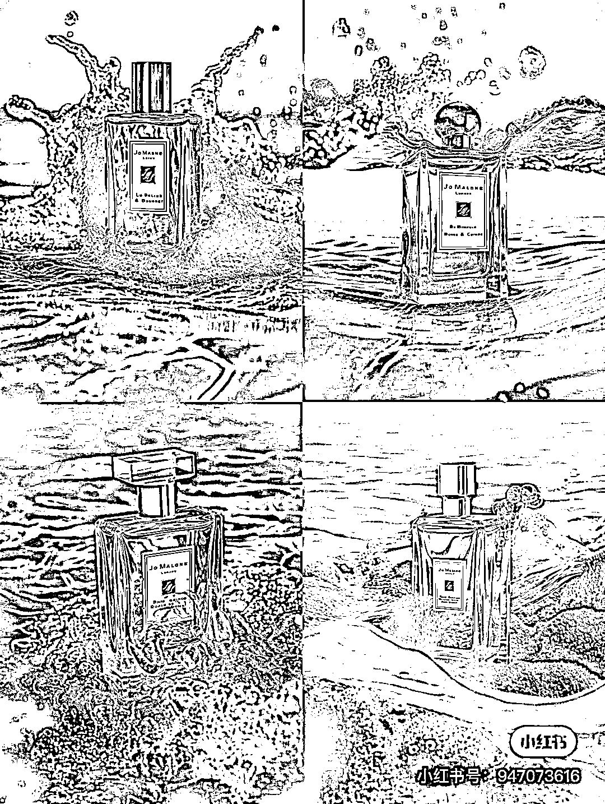
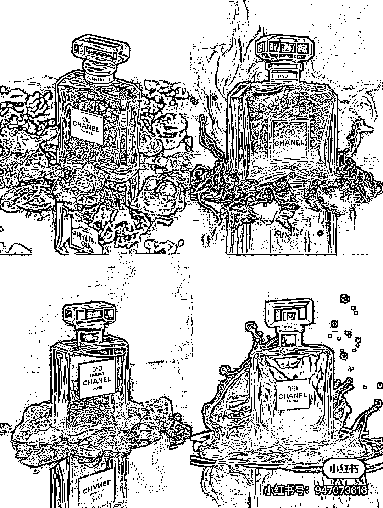

# Midjourney V5 可以把知名品牌的商品展示效果图做到这样的水平

> 原文：[`www.yuque.com/for_lazy/xkrm14/ag65bfqicidvwmoa`](https://www.yuque.com/for_lazy/xkrm14/ag65bfqicidvwmoa)

作者： Sunwei

日期：2023-04-04

点赞数：34

<ne-hole id="u4e237503" data-lake-id="u4e237503"><ne-card data-card-name="hr" data-card-type="block" id="WXTRb" data-event-boundary="card">

正文：

Midjourney V5 已经可以把知名品牌的商品展示效果图做到这样的水平（图 1-3，转自小红书），不禁感叹一下，开始以为是垫图或后期 PS 的。 把作者分享的关键词发到 MJ QQ 频道生成效果是图 4。

<ne-card data-card-name="image" data-card-type="inline" id="BDiu4" data-event-boundary="card"></ne-card>

<ne-card data-card-name="image" data-card-type="inline" id="Ift1R" data-event-boundary="card"></ne-card>

<ne-card data-card-name="image" data-card-type="inline" id="U9Ebf" data-event-boundary="card"></ne-card>

<ne-card data-card-name="image" data-card-type="inline" id="R22KF" data-event-boundary="card"></ne-card>

<ne-hole id="u31e79870" data-lake-id="u31e79870"><ne-card data-card-name="hr" data-card-type="block" id="L4lyv" data-event-boundary="card">

评论区：

jenny 胥 : 怎么做的啊

Sunwei : 图片是转的（带水印，尊重作者） 描述词已私信分享

奥巴驴 : 描述参考一下

Sunwei : 如图自取一下[呲牙]

<ne-hole id="u0f93f617" data-lake-id="u0f93f617"><ne-card data-card-name="hr" data-card-type="block" id="OhgYL" data-event-boundary="card">

公众号懒人找资源，懒人专属群分享

</ne-card></ne-hole></ne-card></ne-hole></ne-card></ne-hole>