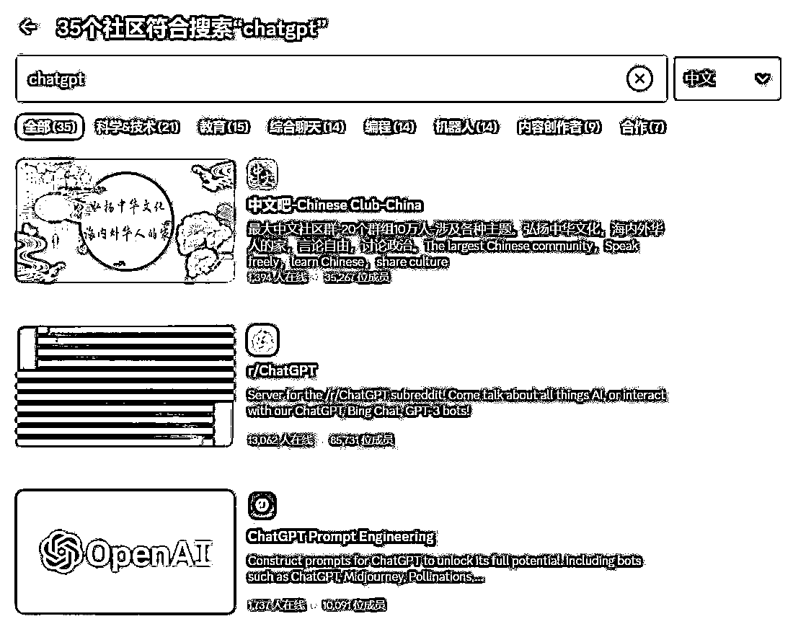

# 可以将 ChatGPT 机器人添加到 Midjourney 频道，直接提问，获取描述词

> 原文：[`www.yuque.com/for_lazy/xkrm14/mkeqp92eh4t1zke4`](https://www.yuque.com/for_lazy/xkrm14/mkeqp92eh4t1zke4)

作者： 北辰

日期：2023-04-04

点赞数：29

正文：

这几天 Chatgpt 大面积封号，很多创作会受到影响。 现在可以将 chatgpt 机器人添加到 midjourney 频道，直接提问，获取描述词，很方便。 1、查找 chatgpt 频道 2、添加 chatgpt 机器人到指定频道 3、输入 /question 进行提问

  

  

  

  

评论区：

艾威 : 这个版本是 3.0 并且有时间限制

公众号懒人找资源，懒人专属群分享

</ne-p></ne-p></ne-p></ne-p>