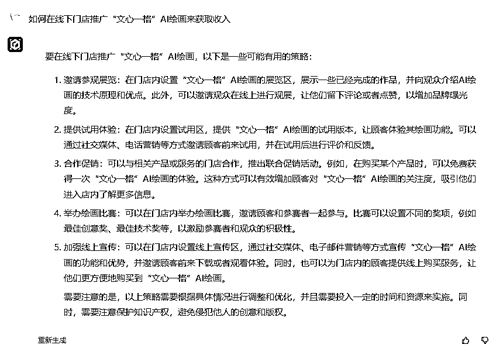

# AI 的线下变现模式

> 原文：[`www.yuque.com/for_lazy/xkrm14/zdc94eee4nrifn49`](https://www.yuque.com/for_lazy/xkrm14/zdc94eee4nrifn49)

作者： 黄浩在观察

日期：2023-04-03

点赞数：21

<ne-hole id="u3712457a" data-lake-id="u3712457a">

正文：

有没有想过 AI 的线下变现模式：AI 绘画火了这么久，目前看到的变现方式基本上都是线上的，很少看到把 AI 绘画应用到线下的变现形式。比如门店展示 AI 绘画，可以让人免费输几次关键词画画，然后影印自己的词生成的画收费。顾客自己创作的画，可能付费意愿大。 在抖音上已经看到有人做成机器线下卖照片赚钱了： 听说福田插画馆有台机器每月嫌 10 万！！带大家来揭秘一下～ 复制此链接，打开 Dou 音搜索，直接观看视频！ 同理，ChatGPT 会不会也迸发出现线下的变现模式？可以开开脑洞 [嘿哈] （图 2、3 是我问了文心一言得到的回答）[https://v.douyin.com/AygxNAe/](https://v.douyin.com/AygxNAe/)

<ne-hole id="ud6b9b288" data-lake-id="ud6b9b288">

评论区：

黄浩在观察 : 想到一个点，有很多给人题诗写字题词的线下店，结合 GPT 应该不错。这个方案可以卖不[呲牙]

<ne-hole id="u57d5745a" data-lake-id="u57d5745a">

公众号懒人找资源，懒人专属群分享

</ne-hole></ne-hole></ne-hole>