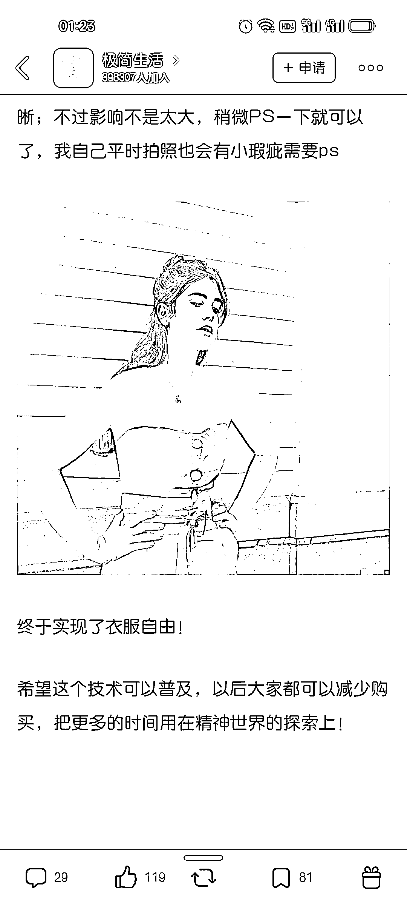

# 利用 AI 绘画给自己换不同类型衣服，市场很大

> 原文：[`www.yuque.com/for_lazy/xkrm14/tedv1kfmcnuxs704`](https://www.yuque.com/for_lazy/xkrm14/tedv1kfmcnuxs704)

作者： 可伊

日期：2023-04-03

点赞数：32

<ne-hole id="u802c188f" data-lake-id="u802c188f"><ne-card data-card-name="hr" data-card-type="block" id="X6r1h" data-event-boundary="card">

正文：

利用 ai 绘画给自己换不同类型衣服，看到后就很心动，自己是程序小白，说说自己的设想哈，不过感觉这块市场会很大。 c 端:做小程序或 app，用户上传自己的照片，然后选择不同按钮就可以给自己换上不同风格颜色的衣服，在风格，颜色，面料等这里采用模块化设计，提供常用类型按钮。 b 端:与圈友发的 AI 服装拍摄相结合，人是真实的，衣服也是真实的，通过 AI 两者结合生成不同场景图片。

<ne-card data-card-name="image" data-card-type="inline" id="SejJH" data-event-boundary="card"></ne-card>

<ne-card data-card-name="image" data-card-type="inline" id="fY8cs" data-event-boundary="card"></ne-card>

<ne-card data-card-name="image" data-card-type="inline" id="lNqEs" data-event-boundary="card"></ne-card>

<ne-card data-card-name="image" data-card-type="inline" id="jCglE" data-event-boundary="card"></ne-card>

<ne-hole id="uea73df22" data-lake-id="uea73df22"><ne-card data-card-name="hr" data-card-type="block" id="vXzzK" data-event-boundary="card">

评论区：

可伊 : c 端感觉广告词都有了[机智]，实现你的衣服自由！如果 c 端数据够多，之后还可以把统计数据卖给 b 端服装品牌

好好学习 : 这个是什么 app 论坛

可伊 : 豆瓣小组，极简生活

二月三十 : 当前 gpu 成本太高

可伊 : 这倒是没有想到。如果是这样，倒是目前可以直接做为一个 ai 课程卖点[呲牙]

<ne-hole id="u6304330f" data-lake-id="u6304330f"><ne-card data-card-name="hr" data-card-type="block" id="pEmiz" data-event-boundary="card">

公众号懒人找资源，懒人专属群分享

</ne-card></ne-hole></ne-card></ne-hole></ne-card></ne-hole>