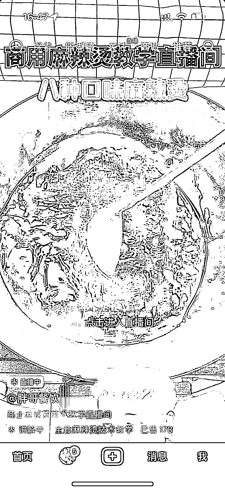
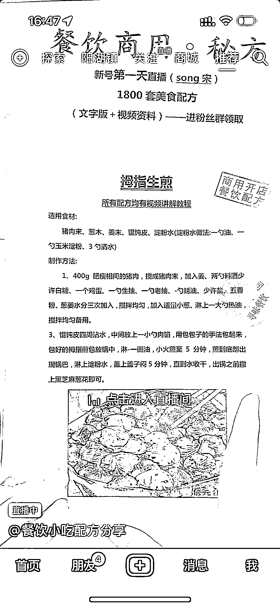
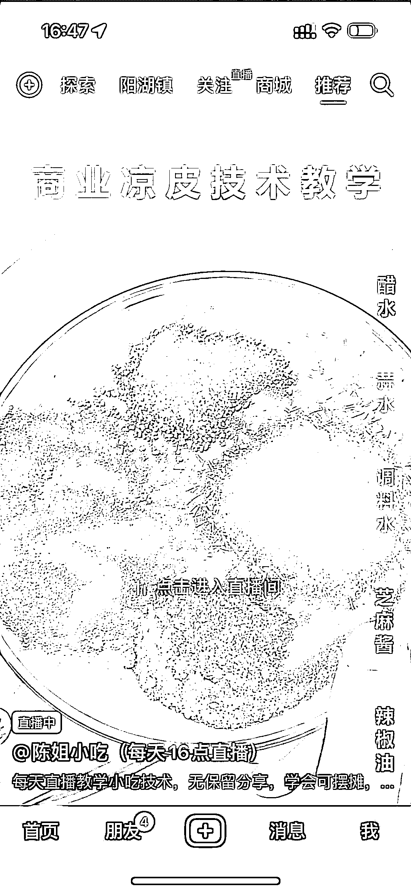
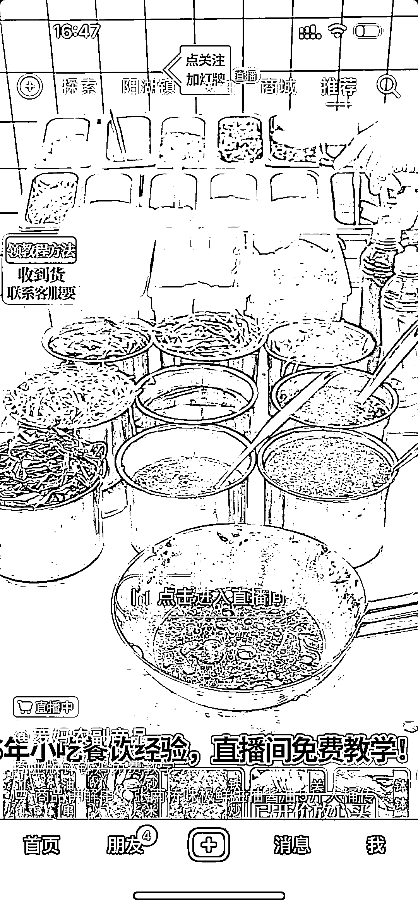

# 抖音，一波模仿比尔盖南，这种卖小吃配方的办法

> 原文：[`www.yuque.com/for_lazy/xkrm14/fmuv7357kyhzaxsg`](https://www.yuque.com/for_lazy/xkrm14/fmuv7357kyhzaxsg)

作者： 詹小卫

日期：2023-04-06

点赞数：26

正文：

最近抖音刷到一波模仿比尔盖南，这种卖小吃配方的号很多。有卖单品 26.9、59.9，有卖整套配方技术的 99、199。 具体操作如下： 采用绿幕背景直播，循环播放小吃制作视频，主播做课程讲解。 或者，打印出来很多小吃配方，直播间让客户截图做停留时常。然后通过挂载第三方小程序类似豆包知道、海豚课程这种小程序来售卖。 然后通过淘宝买一些几块钱的配方，转手上传到第三方小程序就可以卖。普通人可以试试，收获应该可以。

评论区：

欧欧 : 这个送商标使用权是怎么整的？

詹小卫 : 就是授权

欧欧 : 自己注册一个商标，授权给用户？

公众号懒人找资源，懒人专属群分享

