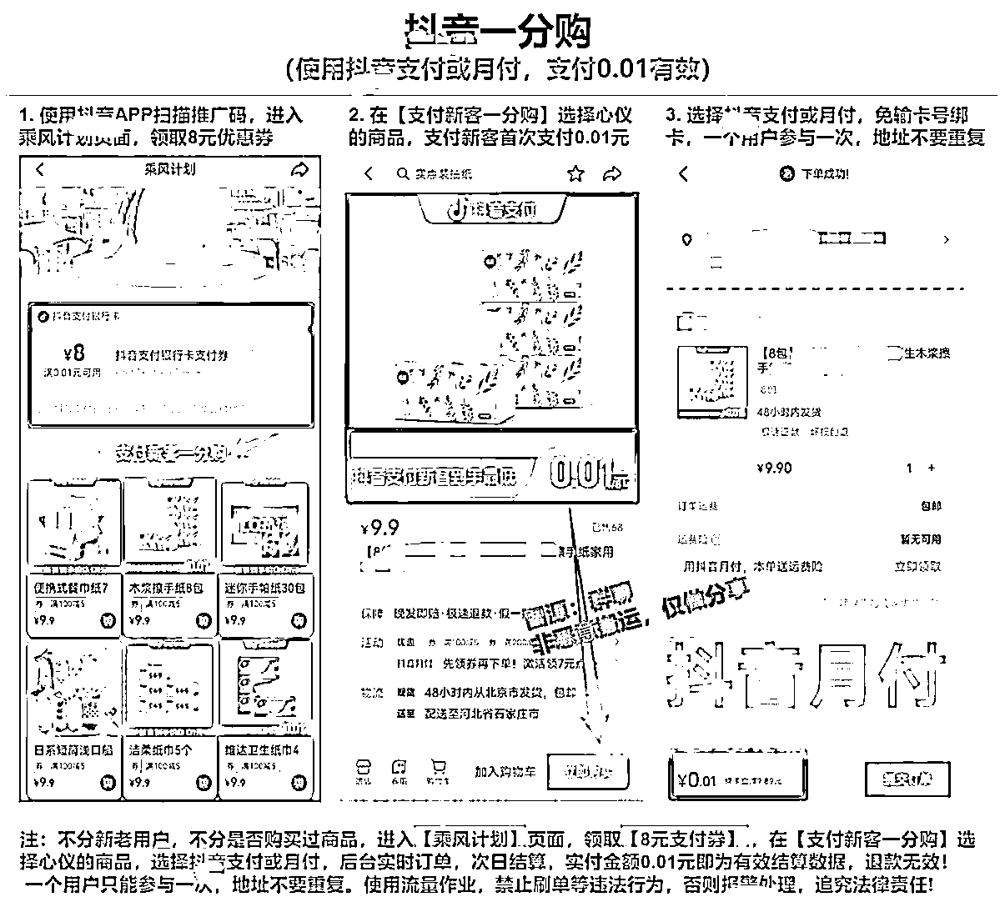

# 月入百万 20 天回本抖音口令粉

> 原文：[`www.yuque.com/for_lazy/xkrm14/vpcfgb4sw7r48zq6`](https://www.yuque.com/for_lazy/xkrm14/vpcfgb4sw7r48zq6)

作者： 霸气哥

日期：2023-04-06

点赞数：31

<ne-hole id="ue2e3966e" data-lake-id="ue2e3966e"><ne-card data-card-name="hr" data-card-type="block" id="xwdpG" data-event-boundary="card">

正文：

月入百万 20 天回本抖音口令粉 最近淘客圈最火的话题莫过于抖音口令用户，已经有大佬实操，一天能产 50 万的量，可以做到 20 天回本，真的是一波大风口。该玩法有当年淘宝评价的那种感觉，当年淘宝评价成本一两块钱，很多大佬实操一个月回本，并且产出持续，直接造就不少跨越阶级的神话。而现在抖音只需 20 天，所以有在实操的大佬们，一定要牢牢把握。 将用户囤积在抖音社群中，可以配合目前比较火热的抖音一分购玩法，可以快速提升与用户的信任感，且增加裙活跃度。并且可以配合后续的变现，加速回本。 本期分享到此结束 想要此玩法更多细节，和行业优秀案例，可以找我免费领取。

<ne-card data-card-name="image" data-card-type="inline" id="bBwnm" data-event-boundary="card"></ne-card>

<ne-card data-card-name="image" data-card-type="inline" id="Vc8n7" data-event-boundary="card">  <ne-p id="u0649abb6" data-lake-id="u0649abb6"><ne-card data-card-name="image" data-card-type="inline" id="sIGBV" data-event-boundary="card"></ne-card>

<ne-hole id="ubf02cde3" data-lake-id="ubf02cde3"><ne-card data-card-name="hr" data-card-type="block" id="O7UcI" data-event-boundary="card">

评论区：

Feng : 大佬，微多少，分享下细节

霸气哥 : 看我首页哈

<ne-hole id="ub557b612" data-lake-id="ub557b612"><ne-card data-card-name="hr" data-card-type="block" id="MXMlS" data-event-boundary="card">

公众号懒人找资源，懒人专属群分享

</ne-card></ne-hole></ne-card></ne-hole></ne-card></ne-p></ne-card></ne-hole>