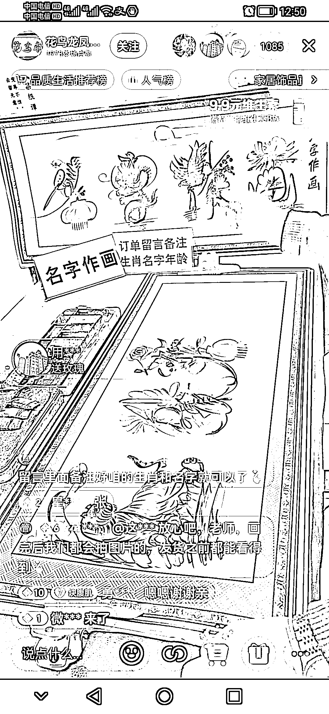

# 抖音，名字作画销量高

> 原文：[`www.yuque.com/for_lazy/xkrm14/sis3frykg8aro1w9`](https://www.yuque.com/for_lazy/xkrm14/sis3frykg8aro1w9)

<ne-p id="u02c6dbe3" data-lake-id="u02c6dbe3">作者： 平凡</ne-p> <ne-p id="u0ce144c7" data-lake-id="u0ce144c7">日期：2023-04-05</ne-p> <ne-p id="u6d0a3fef" data-lake-id="u6d0a3fef">点赞数：27</ne-p> <ne-hole id="u528fa25c" data-lake-id="u528fa25c"><ne-card data-card-name="hr" data-card-type="block" id="gNGqD" data-event-boundary="card"><ne-p id="uc050b755" data-lake-id="uc050b755">正文：</ne-p> <ne-p id="ue99c2202" data-lake-id="ue99c2202">名字作画，单写字 19.9，覆膜 39.9，卖了一万多笔。记得以前遇到过摆摊的，5 元一个字。可以找会写的合作，发作品开直播都能开卖。</ne-p> <ne-p id="u6500c4be" data-lake-id="u6500c4be"><ne-card data-card-name="image" data-card-type="inline" id="vY3Jf" data-event-boundary="card"></ne-card></ne-p> <ne-p id="ud675eaa4" data-lake-id="ud675eaa4"><ne-card data-card-name="image" data-card-type="inline" id="I8UI4" data-event-boundary="card"></ne-card></ne-p> <ne-p id="ubf44f123" data-lake-id="ubf44f123"><ne-card data-card-name="image" data-card-type="inline" id="xfoCp" data-event-boundary="card"></ne-card></ne-p> <ne-hole id="ubbe27ce8" data-lake-id="ubbe27ce8"><ne-card data-card-name="hr" data-card-type="block" id="mScP8" data-event-boundary="card"><ne-p id="u423e3a66" data-lake-id="u423e3a66">评论区：</ne-p> <ne-p id="uc416c8f9" data-lake-id="uc416c8f9">汉智平 : 1.1 万单，厉害。以前路边摊就是 5 块钱，一天也写不了几张</ne-p> <ne-hole id="u52738fa9" data-lake-id="u52738fa9"><ne-card data-card-name="hr" data-card-type="block" id="Sfnuk" data-event-boundary="card"><ne-p id="u161148cc" data-lake-id="u161148cc">公众号懒人找资源，懒人专属群分享</ne-p></ne-card></ne-hole></ne-card></ne-hole></ne-card></ne-hole>